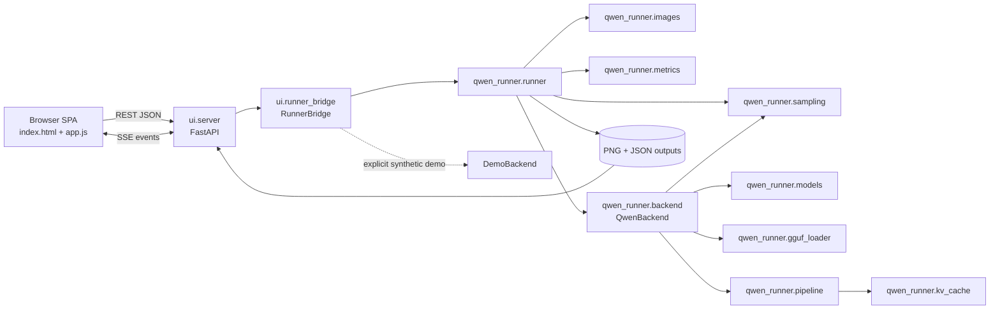

# Repository Context

Last updated: 2026-09-23 (Asia/Dhaka)

## Project Overview

`qwen_workflow_runner` is a Python implementation of a ComfyUI Qwen Image 2.1 workflow with two entry surfaces:

- A command-line runner (`run.py`) backed by `qwen_runner`.
- A FastAPI application (`ui`) with a vanilla HTML/CSS/JavaScript single-page interface, background execution, SSE progress events, model discovery/download/upload, output history, and image comparison.

The core production backend loads the Qwen Image 2.1 Diffusers pipeline and reproduces the source workflow's image conditioning, Euler flow sampling, optional GGUF transformer loading, KV caching, output persistence, and run metadata. The web layer also contains a synthetic `DemoBackend` intended for quick UI testing.

The active checkout is `/mnt/lab/farzine/qwen_workflow_runner`. The path originally supplied as the primary checkout, `/mnt/lab/farzine/projects/qwen_workflow_runner`, did not exist during the audit. The Git remote is `https://github.com/Farzine/qwen_workflow_runner.git`.

## Repository Map

| Path | Purpose |
| --- | --- |
| `run.py` | CLI entry point for a single configured generation run. |
| `benchmark.py` | Repeated benchmark entry point and summary writer. |
| `qwen_runner/config.py` | `ModelConfig`, `GenerationConfig`, `RuntimeConfig`, validation, and JSON serialization. |
| `qwen_runner/images.py` | Ordered conditioning-image loading, EXIF correction, resize/canvas selection, and comparison saving. |
| `qwen_runner/models.py` | Hugging Face/local model reference parsing, download/cache resolution, manifests, and model provenance. |
| `qwen_runner/gguf_loader.py` | Qwen transformer GGUF loading and tensor conversion. |
| `qwen_runner/sampling.py` | Comfy-compatible sigma schedule creation. |
| `qwen_runner/kv_cache.py` | Lossless transformer prefix KV cache and GPU/CPU placement policy. |
| `qwen_runner/pipeline.py` | Custom `WorkflowQwenImage21Pipeline`: prompt/image encoding, conditioning latent assembly, denoising, and VAE decoding. |
| `qwen_runner/backend.py` | Production `QwenBackend`: device/model initialization and pipeline invocation. |
| `qwen_runner/metrics.py` | Inference timing and memory metrics. |
| `qwen_runner/runner.py` | End-to-end orchestration, durable JSON records, output PNG saving, comparisons, and error records. |
| `ui/app.py` | Uvicorn launcher, CLI flags, directory setup, and port selection. |
| `ui/server.py` | FastAPI routes for health, inputs, thumbnails, models, validation, runs, SSE, history, and outputs. |
| `ui/runner_bridge.py` | Background job bridge, stdout/stderr capture, event fan-out, `DemoBackend`, and backend selection. |
| `ui/templates/index.html` | Single-page UI markup. |
| `ui/static/js/app.js` | Client state, server-side image browser, ordered selection, forms, run submission, SSE, history, and comparison viewer. |
| `ui/static/css/style.css` | Three-panel desktop UI and responsive styling. |
| `tests/` | Core configuration, sampling, image, GGUF, cache, and small runtime tests. |
| `ui/tests/` | API, security, concurrency, workflow, DOM, and JavaScript state-machine tests. |
| `workflow/original.json` | Original ComfyUI workflow graph. |
| `workflow/PORTING_NOTES.md` | Workflow parity decisions and current limitations. |
| `workflow/reviewed_gguf_tensor_inventory.json` | Reviewed GGUF tensor inventory. |
| `workflow/source_manifest.json` | Source model/workflow provenance. |
| `scripts/download_examples.py` | Example input download helper. |
| `scripts/summarize_logs.py` | Durable run-log summarizer. |
| `models/`, `outputs/`, `inputs/`, `.cache/` | Ignored runtime assets, results, configured inputs, and thumbnails. |

The repository had 62 tracked files and about 24,478 tracked lines at the audit. The local virtual environment and model/output data are intentionally ignored. The cached full model manifest reports approximately 33.13 GB of selected files.

## Architecture

No Graphiphy, Graphviz, `dot`, `pyreverse`, `pydeps`, or `madge` executable/tool was installed or exposed in the environment. The dependency map below was generated by parsing Python imports with `ast`, then augmented with the browser and runtime data flow. Mermaid provides the requested graph visualization in this persistent document.



The AST-derived internal import edges are:

```text
qwen_runner.backend -> qwen_runner.gguf_loader, models, pipeline, sampling
qwen_runner.pipeline -> qwen_runner.kv_cache
qwen_runner.runner -> qwen_runner.backend, images, metrics, sampling
ui.app -> ui.server
ui.server -> qwen_runner.config, qwen_runner.models, ui.runner_bridge
ui.runner_bridge -> qwen_runner.backend, qwen_runner.config, qwen_runner.runner, ui.server
```

### Current request flow

```mermaid
sequenceDiagram
    participant U as User
    participant JS as app.js
    participant API as FastAPI
    participant B as RunnerBridge
    participant R as qwen_runner.runner
    participant E as Selected backend
    participant F as Filesystem

    U->>JS: Select 1-10 server-side images
    JS->>API: POST /api/run (model, generation, runtime, demo_mode)
    API->>API: Build Config and validate image paths
    API->>B: submit_run(config, demo_mode)
    B->>B: resolve_backend_factory
    B->>R: run(config, backend_factory)
    R->>F: Load ordered images; first image sets canvas
    R->>E: load()
    R->>E: generate(images, canvas, seed)
    alt DemoBackend
        E->>E: Resize/blend images[0] and draw overlays
    else QwenBackend
        E->>E: Start from seeded CPU noise, condition on all images, denoise, decode
    end
    R->>F: Save PNG, optional comparison, and JSON record
    B-->>API: Status/log/progress events
    API-->>JS: SSE complete event and output URLs
    JS-->>U: Display generated image and comparison
```

### Production inference flow

1. `GenerationConfig.images` is an ordered list of one to ten conditioning images. The first image determines the default output canvas; later images are additional references.
2. `load_references` opens images with Pillow, applies EXIF orientation, converts to RGB/RGBA, rounds sizes to model-compatible values, and returns images plus canvas metadata.
3. `QwenBackend.load` validates the selected device, resolves the main model and optional companion files, loads a Diffusers or supported GGUF transformer, builds `WorkflowQwenImage21Pipeline`, installs the flow-matching scheduler, and applies device/offload settings.
4. `QwenBackend.generate` constructs deterministic CPU `float32` noise, applies the configured sigma schedule, packs the empty starting latent, and supplies the prompt and all conditioning images to the pipeline.
5. The pipeline encodes text and images with Qwen3-VL and the VAE, concatenates reference conditioning, denoises only the generated target latent, and decodes it to PIL images.
6. `qwen_runner.runner.run` saves output images and comparisons and atomically updates one JSON record per attempted inference.

The original ComfyUI graph follows the same broad semantics: its `KSampler` receives an empty latent selected by the graph's switch, while the loaded images feed `TextEncodeQwenImage21` as conditioning. It does not use the first image as the starting latent.

## Current Goal

Make the application a reliable production image-generation workflow: run real Qwen inference end to end, separate process inputs from references, support multiple input images, manage and apply LoRAs, expose and honor device selection, improve error visibility, then redesign and document the UI without regressing the tested workflow.

## Active Task

Phase 2.2 — restore a working CUDA runtime and perform the first real-model smoke test:

1. Inspect installed PyTorch/torchvision provenance and available compatible wheel options.
2. Select the least disruptive PyTorch build compatible with NVIDIA driver 560.28.03 / CUDA 12.6.
3. Preserve the current environment dependency constraints while replacing only incompatible runtime packages.
4. Verify CUDA discovery, device properties, BF16 support, and `/api/system` readiness.
5. Run one low-resolution, single-output Qwen inference with conservative memory settings.
6. Confirm the record identifies `QwenBackend` and that the generated output is saved and materially differs from the source.

## Completed Tasks

- [x] Inspected Git state, tracked source, documentation, workflow artifacts, entry points, tests, runtime directories, and recent history.
- [x] Mapped frontend, API, job bridge, core model, sampling, image, caching, persistence, and output-display flows.
- [x] Generated an AST-based dependency graph and Mermaid architecture/inference visualizations because specialized graph executables were unavailable.
- [x] Traced UI input through preprocessing, backend selection, inference, saving, history, and result display.
- [x] Studied and compared the reference `klein_generic_infer.py` implementation.
- [x] Identified and empirically validated the immediate same-image root cause.
- [x] Diagnosed the runtime condition preventing the production backend from loading.
- [x] Established baseline core, targeted UI, and JavaScript validation.
- [x] Created the persistent repository context and prioritized modular plan.
- [x] Made production inference the UI/API/bridge default and made synthetic demo mode an explicit opt-in.
- [x] Removed the CUDA-dependent fallback from real requests to `DemoBackend`.
- [x] Added a reusable runtime capability probe, `/api/system`, visible header/footer readiness, and actionable production setup errors.
- [x] Added strict `demo_mode` validation and tests proving a production request cannot be reported as demo output.
- [x] Updated synthetic E2E fixtures to request demo mode explicitly and completed the full UI suite.

## Remaining Tasks

- [x] Phase 2.1: make real/demo selection explicit, default to real inference, eliminate silent fallback, and add runtime capability diagnostics.
- [ ] Phase 2.2: install/use a PyTorch build compatible with the NVIDIA driver (or update the driver), then run and validate real Qwen inference at a safe resolution.
- [ ] Phase 2.3: verify actual transformation quality, parameter propagation, image conditioning, persistence, and UI display with the full model.
- [ ] Phase 3: introduce separate ordered `input_images` and `reference_images` request concepts; define each input as an independently generated output while applying the chosen reference set.
- [ ] Phase 3: add multi-file image upload, drag-and-drop, previews, ordering, individual removal, validation, and clear empty/error states.
- [ ] Phase 4: add LoRA directory discovery, validated upload, selection, active-state reporting, backend loading/application, metadata, and tests.
- [ ] Phase 5: add system/GPU inventory and configuration API/page; validate and honor manual device selection.
- [ ] Phase 6: reorganize the UI around the production workflow and improve responsive behavior, accessibility, loading, progress, and long-list states.
- [ ] Phase 7: add implementation-backed information controls for all meaningful parameters.
- [ ] Phase 8: run the complete input/reference/LoRA/GPU/inference/UI validation matrix, fix remaining failures, and stabilize documentation.

## Current Problems

### Inference truthfulness

- Production is now the default in HTML, client state, request payloads, API handling, and `RunnerBridge`.
- `resolve_backend_factory(False)` always selects `QwenBackend`; CUDA failure produces a setup error instead of demo output.
- Synthetic demo remains available only through the unchecked UI toggle, `demo_mode: true`, `--demo`, or `DEMO_MODE=1`, and the UI labels it as input-derived with no model inference.
- `demo_mode` must be a JSON boolean, preventing strings such as `"false"` from being treated as true.
- The same-image symptom is contained to the clearly labeled synthetic mode. A real request can no longer return a successful demo image silently.

### Runtime blocker

- NVIDIA kernel driver: 560.28.03, reporting CUDA driver version 12.6 (`12060`).
- Virtual environment: PyTorch `2.14.0+cu130`, compiled for CUDA 13.0.
- `torch.cuda.is_available()` is false, device count is zero, and `nvidia-smi` cannot communicate with the driver in this environment.
- The full production model cannot be meaningfully exercised on CPU; real inference validation is blocked until driver/wheel compatibility is corrected.

### Inputs and references

- The UI can click-select and reorder up to ten images from a server-side directory, but it labels the combined list “Reference Sequence.” Slot 1 is both canvas/input and conditioning; slots 2-10 are references.
- There is no local multi-image upload endpoint/control, no image drag-and-drop, and no separate input/reference state.
- Current core configuration has one combined `images` list and produces a configured batch from a single conditioning set. It does not model multiple process inputs as independent jobs/outputs.

### LoRA and device management

- The current documentation explicitly lists LoRA as unsupported.
- The custom pipeline inherits Diffusers' Qwen Image LoRA loader support, but `QwenBackend` never calls it and configuration/API/UI have no LoRA fields.
- The UI device selector remains a static list (`cuda:0`, CPU, MPS). `/api/system` now reports runtime/device readiness and the header shows the selected state, but dynamic GPU options, detailed memory information, and the dedicated system page remain for Phase 5.

### Validation and maintainability

- The existing suites strongly validate demo behavior, schema, security, and UI state, but do not load the pretrained model or establish output quality.
- Backend choice is explicit. The new runtime probe validates the selected device/dtype/offload combination before model loading and returns the same actionable message used by `QwenBackend`.
- Parameter hints exist for several fields, but there is no complete, consistent help system based on actual implementation behavior.
- The UI suite contains 402 tests after Phase 2.1 and completes in about 20 seconds when local loopback sockets are permitted.

## Important Technical Findings

### Root cause evidence

- There were 426 durable `*_run_*.json` records in `outputs`; all 426 identify `DemoBackend` and demo mode. Of these, 425 were successful and one recorded an error. No local durable record proves that `QwenBackend` has completed a pretrained inference.
- The latest record, `outputs/20260923T093734_6af8c9910b_run_000.json`, reports `DemoBackend`, `WorkflowQwenImage21Pipeline[Demo]`, and an inference time of about 0.009 seconds for a 960x1280 image.
- The latest source/output diagnostic measured whole-image MAE 27.7122, RMSE 46.6755, and correlation 0.834826. Excluding the demo header/footer regions, source/output correlation rises to 0.991248 with MAE 17.7808. This matches the backend's 85% source-image blend and proves that the apparent non-transformation occurs before production inference.
- Before Phase 2.1, calling `resolve_backend_factory(False)` returned `DemoBackend` in this environment. It now returns `QwenBackend` and raises the documented CUDA compatibility setup error during `load()`.
- The production backend's generation path does not directly return an input image. It starts from seeded noise and passes all references only as conditioning, consistent with the original graph.

### Model and workflow findings

- The cached full Diffusers snapshot has a valid manifest for the selected files at model revision `790c926...`; model absence is not the immediate cause of demo output.
- `QwenBackend` supports full Diffusers directories, a supported GGUF transformer plus companion model, and floating-point single-file transformer weights. It intentionally rejects incompatible older Qwen pipeline classes and Comfy `int8_convrot` files.
- The core applies the requested `runtime.device` with `torch.cuda.set_device` or pipeline placement/offload. The web UI currently lacks trustworthy capability discovery around that control.
- Output persistence is structurally sound: generated PIL results are saved, hashed, recorded, and exposed through output APIs. In the failing scenario the wrong backend produced the image; saving/display did not replace a valid production result with the input.
- `qwen_runner.system.probe_runtime_capabilities` reports Python/PyTorch versions, CUDA/MPS state, devices, diagnostics, and readiness for the requested device/dtype/offload without loading model weights.
- `/api/system` adds explicit server demo-default metadata. The browser uses this endpoint at startup and whenever the selected device changes.

### State and repository findings

- Audit start: branch `main`, commit `52e353e`, matching `origin/main`, with a clean tracked working tree.
- There were only two commits: the initial implementation and a Tier 5 frontend/adversarial test addition.
- Runtime assets are large but ignored: the local environment, models, outputs, and cache must not be treated as source changes.
- The FastAPI job executor is intentionally single-worker. It captures process stdout/stderr and publishes events to per-run SSE subscribers.

## Reference Implementations

### `/mnt/lab/farzine/projects/Nunchaku-Generic-Form/klein_generic_infer.py`

This 528-line script is a client for a remote Flux.2 Klein inference service; it is not a local Qwen Image 2.1 implementation.

It:

1. Scans an input folder and processes images one at a time.
2. Uploads each base image to `/flux-klein-generic`, retains the returned identifier, and submits later jobs through `/flux-klein-generic-from`.
3. Represents an optional reference image separately in prompt metadata (`ref_image#...`).
4. Sends an optional `adapter_name` separately, providing a simple LoRA/adapter selection concept.
5. Polls `/status`, downloads the service-produced image from `/download`, and writes original, processed, comparison, and metadata artifacts.
6. Retries by removing adapter and reference options if those optional features fail.
7. Delegates device, GPU, and model loading to the remote service.

Useful concepts to adapt are the separation of base input from optional reference, one result per source input, explicit adapter state, visible polling/errors, and preserving both generated artifacts and metadata. Its endpoints, Flux prompt contract, retry semantics, and remote device handling cannot be copied into the local Qwen pipeline.

### Current implementation comparison

| Concern | Reference script | Current project | Implication |
| --- | --- | --- | --- |
| Input processing | Iterates independent base images | One ordered conditioning list | Add a UI/API batch layer that expands multiple process inputs into independently tracked generations. |
| References | Separate optional reference field | Mixed with first/canvas image | Split request and UI concepts while preserving ordered conditioning passed to Qwen. |
| LoRA | Sends optional `adapter_name` | Unsupported and never loaded | Add local discovery/upload plus explicit Diffusers loading and metadata. |
| Device/model | Remote service owns them | Local `QwenBackend` owns them | Local capability reporting and strict device errors are required. |
| Execution | Always requests remote inference | Defaults/falls back to synthetic demo | Make demo explicit and never substitute it for a real request. |
| Result | Downloads service output | Saves backend PIL output | Current persistence can remain after backend selection is fixed. |

## Files Modified

- `CONTEXT.md` — updated persistent architecture, completed work, validation, blockers, and next action.
- `qwen_runner/system.py` — added reusable, JSON-safe runtime/device capability probing.
- `qwen_runner/backend.py` — made `QwenBackend` consume the shared readiness result before loading weights.
- `ui/runner_bridge.py` — removed implicit demo fallback and changed bridge defaults to production.
- `ui/server.py` — added `/api/system`, explicit server demo defaults, and strict `demo_mode` boolean handling.
- `ui/app.py` — made `--demo`/`DEMO_MODE` the explicit server-default controls.
- `ui/static/js/app.js` — defaulted to real inference, queried runtime readiness, updated visible mode status, and sent explicit booleans.
- `ui/templates/index.html` — unchecked and relabeled synthetic demo mode; added truthful initial runtime text.
- `ui/static/css/style.css` — added a warning state for a connected server with a blocked production runtime.
- `ui/README.md`, `PROJECT.md` — documented production defaults, `/api/system`, strict mode semantics, and removal of fallback behavior.
- `tests/test_system.py` — added runtime probe tests.
- `ui/tests/test_backend.py`, `ui/tests/test_frontend.py` — added backend-selection, API contract, default-mode, and UI truthfulness tests.
- `ui/tests/e2e/common.py`, `ui/tests/e2e/test_tier4_scenarios.py` — made synthetic E2E intent explicit after changing the production default.

## Tests Performed

- `.venv/bin/python -m compileall -q qwen_runner ui` — passed.
- `node --check ui/static/js/app.js` — passed.
- `git diff --check` — passed.
- `.venv/bin/python -m pytest -q tests` — 24 passed in 2.42 seconds; the existing CUDA warning remains.
- `.venv/bin/python -m pytest -q ui/tests/test_app.py ui/tests/test_backend.py ui/tests/test_frontend.py` — 59 passed in 3.83 seconds.
- `.venv/bin/python -m pytest -q ui/tests/test_tier5_frontend_stress.py -k 'DOMIntegrityAndA11y or NodeFrontendStressHarness'` — 6 passed, 4 deselected.
- `.venv/bin/python -m pytest -q ui/tests/e2e/test_tier4_scenarios.py` — 8 passed.
- `.venv/bin/python -m pytest -q ui/tests/e2e/test_tier1_features.py ui/tests/e2e/test_tier2_boundaries.py ui/tests/e2e/test_tier3_pairwise.py` — 219 passed.
- `.venv/bin/python -m pytest -q ui/tests` — all 402 passed in 19.86 seconds after synthetic fixtures explicitly enabled demo mode.
- `node ui/tests/test_challenger_m2_node.js` — 27/27 passed.
- `node ui/tests/test_tier5_node_stress.js` — 14/14 passed.
- Direct diagnostic: `resolve_backend_factory(False)` returned `QwenBackend`; `QwenBackend.load()` stopped before weight loading with `RuntimeError: CUDA is unavailable to PyTorch for cuda:0. Install a PyTorch build compatible with the NVIDIA driver, or update the driver.`
- An initial full UI run revealed 35 legacy E2E cases that omitted `demo_mode` and consequently attempted real CPU inference. The run was interrupted, those synthetic fixtures were made explicit, and the subsequent complete 402-test run passed.
- Parsed all durable run records to count backend and status values; all 426 were demo records.
- Compared the latest input/output pixels with Pillow/NumPy to validate that the output body remained source-derived.
- Inspected NVIDIA driver information, `nvidia-smi`, PyTorch/CUDA versions, CUDA availability, device count, and backend resolution.
- Parsed local Python imports with `ast` to produce the dependency graph.

## Known Issues

- Production inference has not been executed successfully in the current environment because CUDA initialization fails.
- The original same-image behavior still exists inside explicit synthetic demo mode by design, but it can no longer masquerade as production inference.
- Real output quality, LoRA application, multiple process inputs, separate references, selected-GPU execution, and narrow-viewport interaction remain unvalidated.
- The user-provided primary checkout path was absent; work is occurring in the actual Git checkout at `/mnt/lab/farzine/qwen_workflow_runner`.

## User Decisions / Required Input

None at this checkpoint. Phase 2.2 should first inspect installed package provenance and compatible wheel availability. Replacing packages may require network/escalated execution, but no product or architecture decision is currently blocked.

## Next Action

Implement Phase 2.2 as a bounded environment and inference slice:

1. Capture `pip show`/`pip freeze` information for torch, torchvision, Diffusers, Transformers, and Accelerate; inspect local wheel caches before downloading anything.
2. Verify which official PyTorch CUDA build supports driver 560.28.03 and remains compatible with the installed application stack.
3. Replace only the incompatible torch/torchvision packages, preserving an environment snapshot for rollback.
4. Confirm `torch.cuda.is_available()`, enumerate GPU properties, and verify `/api/system` marks `cuda:0` ready.
5. Run a minimal 256x256 or similarly safe real Qwen generation with one input, one output, conservative offload, and no LoRA.
6. Validate the durable record backend, output file/hash/dimensions, and source/output difference; document runtime and memory results here.

## Resume Instructions

When the user says `Continue from CONTEXT.md`:

1. Read this file completely.
2. Run `git status --short` and inspect recent commits/diffs without discarding user changes.
3. Confirm the active checkout and compare repository state with **Files Modified** and **Tests Performed**.
4. Treat **Active Task** and **Next Action** as the starting point.
5. Do not repeat the full repository audit unless relevant source files changed substantially.
6. Implement one coherent, independently testable slice, immediately validate it, and update every affected section of this file before ending the session.
7. Preserve real model, output, input, cache, and virtual-environment assets; they are ignored runtime state.
