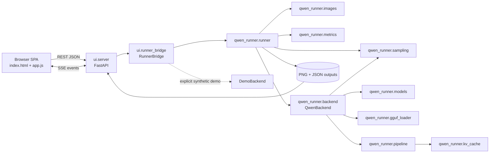
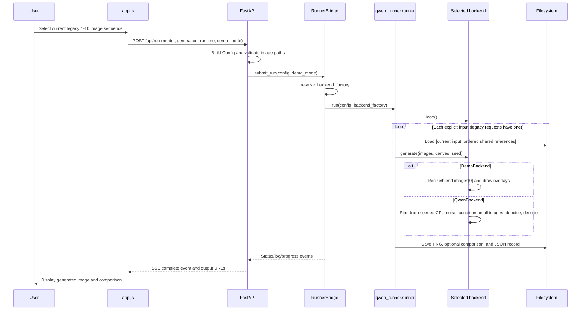

# Repository Context

Last updated: 2026-09-24 (Asia/Dhaka)

## Project Overview

`qwen_workflow_runner` is a Python implementation of a ComfyUI Qwen Image 2.1 workflow with two entry surfaces:

- A command-line runner (`run.py`) backed by `qwen_runner`.
- A FastAPI application (`ui`) with a vanilla HTML/CSS/JavaScript single-page interface, background execution, SSE progress events, model discovery/download/upload, output history, and image comparison.

The core production backend loads the Qwen Image 2.1 Diffusers pipeline and reproduces the source workflow's image conditioning, Euler flow sampling, optional GGUF transformer loading, KV caching, output persistence, and run metadata. The web layer also contains a synthetic `DemoBackend` intended for quick UI testing.

The active checkout is `/mnt/lab/farzine/qwen_workflow_runner`. The path originally supplied as the primary checkout, `/mnt/lab/farzine/projects/qwen_workflow_runner`, did not exist during the audit. The Git remote is `https://github.com/Farzine/qwen_workflow_runner.git`.

## Repository Map

| Path | Purpose |
| --- | --- |
| `run.py` | CLI entry point for legacy conditioning sequences or explicit multi-input generation batches. |
| `benchmark.py` | Repeated benchmark entry point and summary writer. |
| `qwen_runner/config.py` | `ModelConfig`, `GenerationConfig`, `RuntimeConfig`, validation, and JSON serialization. |
| `qwen_runner/images.py` | Ordered conditioning-image loading, EXIF correction, resize/canvas selection, and comparison saving. |
| `qwen_runner/models.py` | Hugging Face/local model reference parsing, download/cache resolution, manifests, and model provenance. |
| `qwen_runner/gguf_loader.py` | Qwen transformer GGUF loading and tensor conversion. |
| `qwen_runner/sampling.py` | Comfy-compatible sigma schedule creation. |
| `qwen_runner/kv_cache.py` | Lossless transformer prefix KV cache and GPU/CPU placement policy. |
| `qwen_runner/pipeline.py` | Custom `WorkflowQwenImage21Pipeline`: prompt/image encoding, conditioning latent assembly, denoising, and VAE decoding. |
| `qwen_runner/backend.py` | Production `QwenBackend`: device/model initialization and pipeline invocation. |
| `qwen_runner/metrics.py` | Inference timing and memory metrics. |
| `qwen_runner/runner.py` | End-to-end orchestration, durable JSON records, output PNG saving, comparisons, and error records. |
| `ui/app.py` | Uvicorn launcher, CLI flags, directory setup, and port selection. |
| `ui/server.py` | FastAPI routes for health, inputs, thumbnails, models, validation, runs, SSE, history, and outputs. |
| `ui/runner_bridge.py` | Background job bridge, stdout/stderr capture, event fan-out, `DemoBackend`, and backend selection. |
| `ui/templates/index.html` | Single-page UI markup. |
| `ui/static/js/app.js` | Client state, server-side image browser, ordered selection, forms, run submission, SSE, history, and comparison viewer. |
| `ui/static/css/style.css` | Three-panel desktop UI and responsive styling. |
| `tests/` | Core configuration, sampling, image, GGUF, cache, and small runtime tests. |
| `ui/tests/` | API, security, concurrency, workflow, DOM, and JavaScript state-machine tests. |
| `workflow/original.json` | Original ComfyUI workflow graph. |
| `workflow/PORTING_NOTES.md` | Workflow parity decisions and current limitations. |
| `workflow/reviewed_gguf_tensor_inventory.json` | Reviewed GGUF tensor inventory. |
| `workflow/source_manifest.json` | Source model/workflow provenance. |
| `scripts/download_examples.py` | Example input download helper. |
| `scripts/summarize_logs.py` | Durable run-log summarizer. |
| `models/`, `outputs/`, `inputs/`, `.cache/` | Ignored runtime assets, results, configured inputs, and thumbnails. |

The repository had 62 tracked files and about 24,478 tracked lines at the audit. The local virtual environment and model/output data are intentionally ignored. The cached full model manifest reports approximately 33.13 GB of selected files.

## Architecture

No Graphiphy, Graphviz, `dot`, `pyreverse`, `pydeps`, or `madge` executable/tool was installed or exposed in the environment. The dependency map below was generated by parsing Python imports with `ast`, then augmented with the browser and runtime data flow. Mermaid provides the requested graph visualization in this persistent document.



The AST-derived internal import edges are:

```text
qwen_runner.backend -> qwen_runner.gguf_loader, models, pipeline, sampling
qwen_runner.pipeline -> qwen_runner.kv_cache
qwen_runner.runner -> qwen_runner.backend, images, metrics, sampling
ui.app -> ui.server
ui.server -> qwen_runner.config, qwen_runner.models, ui.runner_bridge
ui.runner_bridge -> qwen_runner.backend, qwen_runner.config, qwen_runner.runner, ui.server
```

### Current request flow



### Production inference flow

1. New callers use `GenerationConfig.input_images` plus `reference_images`. The runner expands these into one inference per input with `[current_input, *reference_images]`. Legacy `images` remains one combined sequence whose first image is the input/canvas.
2. `load_references` opens each expanded conditioning sequence with Pillow, applies EXIF orientation, converts to RGB/RGBA, rounds sizes to model-compatible values, and returns images plus canvas metadata.
3. `QwenBackend.load` validates the selected device, resolves the main model and optional companion files, loads a Diffusers or supported GGUF transformer, builds `WorkflowQwenImage21Pipeline`, installs the flow-matching scheduler, and applies device/offload settings.
4. `QwenBackend.generate` constructs deterministic CPU `float32` noise, applies the configured sigma schedule, packs the empty starting latent, and supplies the prompt and all conditioning images to the pipeline.
5. The pipeline encodes text and images with Qwen3-VL and the VAE, concatenates reference conditioning, denoises only the generated target latent, and decodes it to PIL images.
6. `qwen_runner.runner.run` loads the model once, preserves input order, uses the same seed for all inputs in a repeat, and saves one durable record/output group per input attempt. Explicit multi-input jobs isolate ordinary per-input failures and report mixed outcomes as `partial_success` through the API.

The original ComfyUI graph follows the same broad semantics: its `KSampler` receives an empty latent selected by the graph's switch, while the loaded images feed `TextEncodeQwenImage21` as conditioning. It does not use the first image as the starting latent.

## Current Goal

Make the application a reliable production image-generation workflow: run real Qwen inference end to end, separate process inputs from references, support multiple input images, manage and apply LoRAs, expose and honor device selection, improve error visibility, then redesign and document the UI without regressing the tested workflow.

## Active Task

Phase 3.2 — expose the completed core/API image distinction through separate browser controls and validated uploads:

1. Add a confined multi-image upload endpoint for supported image formats with clear validation and collision-safe storage.
2. Replace the combined client selection state with ordered process inputs and ordered references while keeping the legacy request path compatible.
3. Add distinct input/reference drop zones, previews, ordering, individual removal, empty states, and actionable errors.
4. Submit `generation.input_images` and `generation.reference_images`, display every successful per-input result, and surface partial failures without hiding successful outputs.
5. Cover desktop and narrow layouts plus long filenames, many images, invalid files, and drag/drop behavior without starting the LoRA redesign.

## Completed Tasks

- [x] Inspected Git state, tracked source, documentation, workflow artifacts, entry points, tests, runtime directories, and recent history.
- [x] Mapped frontend, API, job bridge, core model, sampling, image, caching, persistence, and output-display flows.
- [x] Generated an AST-based dependency graph and Mermaid architecture/inference visualizations because specialized graph executables were unavailable.
- [x] Traced UI input through preprocessing, backend selection, inference, saving, history, and result display.
- [x] Studied and compared the reference `klein_generic_infer.py` implementation.
- [x] Identified and empirically validated the immediate same-image root cause.
- [x] Diagnosed the runtime condition preventing the production backend from loading.
- [x] Established baseline core, targeted UI, and JavaScript validation.
- [x] Created the persistent repository context and prioritized modular plan.
- [x] Made production inference the UI/API/bridge default and made synthetic demo mode an explicit opt-in.
- [x] Removed the CUDA-dependent fallback from real requests to `DemoBackend`.
- [x] Added a reusable runtime capability probe, `/api/system`, visible header/footer readiness, and actionable production setup errors.
- [x] Added strict `demo_mode` validation and tests proving a production request cannot be reported as demo output.
- [x] Updated synthetic E2E fixtures to request demo mode explicitly and completed the full UI suite.
- [x] Replaced the incompatible CUDA 13 PyTorch runtime with a locally verified CUDA 12.6 stack while retaining the prior packages for rollback.
- [x] Verified both RTX A6000 GPUs, BF16 execution, explicit device selection, `/api/system`, and the runtime class check.
- [x] Completed the first real cached-model inference with `QwenBackend` and proved that the output is a prompt-directed transformation rather than a copied input.
- [x] Exercised real production inference through `/api/run`, SSE, run history, record retrieval, output serving, and comparison serving with matching hashes.
- [x] Validated ordered two-reference propagation on both GPUs and isolated native 4000x6000 reference sizing as the cause of unusable output and extreme memory use in the failing case.
- [x] Proved the second reference materially changes inference and documented the remaining reference-adherence quality limitation.
- [x] Added explicit ordered `input_images` and `reference_images` fields while retaining the legacy combined `images` contract.
- [x] Expanded explicit requests into one independently recorded generation per process input using `[current_input, *reference_images]` and one shared model load.
- [x] Preserved repeat seed semantics, input/reference order, per-input output/comparison metadata, and legacy setup-error behavior.
- [x] Added API aggregation for all multi-input artifacts and `partial_success` records when one input fails while later inputs succeed.
- [x] Added core, runner, API, SSE, and compatibility coverage for explicit image batches and documented the CLI/REST contract.

## Remaining Tasks

- [x] Phase 2.1: make real/demo selection explicit, default to real inference, eliminate silent fallback, and add runtime capability diagnostics.
- [x] Phase 2.2: install/use a PyTorch build compatible with the NVIDIA driver (or update the driver), then run and validate real Qwen inference at a safe resolution.
- [x] Phase 2.3: verify actual transformation quality, parameter propagation, image conditioning, persistence, and UI display with the full model.
- [x] Phase 3.1: introduce separate ordered `input_images` and `reference_images` request concepts; define each input as an independently generated output while applying the chosen reference set.
- [ ] Phase 3: add multi-file image upload, drag-and-drop, previews, ordering, individual removal, validation, and clear empty/error states.
- [ ] Phase 4: add LoRA directory discovery, validated upload, selection, active-state reporting, backend loading/application, metadata, and tests.
- [ ] Phase 5: add system/GPU inventory and configuration API/page; validate and honor manual device selection.
- [ ] Phase 6: reorganize the UI around the production workflow and improve responsive behavior, accessibility, loading, progress, and long-list states.
- [ ] Phase 7: add implementation-backed information controls for all meaningful parameters.
- [ ] Phase 8: run the complete input/reference/LoRA/GPU/inference/UI validation matrix, fix remaining failures, and stabilize documentation.

## Current Problems

### Inference truthfulness

- Production is now the default in HTML, client state, request payloads, API handling, and `RunnerBridge`.
- `resolve_backend_factory(False)` always selects `QwenBackend`; CUDA failure produces a setup error instead of demo output.
- Synthetic demo remains available only through the unchecked UI toggle, `demo_mode: true`, `--demo`, or `DEMO_MODE=1`, and the UI labels it as input-derived with no model inference.
- `demo_mode` must be a JSON boolean, preventing strings such as `"false"` from being treated as true.
- The same-image symptom is contained to the clearly labeled synthetic mode. A real request can no longer return a successful demo image silently.

### Runtime state

- NVIDIA kernel driver 560.28.03 exposes CUDA 12.6 and two RTX A6000 GPUs with about 48 GiB each.
- The project environment now uses PyTorch `2.11.0+cu126`, torchvision `0.26.0+cu126`, Triton `3.6.0`, and setuptools `81.0.0`; `pip check` reports no broken requirements.
- The previous CUDA 13 package directories are preserved at `.venv/runtime-backups/cu130-20260923/site-packages` for local rollback.
- Filesystem-sandboxed commands cannot see `/dev/nvidia*`; GPU diagnostics and inference must run with host device access. This isolation explained the earlier sandboxed `nvidia-smi` failure.
- GPU 0 was using about 40 GiB during the smoke test, so the validated run explicitly selected the otherwise free `cuda:1` device.

### Inputs and references

- The UI can click-select and reorder up to ten images from a server-side directory, but it labels the combined list “Reference Sequence.” Slot 1 is both canvas/input and conditioning; slots 2-10 are references.
- There is no local multi-image upload endpoint/control, no image drag-and-drop, and no separate input/reference state.
- The core/API now accepts up to ten ordered process inputs and nine ordered shared references. It emits a separate durable attempt for each input while loading the backend once; the browser still submits the legacy combined `images` field until Phase 3.2.
- Explicit multi-input API responses flatten all successful non-warmup artifacts into `outputs`/`comparisons` and retain per-input records/errors. The current client treats `partial_success` as failure and therefore needs the Phase 3.2 result-display update before it uses this contract.

### LoRA and device management

- The current documentation explicitly lists LoRA as unsupported.
- The custom pipeline inherits Diffusers' Qwen Image LoRA loader support, but `QwenBackend` never calls it and configuration/API/UI have no LoRA fields.
- The UI device selector remains a static list (`cuda:0`, CPU, MPS). `/api/system` now reports runtime/device readiness and the header shows the selected state, but dynamic GPU options, detailed memory information, and the dedicated system page remain for Phase 5.

### Validation and maintainability

- The completed-job SSE hang was caused by running Starlette `TestClient` inside the restricted command sandbox. The exact test and full UI suite pass with the local IPC/loopback access already required by these tests; no streaming code change was needed.
- Backend choice is explicit. The new runtime probe validates the selected device/dtype/offload combination before model loading and returns the same actionable message used by `QwenBackend`.
- Parameter hints exist for several fields, but there is no complete, consistent help system based on actual implementation behavior.
- The UI suite contains 406 tests after Phase 3.1 and completes in about 20 seconds when local loopback sockets are permitted.

## Important Technical Findings

### Root cause evidence

- There were 426 pre-fix durable `*_run_*.json` records in `outputs`; all 426 identify `DemoBackend` and demo mode. New production validation records under `/tmp/qwen-ui-*` now prove successful `QwenBackend` inference without mixing diagnostics into the user's output history.
- The latest record, `outputs/20260923T093734_6af8c9910b_run_000.json`, reports `DemoBackend`, `WorkflowQwenImage21Pipeline[Demo]`, and an inference time of about 0.009 seconds for a 960x1280 image.
- The latest source/output diagnostic measured whole-image MAE 27.7122, RMSE 46.6755, and correlation 0.834826. Excluding the demo header/footer regions, source/output correlation rises to 0.991248 with MAE 17.7808. This matches the backend's 85% source-image blend and proves that the apparent non-transformation occurs before production inference.
- Before Phase 2.1, calling `resolve_backend_factory(False)` returned `DemoBackend` in this environment. It now returns `QwenBackend` and raises the documented CUDA compatibility setup error during `load()`.
- The production backend's generation path does not directly return an input image. It starts from seeded noise and passes all references only as conditioning, consistent with the original graph.

### Model and workflow findings

- The cached full Diffusers snapshot has a valid manifest for the selected files at model revision `790c926...`; model absence is not the immediate cause of demo output.
- `QwenBackend` supports full Diffusers directories, a supported GGUF transformer plus companion model, and floating-point single-file transformer weights. It intentionally rejects incompatible older Qwen pipeline classes and Comfy `int8_convrot` files.
- The core applies the requested `runtime.device` with `torch.cuda.set_device` or pipeline placement/offload. The web UI currently lacks trustworthy capability discovery around that control.
- Output persistence is structurally sound: generated PIL results are saved, hashed, recorded, and exposed through output APIs. In the failing scenario the wrong backend produced the image; saving/display did not replace a valid production result with the input.
- `qwen_runner.system.probe_runtime_capabilities` reports Python/PyTorch versions, CUDA/MPS state, devices, diagnostics, and readiness for the requested device/dtype/offload without loading model weights.
- `/api/system` adds explicit server demo-default metadata. The browser uses this endpoint at startup and whenever the selected device changes.
- Host-side runtime validation now sees both A6000s, completes a BF16 matrix multiplication on `cuda:0`, and reports production readiness for the requested CUDA device.
- The first real run used `cuda:1`, `bfloat16`, model CPU offload, a 256x256 canvas, four steps, one conditioning image, and cached revision `790c92633540aa0cb11d9abf19eb46d861714758`.
- That run completed with `WorkflowQwenImage21Pipeline` in 43.2568 inference seconds. The watercolor result preserved the subject while visibly applying the prompt; against the resized source it measured MAE 38.2183, RMSE 55.2425, and a changed-pixel fraction of 1.0.
- The durable smoke record is `/tmp/qwen-real-smoke/20260923T125112_2a61ac789a_run_000.json`; its output SHA-256 is `32b1c1132ead2daf84c66666e39cd508cf98a412ff09b2dbfdee73c1cbafbb5a`.
- The production web-path run `/tmp/qwen-ui-production/20260923T132805_5052093b2e_run_000.json` completed on `cuda:0` in 19.2492 seconds. SSE, record, history, output, and comparison endpoints all succeeded, and the served PNG hash matched the SSE and durable record (`9b1694ec...`).
- Its colored-pencil output differed from the resized input with MAE 42.6208, RMSE 65.0392, changed-pixel fraction 0.999985, and correlation 0.662812.
- An unbounded two-reference run kept a 4000x6000 second image at native size, peaked at 39.84 GB allocated / 48.47 GB reserved GPU memory, took 137.05 seconds with cache and decoded an unusable textured frame. The cache-disabled control took 313.02 seconds and decoded an almost uniform frame.
- Setting `generation.resolution=512` resized the same ordered references to 608x416 and 416x640. The result became coherent, inference fell to 17.00 seconds, and GPU peak allocation fell to 18.38 GB.
- A bounded 25-step two-reference run finished in 18.26 seconds with KV caching. Against an otherwise identical one-reference control, the second reference changed 85.8063% of pixels (MAE 28.6991, correlation 0.748863), proving it reaches model conditioning. In this sample the requested dark hairstyle appeared only in the text-only control, so reference adherence remains a quality limitation rather than a transport failure.
- Explicit image mode is selected whenever either new field is non-null. `input_images` must contain 1-10 non-empty paths; `reference_images` may contain 0-9, preserving the model's ten-image conditioning limit. Explicit fields take precedence over a serialized legacy `images` value, so validated configs round-trip without ambiguity.
- When explicit image mode is active, `Config.as_dict()` serializes the inactive legacy `images` field as `[]`; API responses and durable records therefore cannot imply that ignored default example paths participated in inference.
- A request with two inputs and two references expands deterministically in input order. Each repeat uses one seed for all inputs; `increment_seed` advances between repeats. Tests prove the backend `load()` hook runs once across the expanded batch and each backend call receives exactly `[current_input, *references]`.
- Legacy corrupt-image requests still decode before backend loading and write `*_setup_error.json`. Explicit multi-input requests decode per input, write a durable error record for a corrupt item, continue ordinary `Exception` failures, and retain successful later outputs. Process-level interruptions continue to propagate.

### State and repository findings

- Audit start: branch `main`, commit `52e353e`, matching `origin/main`, with a clean tracked working tree.
- There were only two commits: the initial implementation and a Tier 5 frontend/adversarial test addition.
- Runtime assets are large but ignored: the local environment, models, outputs, and cache must not be treated as source changes.
- The FastAPI job executor is intentionally single-worker. It captures process stdout/stderr and publishes events to per-run SSE subscribers.

## Reference Implementations

### `/mnt/lab/farzine/projects/Nunchaku-Generic-Form/klein_generic_infer.py`

This 528-line script is a client for a remote Flux.2 Klein inference service; it is not a local Qwen Image 2.1 implementation.

It:

1. Scans an input folder and processes images one at a time.
2. Uploads each base image to `/flux-klein-generic`, retains the returned identifier, and submits later jobs through `/flux-klein-generic-from`.
3. Represents an optional reference image separately in prompt metadata (`ref_image#...`).
4. Sends an optional `adapter_name` separately, providing a simple LoRA/adapter selection concept.
5. Polls `/status`, downloads the service-produced image from `/download`, and writes original, processed, comparison, and metadata artifacts.
6. Retries by removing adapter and reference options if those optional features fail.
7. Delegates device, GPU, and model loading to the remote service.

Useful concepts to adapt are the separation of base input from optional reference, one result per source input, explicit adapter state, visible polling/errors, and preserving both generated artifacts and metadata. Its endpoints, Flux prompt contract, retry semantics, and remote device handling cannot be copied into the local Qwen pipeline.

### Current implementation comparison

| Concern | Reference script | Current project | Implication |
| --- | --- | --- | --- |
| Input processing | Iterates independent base images | Core/API expands ordered `input_images` into independent durable generations; browser still uses the legacy sequence | Build the separate browser selection/upload controls on the completed batch boundary. |
| References | Separate optional reference field | Core/API has ordered shared `reference_images`; browser still mixes references with the first/canvas image | Split browser state and controls while preserving `[input, *references]` conditioning order. |
| LoRA | Sends optional `adapter_name` | Unsupported and never loaded | Add local discovery/upload plus explicit Diffusers loading and metadata. |
| Device/model | Remote service owns them | Local `QwenBackend` owns them | Local capability reporting and strict device errors are required. |
| Execution | Always requests remote inference | Production by default; synthetic demo requires explicit opt-in | Continue validating the real backend through the complete UI/API path. |
| Result | Downloads service output | Saves backend PIL output | Current persistence can remain after backend selection is fixed. |

## Files Modified

- `CONTEXT.md` — updated persistent architecture, completed work, validation, blockers, and next action.
- `requirements-cu126.txt` — added the exact CUDA 12.6 PyTorch/torchvision profile proven on this host.
- `README.md` — documented the verified CUDA runtime plus explicit multi-input/reference semantics, limits, seed policy, and CLI example.
- `run.py` — added mutually exclusive `--input-images` and legacy `--images` modes plus shared `--reference-images` validation.
- `qwen_runner/config.py` — added backward-compatible explicit image fields, deterministic resolution/precedence, limits, path validation, and legacy interpretation.
- `qwen_runner/runner.py` — added model-sharing multi-input expansion, per-input records and metadata, deterministic run IDs/seeds, and isolated partial failures while retaining legacy setup behavior.
- `qwen_runner/system.py` — added reusable, JSON-safe runtime/device capability probing.
- `qwen_runner/backend.py` — made `QwenBackend` consume the shared readiness result before loading weights.
- `ui/runner_bridge.py` — removed implicit demo fallback, changed defaults to production, and aggregated multi-input outputs/comparisons/errors with `partial_success` status.
- `ui/server.py` — added `/api/system`, explicit server demo defaults, strict `demo_mode` boolean handling, and explicit input/reference validation.
- `ui/app.py` — made `--demo`/`DEMO_MODE` the explicit server-default controls.
- `ui/static/js/app.js` — defaulted to real inference, queried runtime readiness, updated visible mode status, and sent explicit booleans.
- `ui/templates/index.html` — unchecked and relabeled synthetic demo mode; added truthful initial runtime text.
- `ui/static/css/style.css` — added a warning state for a connected server with a blocked production runtime.
- `ui/README.md`, `PROJECT.md` — documented production defaults, `/api/system`, strict mode semantics, removal of fallback behavior, and the new batch request/response contract.
- `tests/test_system.py` — added runtime probe tests.
- `tests/test_core.py`, `tests/test_runtime.py` — added image-contract boundary, ordering, shared-load, seed, record, and partial-failure tests.
- `ui/tests/test_backend.py`, `ui/tests/test_frontend.py` — added backend-selection, API contract, default-mode, UI truthfulness, multi-input SSE, and partial-success tests.
- `ui/tests/e2e/common.py`, `ui/tests/e2e/test_tier4_scenarios.py` — made synthetic E2E intent explicit after changing the production default.

## Tests Performed

- `.venv/bin/python -m compileall -q qwen_runner ui` — passed.
- `node --check ui/static/js/app.js` — passed.
- `git diff --check` — passed.
- `.venv/bin/python -m pytest -q tests` — 24 passed in 2.42 seconds; the existing CUDA warning remains.
- `.venv/bin/python -m pytest -q ui/tests/test_app.py ui/tests/test_backend.py ui/tests/test_frontend.py` — 59 passed in 3.83 seconds.
- `.venv/bin/python -m pytest -q ui/tests/test_tier5_frontend_stress.py -k 'DOMIntegrityAndA11y or NodeFrontendStressHarness'` — 6 passed, 4 deselected.
- `.venv/bin/python -m pytest -q ui/tests/e2e/test_tier4_scenarios.py` — 8 passed.
- `.venv/bin/python -m pytest -q ui/tests/e2e/test_tier1_features.py ui/tests/e2e/test_tier2_boundaries.py ui/tests/e2e/test_tier3_pairwise.py` — 219 passed.
- `.venv/bin/python -m pytest -q ui/tests` — all 402 passed in 19.86 seconds after synthetic fixtures explicitly enabled demo mode.
- `node ui/tests/test_challenger_m2_node.js` — 27/27 passed.
- `node ui/tests/test_tier5_node_stress.js` — 14/14 passed.
- Direct diagnostic: `resolve_backend_factory(False)` returned `QwenBackend`; `QwenBackend.load()` stopped before weight loading with `RuntimeError: CUDA is unavailable to PyTorch for cuda:0. Install a PyTorch build compatible with the NVIDIA driver, or update the driver.`
- An initial full UI run revealed 35 legacy E2E cases that omitted `demo_mode` and consequently attempted real CPU inference. The run was interrupted, those synthetic fixtures were made explicit, and the subsequent complete 402-test run passed.
- Parsed all durable run records to count backend and status values; all 426 were demo records.
- Compared the latest input/output pixels with Pillow/NumPy to validate that the output body remained source-derived.
- Inspected NVIDIA driver information, `nvidia-smi`, PyTorch/CUDA versions, CUDA availability, device count, and backend resolution.
- Parsed local Python imports with `ast` to produce the dependency graph.
- Official PyTorch CUDA 12.6 index inspection — confirmed matching CUDA 12.6 variants are available; an 869 MB 2.14 wheel probe was stopped after the mirror sustained only about 126 kB/s.
- `/mnt/lab/farzine/projects/.venv/bin/python` CUDA probe — established that the host driver and GPUs work with PyTorch `2.11.0+cu126` before changing the project environment.
- `.venv/bin/python -m pip check` — passed after replacing the CUDA stack and aligning setuptools to `81.0.0`.
- Host-side BF16 probe — both RTX A6000 devices enumerated and a 1024x1024 BF16 matrix multiplication completed on `cuda:0`.
- `/api/system?device=cuda:0&dtype=bfloat16&offload=model` through `TestClient` — HTTP 200, two GPUs returned, and production backend `ready: true`.
- `.venv/bin/python run.py --check` with host GPU access — passed with PyTorch `2.11.0+cu126`, CUDA 12.6, and all Qwen Image 2.1 runtime classes.
- Real Qwen smoke test — one 256x256, four-step generation succeeded on `cuda:1` with cached revision `790c926...`; inference 43.2568 seconds, output and comparison saved, and durable record status `success`.
- Output-difference validation — input/output hashes differ; MAE 38.2183, RMSE 55.2425, and all resized source pixels changed. Visual inspection confirmed the requested watercolor transformation.
- `.venv/bin/python -m pytest -q tests` — 24 passed in 2.31 seconds after the runtime change.
- `node ui/tests/test_challenger_m2_node.js` and `node ui/tests/test_tier5_node_stress.js` — 27/27 and 14/14 passed after the runtime change.
- Full Python suite attempt — timed out after 300 seconds; isolated UI non-E2E attempt also timed out. A single-test faulthandler run identified the wait at the completed-job SSE request in `test_adv_history_overflow_preserves_complete_and_error`.
- Restricted-sandbox streaming reproduction — even a minimal finite `StreamingResponse` blocked, confirming the timeout was environmental. A temporary `httpx2` experiment did not help and was fully removed.
- Host-access targeted SSE replay test — 1 passed in 0.91 seconds.
- Host-access `.venv/bin/python -m pytest -q ui/tests` — 402 passed in 19.54 seconds; only Starlette/AnyIO deprecation warnings remain.
- Production FastAPI run — `demo_mode: false` request completed on `cuda:0`; SSE completion, run record, history listing, output PNG, and comparison PNG all returned successfully with matching hashes.
- Two-reference parameter run — recorded ordered source paths/hashes plus `steps=4`, `strength=0.8`, `scheduler=normal`, `shift=0.8`, KV placement, sigma schedule, and `cuda:1`; the native 24 MP reference produced unusable output and near-capacity memory use.
- Bounded two-reference run — `resolution=512`, simple schedule, full strength, and cache enabled produced a coherent result in 17.00 seconds at 18.38 GB peak allocation.
- Bounded 25-step run plus one-reference control — proved image 2 materially changes generated pixels even though this example did not follow its requested hairstyle closely.
- Final `.venv/bin/python -m pip check` — no broken requirements.
- Final `.venv/bin/python -m pytest -q tests` — 24 passed in 2.60 seconds.
- Phase 3.1 `.venv/bin/python -m pytest -q tests` — 28 passed plus 5 parameterized subtests in 2.24 seconds; includes explicit expansion, shared model loading, deterministic order/seeds, durable outputs, and corrupt-input isolation.
- Phase 3.1 first host-access full UI run — 399 passed and 5 failed because moving all image decoding into per-input execution changed legacy corrupt-image records from `setup_error` to `error`; the legacy setup lifecycle was restored rather than weakening those tests.
- `timeout 180 .venv/bin/python -m pytest -q ui/tests/test_challenger_m1_2.py ui/tests/test_challenger_m1_stress.py` with host IPC — 23 passed after the compatibility fix.
- `timeout 180 .venv/bin/python -m pytest -q ui/tests/test_backend.py` with host IPC — 21 passed, including explicit validation, two-input SSE output aggregation, and partial-success behavior.
- Final host-access `timeout 300 .venv/bin/python -m pytest -q ui/tests` — all 406 passed in 19.74 seconds after explicit serialization normalization; only the known Starlette/AnyIO deprecation warnings remain.
- `.venv/bin/python run.py --input-images a.png b.png --reference-images ref.png --dry-run` — passed and serialized the explicit contract; `--reference-images` without `--input-images` exited with the intended parser error.
- Phase 3.1 `node ui/tests/test_challenger_m2_node.js` and `node ui/tests/test_tier5_node_stress.js` — 27/27 and 14/14 passed.
- Final `.venv/bin/python -m compileall -q qwen_runner ui tests` and `git diff --check` — passed.

## Known Issues

- Real production execution is proven through the API, SSE, history, persistence, and file-serving path. A real browser automation pass with full model inference remains deferred to final end-to-end stabilization.
- The original same-image behavior still exists inside explicit synthetic demo mode by design, but it can no longer masquerade as production inference.
- Multi-reference transport is proven, but adherence is weak in the tested hairstyle transfer. Multiple process inputs and separate references are validated through the core and synthetic API/SSE path; the real full-model multi-input batch and browser controls remain unvalidated. LoRA application and narrow-viewport interaction also remain unvalidated. Selected-GPU execution is proven on both `cuda:0` and `cuda:1`.
- `resolution=0` intentionally preserves native reference sizes. Very large references can consume nearly all GPU memory, take several minutes, and produce unusable output when the output canvas is much smaller; the UI needs a stronger warning or safer production default during the input/reference redesign.
- Starlette 1.6 warns that its HTTPX fallback is deprecated. Installing `httpx2` 2.13.1 made TestClient unusable in this environment, so it was removed; current tests pass with HTTPX 0.28.1 when host IPC/loopback is available.
- The user-provided primary checkout path was absent; work is occurring in the actual Git checkout at `/mnt/lab/farzine/qwen_workflow_runner`.

## User Decisions / Required Input

None at this checkpoint.

## Next Action

Implement Phase 3.2 as the separate browser input/reference workflow:

1. Trace the existing input browser, selection tray, thumbnail path checks, and output rendering before changing client state.
2. Add a confined multi-file image upload endpoint with decoded-image validation, supported-extension/size limits, collision-safe names, and tests for valid, invalid, empty, and traversal-like uploads.
3. Add separate ordered `inputs.selected` and `references.selected` client collections and distinct controls/drop zones with thumbnails, removal, ordering, and clear limits.
4. Submit the Phase 3.1 `input_images`/`reference_images` fields and render all successful artifacts. Treat `partial_success` as a visible warning while preserving successful outputs and per-input errors.
5. Validate click selection, drag/drop, multiple uploads, long filenames, max counts, empty states, and a narrow viewport; retain legacy server compatibility but stop emitting the combined field from the redesigned client.

## Resume Instructions

When the user says `Continue from CONTEXT.md`:

1. Read this file completely.
2. Run `git status --short` and inspect recent commits/diffs without discarding user changes.
3. Confirm the active checkout and compare repository state with **Files Modified** and **Tests Performed**.
4. Treat **Active Task** and **Next Action** as the starting point.
5. Do not repeat the full repository audit unless relevant source files changed substantially.
6. Implement one coherent, independently testable slice, immediately validate it, and update every affected section of this file before ending the session.
7. Preserve real model, output, input, cache, and virtual-environment assets; they are ignored runtime state.
