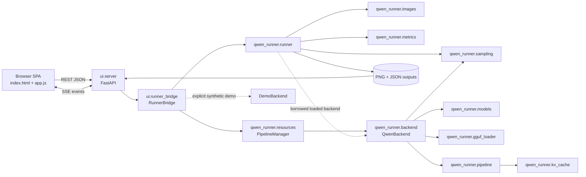

# Repository Context

Last updated: 2026-09-24 (Asia/Dhaka)

## Project Overview

`qwen_workflow_runner` is a Python implementation of a ComfyUI Qwen Image 2.1 workflow with two entry surfaces:

- A command-line runner (`run.py`) backed by `qwen_runner`.
- A FastAPI application (`ui`) with a vanilla HTML/CSS/JavaScript single-page interface, background execution, SSE progress events, model discovery/download/upload, output history, and image comparison.

The core production backend loads the Qwen Image 2.1 Diffusers pipeline and reproduces the source workflow's image conditioning, Euler flow sampling, optional GGUF transformer loading, KV caching, output persistence, and run metadata. The web server retains one compatible production pipeline per device through a shared `PipelineManager`; the web layer also contains a synthetic `DemoBackend` intended for quick UI testing.

The active checkout is `/mnt/lab/farzine/qwen_workflow_runner`. The path originally supplied as the primary checkout, `/mnt/lab/farzine/projects/qwen_workflow_runner`, did not exist during the audit. The Git remote is `https://github.com/Farzine/qwen_workflow_runner.git`.

## Repository Map

| Path | Purpose |
| --- | --- |
| `run.py` | CLI entry point for legacy conditioning sequences or explicit multi-input generation batches. |
| `benchmark.py` | Repeated benchmark entry point and summary writer. |
| `qwen_runner/config.py` | `ModelConfig`, `GenerationConfig`, `RuntimeConfig`, validation, and JSON serialization. |
| `qwen_runner/images.py` | Ordered conditioning-image loading, EXIF correction, resize/canvas selection, and comparison saving. |
| `qwen_runner/models.py` | Hugging Face/local model reference parsing, download/cache resolution, manifests, and model provenance. |
| `qwen_runner/gguf_loader.py` | Qwen transformer GGUF loading and tensor conversion. |
| `qwen_runner/sampling.py` | Comfy-compatible sigma schedule creation. |
| `qwen_runner/kv_cache.py` | Lossless transformer prefix KV cache and GPU/CPU placement policy. |
| `qwen_runner/pipeline.py` | Custom `WorkflowQwenImage21Pipeline`: prompt/image encoding, conditioning latent assembly, denoising, and VAE decoding. |
| `qwen_runner/backend.py` | Production `QwenBackend`: device/model initialization and pipeline invocation. |
| `qwen_runner/resources.py` | Exclusive per-device pipeline leases, compatibility keys, reuse/replacement telemetry, and shutdown cleanup. |
| `qwen_runner/metrics.py` | Inference timing and memory metrics. |
| `qwen_runner/runner.py` | End-to-end orchestration, durable JSON records, output PNG saving, comparisons, and error records. |
| `ui/app.py` | Uvicorn launcher, CLI flags, directory setup, and port selection. |
| `ui/server.py` | FastAPI routes for health, inputs, thumbnails, models, validation, runs, SSE, history, and outputs. |
| `ui/runner_bridge.py` | Background job bridge, stdout/stderr capture, event fan-out, `DemoBackend`, and backend selection. |
| `ui/templates/index.html` | Single-page UI markup. |
| `ui/static/js/app.js` | Client state, server-side image browser, ordered selection, forms, run submission, SSE, history, and comparison viewer. |
| `ui/static/css/style.css` | Three-panel desktop UI and responsive styling. |
| `tests/` | Core configuration, sampling, image, GGUF, cache, and small runtime tests. |
| `ui/tests/` | API, security, concurrency, workflow, DOM, and JavaScript state-machine tests. |
| `workflow/original.json` | Original ComfyUI workflow graph. |
| `workflow/PORTING_NOTES.md` | Workflow parity decisions and current limitations. |
| `workflow/reviewed_gguf_tensor_inventory.json` | Reviewed GGUF tensor inventory. |
| `workflow/source_manifest.json` | Source model/workflow provenance. |
| `scripts/download_examples.py` | Example input download helper. |
| `scripts/summarize_logs.py` | Durable run-log summarizer. |
| `scripts/validate_browser_production.js` | Hardware-gated Chrome DevTools driver for real UI selection, production submission, SSE/result inspection, and screenshots. |
| `VALIDATION_MATRIX.md` | Final scenario-by-scenario automated and live-hardware evidence, including remaining asset-dependent limitations. |
| `models/`, `outputs/`, `inputs/`, `.cache/` | Ignored runtime assets, results, configured inputs, and thumbnails. |

The repository had 62 tracked files and about 24,478 tracked lines at the audit. The local virtual environment and model/output data are intentionally ignored. The cached full model manifest reports approximately 33.13 GB of selected files.

## Architecture

No Graphiphy, Graphviz, `dot`, `pyreverse`, `pydeps`, or `madge` executable/tool was installed or exposed in the environment. The dependency map below was generated by parsing Python imports with `ast`, then augmented with the browser and runtime data flow. Mermaid provides the requested graph visualization in this persistent document.



The AST-derived internal import edges are:

```text
qwen_runner.backend -> qwen_runner.gguf_loader, models, pipeline, sampling
qwen_runner.pipeline -> qwen_runner.kv_cache
qwen_runner.runner -> qwen_runner.backend, images, metrics, sampling
ui.app -> ui.server
ui.server -> qwen_runner.config, qwen_runner.models, ui.runner_bridge
ui.runner_bridge -> qwen_runner.backend, qwen_runner.config, qwen_runner.resources, qwen_runner.runner, ui.server
```

### Current request flow

```mermaid
sequenceDiagram
    participant U as User
    participant JS as app.js
    participant API as FastAPI
    participant B as RunnerBridge
    participant R as qwen_runner.runner
    participant E as Selected backend
    participant F as Filesystem

    U->>JS: Select/upload ordered inputs and optional references
    JS->>API: POST /api/run (model, generation, runtime, demo_mode)
    API->>API: Build Config and validate image paths
    API->>B: submit_run(config, demo_mode)
    B->>B: resolve_backend_factory
    B->>B: acquire exclusive per-device pipeline lease
    B->>E: load or reuse compatible backend; switch LoRA if needed
    B->>R: run(config, borrowed loaded backend)
    loop Each explicit input (legacy requests have one)
        R->>F: Load [current input, ordered shared references]
        R->>E: generate(images, canvas, seed)
    end
    alt DemoBackend
        E->>E: Resize/blend images[0] and draw overlays
    else QwenBackend
        E->>E: Start from seeded CPU noise, condition on all images, denoise, decode
    end
    R->>F: Save PNG, optional comparison, and JSON record
    B-->>API: Status/log/progress events
    API-->>JS: SSE complete event and output URLs
    JS-->>U: Display generated image and comparison
```

### Production inference flow

1. New callers use `GenerationConfig.input_images` plus `reference_images`. The runner expands these into one inference per input with `[current_input, *reference_images]`. Legacy `images` remains one combined sequence whose first image is the input/canvas.
2. `load_references` opens each expanded conditioning sequence with Pillow, applies EXIF orientation, converts to RGB/RGBA, rounds sizes to model-compatible values, and returns images plus canvas metadata.
3. `PipelineManager` exclusively leases the selected device for the complete job. It reuses a compatible resident backend or unloads only that device's prior backend before calling `QwenBackend.load`. Compatible requests can change LoRA state without rebuilding base weights.
4. `QwenBackend.load` validates the selected device, resolves the main model and optional companion files, loads a Diffusers or supported GGUF transformer, builds `WorkflowQwenImage21Pipeline`, installs the flow-matching scheduler, and applies device/offload settings.
5. `QwenBackend.generate` constructs deterministic CPU `float32` noise, applies the configured sigma schedule, packs the empty starting latent, and supplies the prompt and all conditioning images to the pipeline.
6. The pipeline encodes text and images with Qwen3-VL and the VAE, concatenates reference conditioning, denoises only the generated target latent, and decodes it to PIL images.
7. `qwen_runner.runner.run` preserves input order, uses the same seed for all inputs in a repeat, and saves one durable record/output group per input attempt. Explicit multi-input jobs isolate ordinary per-input failures and report mixed outcomes as `partial_success` through the API.

The original ComfyUI graph follows the same broad semantics: its `KSampler` receives an empty latent selected by the graph's switch, while the loaded images feed `TextEncodeQwenImage21` as conditioning. It does not use the first image as the starting latent.

## Current Goal

Extend the validated Qwen workflow into a production-quality management application with authoritative compatible-model selection, efficient per-device resource reuse, observable downloads, safe deletion, human-readable records, dedicated batch workflow, and task-oriented responsive pages.

## Active Task

Expanded Phase 9.1 is complete: the web server now owns one persistent compatible production pipeline per device, reuses it under an exclusive job lease, reports live cache state, and explicitly unloads resources during server shutdown.

## Completed Tasks

- [x] Inspected Git state, tracked source, documentation, workflow artifacts, entry points, tests, runtime directories, and recent history.
- [x] Mapped frontend, API, job bridge, core model, sampling, image, caching, persistence, and output-display flows.
- [x] Generated an AST-based dependency graph and Mermaid architecture/inference visualizations because specialized graph executables were unavailable.
- [x] Traced UI input through preprocessing, backend selection, inference, saving, history, and result display.
- [x] Studied and compared the reference `klein_generic_infer.py` implementation.
- [x] Identified and empirically validated the immediate same-image root cause.
- [x] Diagnosed the runtime condition preventing the production backend from loading.
- [x] Established baseline core, targeted UI, and JavaScript validation.
- [x] Created the persistent repository context and prioritized modular plan.
- [x] Made production inference the UI/API/bridge default and made synthetic demo mode an explicit opt-in.
- [x] Removed the CUDA-dependent fallback from real requests to `DemoBackend`.
- [x] Added a reusable runtime capability probe, `/api/system`, visible header/footer readiness, and actionable production setup errors.
- [x] Added strict `demo_mode` validation and tests proving a production request cannot be reported as demo output.
- [x] Updated synthetic E2E fixtures to request demo mode explicitly and completed the full UI suite.
- [x] Replaced the incompatible CUDA 13 PyTorch runtime with a locally verified CUDA 12.6 stack while retaining the prior packages for rollback.
- [x] Verified both RTX A6000 GPUs, BF16 execution, explicit device selection, `/api/system`, and the runtime class check.
- [x] Completed the first real cached-model inference with `QwenBackend` and proved that the output is a prompt-directed transformation rather than a copied input.
- [x] Exercised real production inference through `/api/run`, SSE, run history, record retrieval, output serving, and comparison serving with matching hashes.
- [x] Validated ordered two-reference propagation on both GPUs and isolated native 4000x6000 reference sizing as the cause of unusable output and extreme memory use in the failing case.
- [x] Proved the second reference materially changes inference and documented the remaining reference-adherence quality limitation.
- [x] Added explicit ordered `input_images` and `reference_images` fields while retaining the legacy combined `images` contract.
- [x] Expanded explicit requests into one independently recorded generation per process input using `[current_input, *reference_images]` and one shared model load.
- [x] Preserved repeat seed semantics, input/reference order, per-input output/comparison metadata, and legacy setup-error behavior.
- [x] Added API aggregation for all multi-input artifacts and `partial_success` records when one input fails while later inputs succeed.
- [x] Added core, runner, API, SSE, and compatibility coverage for explicit image batches and documented the CLI/REST contract.
- [x] Added atomic, confined multi-image upload with content decoding, extension/format matching, size/count/pixel limits, collision-safe names, and actionable validation errors.
- [x] Replaced the combined browser tray with independent ordered process-input and shared-reference state, controls, previews, counts, reordering, removal, and role-aware upload/drop behavior.
- [x] Made the browser emit only explicit `input_images`/`reference_images`, retain non-enumerable migration aliases for embedded integrations, display every successful batch artifact, and preserve outputs during `partial_success` failures.
- [x] Restored narrow-screen access to the input panel and validated desktop/narrow rendering with headless Chrome in addition to DOM, accessibility, API, and JavaScript state-machine coverage.
- [x] Added optional LoRA path/strength configuration, CLI overrides, validation, and durable requested/effective adapter metadata.
- [x] Added confined LoRA directory discovery plus streamed, size-limited, atomic SafeTensors upload with A/B or down/up tensor-pair validation and actionable invalid-file diagnostics.
- [x] Applied one named, unfused Qwen transformer LoRA through Diffusers/PEFT, verified activation and strength, supported explicit unload/replacement, and included the adapter SHA-256 in run records.
- [x] Added a separate browser LoRA catalog with refresh, upload/drop, selection, strength, clear state, invalid-entry visibility, and production/demo application messaging.
- [x] Proved actual adapter application with a real tiny Qwen Image 2.1 transformer and completed the core, API, DOM, and JavaScript regression suites.
- [x] Extended the shared runtime probe with CPU/RAM inventory and live per-GPU total/free/used plus process-allocated/reserved memory without loading model weights.
- [x] Added a dedicated System tab with dynamically discovered CPU, MPS, and CUDA choices, readiness diagnostics, software/host summaries, GPU memory cards, and explicit next-run configuration application.
- [x] Exposed truthful per-run model lifecycle state, including active requested model/device/LoRA and effective last-run metadata when held by the current server process.
- [x] Recorded production device/offload metadata and verified both RTX A6000 GPUs accept BF16 allocation and report ready through the same probe used by `QwenBackend`.
- [x] Completed Phase 5 core, API, DOM, JavaScript, full UI regression, and live desktop/narrow rendering validation.
- [x] Added a compact Inputs → Configure → Results navigator for tablet and phone layouts, including direct section jumps on phones and a focused Results drawer on tablets.
- [x] Added accessible Results drawer state, backdrop/click/Escape dismissal, focus restoration, run/output `aria-busy` state, and a visible running spinner.
- [x] Moved validation feedback into normal document flow so it no longer covers configuration tabs, and preserved actionable alert content with bounded scrolling.
- [x] Fixed the folder-chip class mismatch, bounded large folder lists, restored readable truncation, made gallery empty/loading states span the grid, and validated live desktop/tablet/phone rendering.
- [x] Added keyboard-, hover-, click-, and touch-accessible information controls for 41 generation, runtime, device, model, LoRA, output, and demo settings.
- [x] Derived every help entry from the implemented config, image resizing, sigma schedule, KV cache, runner, model loader, and validated production behavior, including higher/lower effects, ranges, interactions, and resource trade-offs.
- [x] Corrected the negative-prompt activation text to match `CFG != 1`, added an explicit native-resolution VRAM warning, and corrected the float32 option description.
- [x] Validated help discovery, content, focus/Escape behavior, click/touch dismissal, advanced-model coverage, and desktop/phone collision handling in a real browser.
- [x] Completed the documented Phase 8 validation matrix across inputs, references, LoRA, GPUs, inference, outputs, UI states, responsive layouts, and parameter help.
- [x] Drove a real two-input plus one-reference production batch through the actual browser controls on `cuda:0`, observed SSE completion at 100%, rendered both outputs/comparison/history, and verified every durable artifact.
- [x] Quantified both full-model outputs against their respective sources, confirming record hashes and 97.47%/98.30% changed pixels at the selected threshold.
- [x] Reconciled the root/UI/project/porting documentation with final behavior, evidence, supported launch/test commands, and remaining asset-dependent limits.
- [x] Added `PipelineManager` with one exclusive cache slot per normalized device, exact compatibility keys, safe replacement, load/reuse counters, failure recovery, snapshots, manual unload, and idempotent shutdown.
- [x] Reused compatible full-model pipelines across web jobs and switched or rescaled LoRAs without rebuilding matching base weights.
- [x] Added FastAPI shutdown draining and explicit Diffusers hook removal, CPU transfer, reference release, garbage collection, CUDA synchronization, and allocator cleanup.
- [x] Exposed resident model/device/LoRA and cache lifecycle state through `/api/system` and the System page.
- [x] Proved full-model cache reuse with two real `cuda:0` jobs and a single model load, then verified the manager slot becomes empty after shutdown.

## Remaining Tasks

- [x] Phase 2.1: make real/demo selection explicit, default to real inference, eliminate silent fallback, and add runtime capability diagnostics.
- [x] Phase 2.2: install/use a PyTorch build compatible with the NVIDIA driver (or update the driver), then run and validate real Qwen inference at a safe resolution.
- [x] Phase 2.3: verify actual transformation quality, parameter propagation, image conditioning, persistence, and UI display with the full model.
- [x] Phase 3.1: introduce separate ordered `input_images` and `reference_images` request concepts; define each input as an independently generated output while applying the chosen reference set.
- [x] Phase 3: add multi-file image upload, drag-and-drop, previews, ordering, individual removal, validation, and clear empty/error states.
- [x] Phase 4: add LoRA directory discovery, validated upload, selection, active-state reporting, backend loading/application, metadata, and tests.
- [x] Phase 5: add system/GPU inventory and configuration API/page; validate and honor manual device selection.
- [x] Phase 6: reorganize the UI around the production workflow and improve responsive behavior, accessibility, loading, progress, and long-list states.
- [x] Phase 7: add implementation-backed information controls for all meaningful parameters.
- [x] Phase 8: run the complete input/reference/LoRA/GPU/inference/UI validation matrix, fix remaining failures, and stabilize documentation.
- [x] Phase 9.1: add reusable per-device pipeline ownership, LoRA-aware reuse, concurrency protection, lifecycle telemetry, and shutdown cleanup.
- [ ] Phase 9.2: make a stable, compatible downloaded-model catalog selection authoritative for inference; remove advanced-field authority and expose incompatibility reasons.
- [ ] Phase 9.3: add truthful byte/file-aware Hugging Face download progress, retry/cancel state, and responsive background behavior.
- [ ] Phase 9.4: add safe model, LoRA, output, and run deletion APIs plus confirmed UI actions and active-resource conflicts.
- [ ] Phase 9.5: introduce a versioned common run metadata model and human-readable history/output details while preserving legacy record reads.
- [ ] Phase 9.6: add aggregate batch operations, per-item stages, counts, timing, ETA, failures, and result inspection based on the reference workflow concepts.
- [ ] Phase 9.7: reorganize the SPA into Dashboard, Models, LoRAs, Inference, Batch, History, Outputs, and System views with responsive task navigation.
- [ ] Phase 9.8: run the expanded regression/hardware/browser matrix and reconcile all documentation.

## Current Problems

### Inference truthfulness

- Production is now the default in HTML, client state, request payloads, API handling, and `RunnerBridge`.
- `resolve_backend_factory(False)` always selects `QwenBackend`; CUDA failure produces a setup error instead of demo output.
- Synthetic demo remains available only through the unchecked UI toggle, `demo_mode: true`, `--demo`, or `DEMO_MODE=1`, and the UI labels it as input-derived with no model inference.
- `demo_mode` must be a JSON boolean, preventing strings such as `"false"` from being treated as true.
- The same-image symptom is contained to the clearly labeled synthetic mode. A real request can no longer return a successful demo image silently.

### Runtime state

- NVIDIA kernel driver 560.28.03 exposes CUDA 12.6 and two RTX A6000 GPUs with about 48 GiB each.
- The project environment now uses PyTorch `2.11.0+cu126`, torchvision `0.26.0+cu126`, Triton `3.6.0`, and setuptools `81.0.0`; `pip check` reports no broken requirements.
- The previous CUDA 13 package directories are preserved at `.venv/runtime-backups/cu130-20260923/site-packages` for local rollback.
- Filesystem-sandboxed commands cannot see `/dev/nvidia*`; GPU diagnostics and inference must run with host device access. This isolation explained the earlier sandboxed `nvidia-smi` failure.
- GPU 0 was using about 40 GiB during the smoke test, so the validated run explicitly selected the otherwise free `cuda:1` device.
- `/api/system` now reports the host CPU name/core counts, system RAM, Python/PyTorch/CUDA versions, dynamically available CPU/MPS/CUDA devices, compute capability, and per-GPU total/free/used and process memory. Probe failures remain diagnostic data rather than crashing the endpoint.
- The browser System tab builds its selector from that report. Apply Configuration writes the selected device/dtype/offload into the exact `RuntimeConfig` sent by the next run; CPU is normalized to float32/no-offload and MPS to no-offload.

### Inputs and references

- The browser now maintains up to ten ordered process inputs and nine ordered shared references in separate sections. Gallery clicks and multi-file uploads target the visibly selected role; both lists provide previews, counts, ordering, individual removal, clear actions, distinct empty states, and ellipsized long names while retaining the full original upload name in the card metadata.
- `POST /api/inputs/upload` validates one to ten decoded JPEG/PNG/WebP/BMP/GIF files atomically, enforces a 64 MiB per-file and 100-megapixel limit, matches detected content to the extension, sanitizes names, and confines collision-safe files to `inputs/uploads`.
- The client emits only `generation.input_images` and `generation.reference_images`. Non-enumerable `selected`/`images` aliases preserve older embedded tests/integrations without reintroducing the retired field into request JSON.
- Successful batch outputs retain their per-input source and comparison metadata. `partial_success` renders those outputs, uses a warning state, and surfaces every failed input in the alert and terminal.

### LoRA and device management

- One local Qwen Image adapter is now supported. The UI discovers `.safetensors` files from `models/loras/` (or `LORAS_DIR`/`--loras-dir`), preserves invalid discoveries with diagnostics, validates uploads, and submits the selected absolute path plus a 0–2 strength.
- `QwenBackend` loads the adapter locally under the fixed name `qwen_workflow_lora`, calls `set_adapters` with the requested strength, verifies it is active, keeps it unfused, and records its path, filename, hash, scale, active/available adapter state, and application status. Demo mode explicitly records that a selected adapter was not applied.
- PEFT 0.21.0 is now an explicit runtime dependency. A real tiny Qwen transformer test proves that enabling the saved adapter changes transformer-layer output and that clearing the selection unloads it. Full pretrained inference with a user-supplied production LoRA remains part of the final validation matrix because no compatible LoRA asset is bundled.
- The static device list has been replaced. Only devices reported by the runtime are offered, while a configured unavailable device remains visible with a blocked diagnostic. The page shows both A6000s independently and the selected choice is used by `QwenBackend` through `torch.cuda.set_device` and exact pipeline/offload placement.
- The web runner now retains one compatible production backend per normalized device (`cuda` aliases `cuda:0`). A device lease spans the complete job, so a model or LoRA cannot be replaced during an active batch. The existing executor remains single-worker, while per-device locking keeps the cache safe if scheduling expands later.
- Pipeline compatibility includes backend type, model source/revision/file/quantization, companion and text-encoder sources, cache directory, device, dtype, offload, and VAE tiling. Generation/image parameters and LoRA selection are deliberately excluded so compatible weights can be reused.
- Server shutdown rejects new submissions, drains queued work, unloads adapters and Diffusers hooks, moves remaining components to CPU where possible, drops pipeline references, runs garbage collection, synchronizes CUDA, and clears allocator/IPC caches.

### Validation and maintainability

- The completed-job SSE hang was caused by running Starlette `TestClient` inside the restricted command sandbox. The exact test and full UI suite pass with the local IPC/loopback access already required by these tests; no streaming code change was needed.
- Backend choice is explicit. The new runtime probe validates the selected device/dtype/offload combination before model loading and returns the same actionable message used by `QwenBackend`.
- Every meaningful configuration field now has a consistent information control backed by verified implementation behavior. Validation remains inline and outside the help cards.
- The UI suite contains 417 tests after Phase 7 and completes in about 20 seconds when local loopback sockets are permitted.

### Responsive workflow UI

- Desktop retains the three-panel workspace. Validation errors now consume a bounded row between the header and workspace, so the alert cannot cover configuration tabs or controls.
- Widths from 769–1024 px show an Inputs/Configure/Results navigator. Results opens the existing output panel as a modal-style drawer with a backdrop, focused close control, Escape dismissal, and truthful `aria-expanded` state.
- Widths up to 768 px keep all panels in document flow and expose the same navigator as a fixed bottom bar. Configure and Results scroll/focus their target panels directly, avoiding the previous requirement to traverse the entire input panel.
- Starting a run now marks both the launch button and output panel busy, adds a spinner, and exposes the Results state; tablet runs reveal the output drawer automatically.
- The dynamic input browser creates `subfolder-chip` elements. Its stylesheet previously targeted only `folder-chip`, producing default white buttons and allowing a large folder set to consume most of the input panel. Both classes now share bounded, ellipsized dark-theme styling.

### Parameter guidance

- A shared `role="tooltip"` card is populated from a 41-entry registry. Each runtime-created information button has an accessible name, `aria-controls`, `aria-describedby`, and truthful expanded state while preserving the static 208-ID DOM contract.
- Help opens on hover, keyboard focus, click, or touch. It closes after pointer/focus departure, outside interaction, scrolling, resizing, or Escape; Escape returns focus to the triggering button.
- The card uses collision-aware fixed positioning on desktop and a bounded, scrollable full-width layout on phones. Required validation messages never depend on the help card.
- Content covers prompt image-token order, negative conditioning, steps/strength/schedule behavior, seed/repeat semantics, resolution/canvas sizing, batch multiplication, RGB/RGBA handling, lossless KV-cache placement, VAE tiling, warmup artifacts, memory polling, output confinement, device/dtype/offload constraints, model compatibility, LoRA application, offline mode, and synthetic demo limitations.

## Important Technical Findings

### Root cause evidence

- There were 426 pre-fix durable `*_run_*.json` records in `outputs`; all 426 identify `DemoBackend` and demo mode. New production validation records under `/tmp/qwen-ui-*` now prove successful `QwenBackend` inference without mixing diagnostics into the user's output history.
- The latest record, `outputs/20260923T093734_6af8c9910b_run_000.json`, reports `DemoBackend`, `WorkflowQwenImage21Pipeline[Demo]`, and an inference time of about 0.009 seconds for a 960x1280 image.
- The latest source/output diagnostic measured whole-image MAE 27.7122, RMSE 46.6755, and correlation 0.834826. Excluding the demo header/footer regions, source/output correlation rises to 0.991248 with MAE 17.7808. This matches the backend's 85% source-image blend and proves that the apparent non-transformation occurs before production inference.
- Before Phase 2.1, calling `resolve_backend_factory(False)` returned `DemoBackend` in this environment. It now returns `QwenBackend` and raises the documented CUDA compatibility setup error during `load()`.
- The production backend's generation path does not directly return an input image. It starts from seeded noise and passes all references only as conditioning, consistent with the original graph.

### Model and workflow findings

- The cached full Diffusers snapshot has a valid manifest for the selected files at model revision `790c926...`; model absence is not the immediate cause of demo output.
- `QwenBackend` supports full Diffusers directories, a supported GGUF transformer plus companion model, and floating-point single-file transformer weights. It intentionally rejects incompatible older Qwen pipeline classes and Comfy `int8_convrot` files.
- The core applies the requested `runtime.device` with `torch.cuda.set_device` or pipeline placement/offload. The System tab now discovers available devices and validates the exact requested placement before submission.
- Output persistence is structurally sound: generated PIL results are saved, hashed, recorded, and exposed through output APIs. In the failing scenario the wrong backend produced the image; saving/display did not replace a valid production result with the input.
- `qwen_runner.system.probe_runtime_capabilities` reports Python/PyTorch versions, CUDA/MPS state, devices, diagnostics, and readiness for the requested device/dtype/offload without loading model weights.
- `/api/system` adds explicit server demo-default metadata. The browser uses this endpoint at startup and whenever the selected device changes.
- Host-side runtime validation now sees both A6000s, completes a BF16 matrix multiplication on `cuda:0`, and reports production readiness for the requested CUDA device.
- The first real run used `cuda:1`, `bfloat16`, model CPU offload, a 256x256 canvas, four steps, one conditioning image, and cached revision `790c92633540aa0cb11d9abf19eb46d861714758`.
- That run completed with `WorkflowQwenImage21Pipeline` in 43.2568 inference seconds. The watercolor result preserved the subject while visibly applying the prompt; against the resized source it measured MAE 38.2183, RMSE 55.2425, and a changed-pixel fraction of 1.0.
- The durable smoke record is `/tmp/qwen-real-smoke/20260923T125112_2a61ac789a_run_000.json`; its output SHA-256 is `32b1c1132ead2daf84c66666e39cd508cf98a412ff09b2dbfdee73c1cbafbb5a`.
- The production web-path run `/tmp/qwen-ui-production/20260923T132805_5052093b2e_run_000.json` completed on `cuda:0` in 19.2492 seconds. SSE, record, history, output, and comparison endpoints all succeeded, and the served PNG hash matched the SSE and durable record (`9b1694ec...`).
- Its colored-pencil output differed from the resized input with MAE 42.6208, RMSE 65.0392, changed-pixel fraction 0.999985, and correlation 0.662812.
- An unbounded two-reference run kept a 4000x6000 second image at native size, peaked at 39.84 GB allocated / 48.47 GB reserved GPU memory, took 137.05 seconds with cache and decoded an unusable textured frame. The cache-disabled control took 313.02 seconds and decoded an almost uniform frame.
- Setting `generation.resolution=512` resized the same ordered references to 608x416 and 416x640. The result became coherent, inference fell to 17.00 seconds, and GPU peak allocation fell to 18.38 GB.
- A bounded 25-step two-reference run finished in 18.26 seconds with KV caching. Against an otherwise identical one-reference control, the second reference changed 85.8063% of pixels (MAE 28.6991, correlation 0.748863), proving it reaches model conditioning. In this sample the requested dark hairstyle appeared only in the text-only control, so reference adherence remains a quality limitation rather than a transport failure.
- Explicit image mode is selected whenever either new field is non-null. `input_images` must contain 1-10 non-empty paths; `reference_images` may contain 0-9, preserving the model's ten-image conditioning limit. Explicit fields take precedence over a serialized legacy `images` value, so validated configs round-trip without ambiguity.
- When explicit image mode is active, `Config.as_dict()` serializes the inactive legacy `images` field as `[]`; API responses and durable records therefore cannot imply that ignored default example paths participated in inference.
- A request with two inputs and two references expands deterministically in input order. Each repeat uses one seed for all inputs; `increment_seed` advances between repeats. Tests prove the backend `load()` hook runs once across the expanded batch and each backend call receives exactly `[current_input, *references]`.
- Legacy corrupt-image requests still decode before backend loading and write `*_setup_error.json`. Explicit multi-input requests decode per input, write a durable error record for a corrupt item, continue ordinary `Exception` failures, and retain successful later outputs. Process-level interruptions continue to propagate.
- Installed Diffusers `0.41.0.dev0` exposes `QwenImageLoraLoaderMixin` on `WorkflowQwenImage21Pipeline`. Its supported lifecycle is `load_lora_weights(..., adapter_name=...)`, `set_adapters(..., adapter_weights=...)`, `get_active_adapters()`, `get_list_adapters()`, and `unload_lora_weights()`.
- The production loader passes the adapter directory and exact filename with `local_files_only=True` and `use_safetensors=True`; it never treats an adapter as a full transformer checkpoint and never contacts the Hub for a local selection.
- SafeTensors upload validation reads only the header/key inventory, requires a matching LoRA A/B or down/up pair, and rejects ordinary model tensors. This catches corrupt and obviously wrong files early, while architecture/shape compatibility remains authoritatively checked by Diffusers during model loading.
- A PEFT-generated adapter saved through `WorkflowQwenImage21Pipeline.save_lora_weights` loaded into a real tiny `QwenImage21Transformer2DModel`, became the sole active adapter at strength 0.7, changed the layer output, produced matching SHA-256 metadata, and unloaded without residual adapters.
- The live Phase 5 probe reported a 12th Gen Intel i9-12900K (16 physical/24 logical cores), about 125.6 GiB RAM, PyTorch `2.11.0+cu126`, CUDA runtime 12.6, and two RTX A6000 GPUs with compute capability 8.6 and about 47.4 GiB each.
- At validation time `cuda:0` reported about 33.8 GiB free and `cuda:1` about 45.8 GiB free. A BF16 tensor allocation completed after explicitly calling `torch.cuda.set_device` on each GPU, and both selected-device reports returned production `ready: true`.
- `QwenBackend.load` already honored `runtime.device`; Phase 5 made that contract visible and testable. It calls `torch.cuda.set_device(device)` before loading, passes the same device to Accelerate model/sequential offload or `pipe.to(device)`, and now records `device` and `offload` in backend metadata.
- `RunnerBridge.runtime_snapshot` now reports truthful persistent per-device slots, lease state, requested model identity, active LoRA, pipeline type, load/reuse counts, timestamps, and last error alongside active/last-run state.
- A live two-job `cuda:0` validation loaded `WorkflowQwenImage21Pipeline` once: record one reported `reused: false`, `load_count: 1`; record two reported `reused: true`, `load_count: 1`, `reuse_count: 1`. Inference completed in 15.33 and 14.70 seconds. Explicit shutdown emptied the slot and reduced the 18.8 GB peak allocation to about 9.6 MB allocated/20 MB reserved inside the still-running validation process; process exit releases the remaining CUDA context allocation.
- Phase 6 headless-Chrome assertions proved the validation alert ended before the workspace without intersecting tabs, the tablet Results drawer opened with close focus and closed with Escape, and the phone navigator jumped to Configure/Results while remaining fixed at the viewport bottom.
- The pipeline activates negative conditioning when a negative prompt exists and `true_cfg_scale != 1`; the earlier UI badge incorrectly said `CFG > 1`. Phase 7 corrected both the inline text and help content to the exact implemented condition.
- Denoise strength selects the tail of the flow schedule while generation still starts from CPU float32 noise; it does not blend input pixels. The help system calls this out to prevent treating Strength like conventional image-to-image blending.
- Phase 7 headless-Chrome assertions found exactly 41 unique help triggers with valid targets. Focus opened Denoising Steps help, Escape closed it with focus retained, the advanced model help exposed compatibility limits, and the 390x844 Reference Resolution card remained within the viewport while displaying the native-size VRAM warning.

### State and repository findings

- Audit start: branch `main`, commit `52e353e`, matching `origin/main`, with a clean tracked working tree.
- Current Phase 9.1 checkpoint: branch `main`, commit `be41eb4`, matching `origin/main`; Phase 9.1 changes are uncommitted and listed under **Files Modified**.
- Phase 8 was committed as `be41eb4`; Phase 7 as `7e8867f`; Phase 6 as `f923e2f`; Phase 4 and Phase 5 together as `593f631`; Phase 3.2 as `c1b1bb9`.
- Runtime assets are large but ignored: the local environment, models, outputs, and cache must not be treated as source changes.
- The FastAPI job executor is intentionally single-worker. It captures process stdout/stderr and publishes events to per-run SSE subscribers.

## Reference Implementations

### `/mnt/lab/farzine/projects/Nunchaku-Generic-Form/klein_generic_infer.py`

This 528-line script is a client for a remote Flux.2 Klein inference service; it is not a local Qwen Image 2.1 implementation.

It:

1. Scans an input folder and processes images one at a time.
2. Uploads each base image to `/flux-klein-generic`, retains the returned identifier, and submits later jobs through `/flux-klein-generic-from`.
3. Represents an optional reference image separately in prompt metadata (`ref_image#...`).
4. Sends an optional `adapter_name` separately, providing a simple LoRA/adapter selection concept.
5. Polls `/status`, downloads the service-produced image from `/download`, and writes original, processed, comparison, and metadata artifacts.
6. Retries by removing adapter and reference options if those optional features fail.
7. Delegates device, GPU, and model loading to the remote service.

Useful concepts to adapt are the separation of base input from optional reference, one result per source input, explicit adapter state, visible polling/errors, and preserving both generated artifacts and metadata. Its endpoints, Flux prompt contract, retry semantics, and remote device handling cannot be copied into the local Qwen pipeline.

### Current implementation comparison

| Concern | Reference script | Current project | Implication |
| --- | --- | --- | --- |
| Input processing | Iterates independent base images | Core/API and browser expand ordered `input_images` into independent durable generations and results | Phase 8 proved two ordered inputs through the real browser/full-model path. |
| References | Separate optional reference field | Browser and API keep ordered shared `reference_images` separate and preserve `[input, *references]` conditioning order | The transport and UI distinction are complete; adherence quality remains model/prompt dependent. |
| LoRA | Sends optional `adapter_name` | Discovers/uploads one local SafeTensors adapter, applies it through Diffusers/PEFT, and records effective state | Full pretrained testing requires a compatible user adapter; invalid/load failures are explicit. |
| Device/model | Remote service owns them | Local `QwenBackend` owns them | Local capability reporting and strict device errors are required. |
| Execution | Always requests remote inference | Production by default; synthetic demo requires explicit opt-in | Continue validating the real backend through the complete UI/API path. |
| Result | Downloads service output | Saves backend PIL output | Current persistence can remain after backend selection is fixed. |

## Files Modified

- `CONTEXT.md` — updated persistent architecture, completed work, validation, blockers, and next action.
- `requirements-cu126.txt` — added the exact CUDA 12.6 PyTorch/torchvision profile proven on this host.
- `README.md` — documented the verified CUDA runtime plus explicit multi-input/reference semantics, limits, seed policy, and CLI example.
- `run.py` — added mutually exclusive `--input-images` and legacy `--images` modes plus shared `--reference-images` validation.
- `qwen_runner/config.py` — added backward-compatible explicit image fields, deterministic resolution/precedence, limits, path validation, and legacy interpretation.
- `qwen_runner/runner.py` — added model-sharing multi-input expansion, per-input records and metadata, deterministic run IDs/seeds, and isolated partial failures while retaining legacy setup behavior.
- `qwen_runner/system.py` — added reusable, JSON-safe runtime/device capability probing.
- `qwen_runner/backend.py` — made `QwenBackend` consume the shared readiness result before loading weights.
- `ui/runner_bridge.py` — removed implicit demo fallback, changed defaults to production, and aggregated multi-input outputs/comparisons/errors with `partial_success` status.
- `ui/server.py` — added `/api/system`, explicit server demo defaults, strict `demo_mode` boolean handling, and explicit input/reference validation.
- `ui/app.py` — made `--demo`/`DEMO_MODE` the explicit server-default controls.
- `ui/static/js/app.js` — defaulted to real inference, queried runtime readiness, updated visible mode status, and sent explicit booleans.
- `ui/templates/index.html` — unchecked and relabeled synthetic demo mode; added truthful initial runtime text.
- `ui/static/css/style.css` — added a warning state for a connected server with a blocked production runtime.
- `ui/README.md`, `PROJECT.md` — documented production defaults, `/api/system`, strict mode semantics, removal of fallback behavior, and the new batch request/response contract.
- `tests/test_system.py` — added runtime probe tests.
- `tests/test_core.py`, `tests/test_runtime.py` — added image-contract boundary, ordering, shared-load, seed, record, and partial-failure tests.
- `ui/tests/test_backend.py`, `ui/tests/test_frontend.py` — added backend-selection, API contract, default-mode, UI truthfulness, multi-input SSE, and partial-success tests.
- `ui/tests/e2e/common.py`, `ui/tests/e2e/test_tier4_scenarios.py` — made synthetic E2E intent explicit after changing the production default.

Phase 3.2 additions to the cumulative files above:

- `ui/server.py` — added the confined, atomic `/api/inputs/upload` endpoint and image validation limits.
- `ui/templates/index.html` — added the role selector, upload/drop control, and separate process-input/reference sections and labels.
- `ui/static/js/app.js` — added explicit independent state, role-aware selection/upload, ordered list controls, explicit request serialization, all-output mapping, output-specific comparisons, and partial-success presentation.
- `ui/static/css/style.css` — styled uploads, role/selection states, both ordered galleries, batch thumbnails, and usable stacked narrow-screen panels/header.
- `ui/README.md` — documented the completed input/reference workspace, upload endpoint, validation behavior, and batch completion shape.
- `ui/tests/test_backend.py` — added valid multi-upload, atomic rejection, content mismatch, empty/unsupported input, traversal-name confinement, count, and size-limit coverage.
- `ui/tests/test_frontend.py`, `ui/tests/test_tier5_frontend_stress.py` — updated the DOM/accessibility contract for the new controls.
- `ui/tests/test_challenger_m2_node.js`, `ui/tests/test_tier5_node_stress.js` — migrated assertions to explicit roles and added upload destination, request JSON, independent limits, and partial-success output tests.

Phase 4 additions to the cumulative files above:

- `requirements.txt` — added the PEFT 0.21.0 runtime dependency required by the Diffusers LoRA loader.
- `qwen_runner/config.py`, `run.py` — added optional `lora_path`/`lora_scale` configuration, validation, serialization, and `--lora`/`--lora-scale` overrides.
- `qwen_runner/backend.py` — added local adapter loading, strength activation, active-state verification, unloading, clear load failures, and file-hash/application metadata.
- `qwen_runner/runner.py`, `ui/runner_bridge.py` — added PEFT environment provenance and durable effective LoRA state, including truthful not-applied metadata in synthetic demo mode.
- `ui/server.py`, `ui/app.py` — added configurable LoRA storage, discovery, SafeTensors inspection, streamed atomic upload, API path confinement, and validation.
- `ui/templates/index.html`, `ui/static/js/app.js`, `ui/static/css/style.css` — added the separate adapter catalog, upload/drop control, selector, strength control, active state, client API methods, and responsive styling.
- `tests/test_core.py`, `tests/test_runtime.py` — added configuration boundaries and a real tiny-Qwen adapter lifecycle/output-effect test.
- `ui/tests/test_app.py`, `ui/tests/test_backend.py`, `ui/tests/test_frontend.py`, `ui/tests/test_challenger_m2_node.js`, `ui/tests/test_tier5_frontend_stress.py`, `ui/tests/test_tier5_adversarial.py` — added CLI/API/upload/selection coverage and updated DOM/state-machine contracts.
- `README.md`, `ui/README.md`, `PROJECT.md`, `workflow/PORTING_NOTES.md` — documented supported adapter scope, commands, API endpoints, directory controls, scale semantics, metadata, demo behavior, and limitations.

Phase 5 additions to the cumulative files above:

- `qwen_runner/system.py` — added CPU/core and RAM inventory plus per-GPU free/used/process memory, selected-device memory details, and resilient diagnostics.
- `qwen_runner/backend.py` — recorded the effective production device and offload mode alongside existing pipeline metadata.
- `ui/runner_bridge.py`, `ui/server.py` — added truthful per-run active/last model and LoRA state to `/api/system` without implying a persistent resident model.
- `ui/templates/index.html` — moved device/dtype/offload controls into a dedicated System tab with readiness, CPU/RAM/software, GPU inventory, Apply Configuration, and lifecycle sections.
- `ui/static/js/app.js` — added dynamic device options, system rendering, compatibility normalization, inventory refresh, explicit next-run application, lifecycle rendering, and `#system` deep-link support.
- `ui/static/css/style.css` — added GPU memory cards, readiness states, system summary/lifecycle layouts, scrollable tab navigation, and narrow-screen stacking.
- `tests/test_system.py`, `ui/tests/test_backend.py` — added deterministic GPU-memory inventory, host capacity, API state, and active/effective runtime lifecycle coverage.
- `ui/tests/test_frontend.py`, `ui/tests/test_tier5_frontend_stress.py`, `ui/tests/test_challenger_m2_node.js` — updated the DOM contract and added dynamic two-GPU selection/application state testing.
- `README.md`, `ui/README.md`, `PROJECT.md` — documented the System tab, expanded endpoint contract, next-run lifecycle, and authoritative backend device placement.

Phase 6 additions to the cumulative files above:

- `ui/templates/index.html` — added the responsive three-step workflow navigator, tablet Results drawer close/backdrop controls, and live/busy accessibility attributes.
- `ui/static/js/app.js` — added responsive section navigation, drawer focus/Escape/resize behavior, automatic tablet run-status reveal, and launch/output busy-state management.
- `ui/static/css/style.css` — added tablet/phone navigation, drawer/backdrop presentation, in-flow validation alerts, compact mobile section sizing, loading feedback, and corrected bounded folder/empty-state styles.
- `ui/tests/test_frontend.py` — added responsive navigation, drawer accessibility, busy-state, and non-overlapping validation-alert contracts while retaining exactly 208 unique DOM IDs.
- `CONTEXT.md` — recorded the Phase 6 implementation, validation evidence, remaining work, and Phase 7 handoff.

Phase 7 additions to the cumulative files above:

- `ui/static/js/app.js` — added the 41-entry implementation-backed help registry and shared controller for dynamic trigger creation, rendering, positioning, keyboard/focus/pointer behavior, and dismissal.
- `ui/templates/index.html` — added the shared accessible help card and corrected CFG, native-resolution, and float32 descriptions.
- `qwen_runner/pipeline.py` — aligned the pipeline parameter docstring with its implemented `true_cfg_scale != 1` negative-conditioning condition.
- `ui/static/css/style.css` — styled compact information controls plus collision-safe desktop and bounded scrollable phone help cards.
- `ui/tests/test_frontend.py` — added exact help coverage, target existence, accessibility contract, CSS/controller integration, and verified edge-case content tests.
- `ui/README.md`, `PROJECT.md` — documented help access patterns, implementation-specific guidance, and the completed feature inventory.
- `CONTEXT.md` — recorded Phase 7 findings, validation, modified files, remaining limitations, and the Phase 8 handoff.

Phase 8 additions to the cumulative files above:

- `scripts/validate_browser_production.js` — added a reusable hardware-gated CDP driver that selects gallery inputs/references, applies production device/runtime controls, submits through the browser, observes progress/results/history, retrieves records, and captures a diagnostic screenshot. Its `--collect-existing` mode inspects a completed tab without rerunning the model.
- `VALIDATION_MATRIX.md` — recorded every required input, reference, LoRA, GPU, inference, output, UI, responsive, and help scenario with automated or live-hardware evidence and the sole production-LoRA asset limitation.
- `README.md`, `ui/README.md`, `PROJECT.md`, `workflow/PORTING_NOTES.md` — replaced stale test counts and planned milestone states, documented the final production browser evidence and validation commands, corrected explicit input/reference limits, and linked the final matrix and browser driver.
- `CONTEXT.md` — recorded Phase 8 completion, exact production records/metrics, final tests, remaining limitations, and the maintenance handoff.

Phase 9.1 additions to the cumulative files above:

- `qwen_runner/resources.py` — added compatibility-keyed, exclusive per-device pipeline leases, safe reuse/replacement, observable snapshots, unload, and shutdown.
- `qwen_runner/backend.py` — made compatible load calls idempotent, added request-scoped LoRA switching/rescaling, and added explicit Diffusers/Accelerate/pipeline teardown.
- `ui/runner_bridge.py` — integrated persistent production leases around whole jobs, prevented double-loading through a borrowed-backend view, rejected submissions during shutdown, exposed cache state, and added singleton cleanup.
- `ui/server.py` — drains and shuts down the process runner from the FastAPI lifespan hook.
- `ui/static/js/app.js`, `ui/templates/index.html` — display the live resident model/device/LoRA state on the System page.
- `tests/test_resources.py` — covers reuse keys, generation/LoRA-compatible reuse, per-device replacement, lease exclusion, failed-load recovery, shutdown, and device alias normalization.
- `ui/tests/test_backend.py` — updated the system/runtime lifecycle contract and explicitly closes test-owned bridges.
- `README.md`, `ui/README.md`, `PROJECT.md` — documented persistent cache behavior, shutdown semantics, telemetry, and the expanded milestone roadmap.
- `CONTEXT.md` — recorded the expanded project scope, Phase 9.1 implementation/evidence, remaining phases, and exact continuation point.

## Tests Performed

Phase 9.1 validation:

- `.venv/bin/python -m pytest -q tests` — 38 passed plus 8 parameterized subtests in 2.56 seconds.
- Final host-access `timeout 300 .venv/bin/python -m pytest -q ui/tests` — 417 passed in 19.84 seconds; only the existing Starlette/AnyIO deprecation warnings remain.
- `node ui/tests/test_challenger_m2_node.js` and `node ui/tests/test_tier5_node_stress.js` — 33/33 and 15/15 passed.
- `.venv/bin/python -m compileall -q qwen_runner ui tests`, `.venv/bin/python -m pip check`, `node --check ui/static/js/app.js`, and `git diff --check` — passed.
- Real persistent-cache run on `cuda:0` — two one-step, 256×256 production jobs with 512 reference preprocessing completed through one `RunnerBridge`; the second record reported reuse with one total load. Records: `/tmp/qwen-pipeline-cache-validation/20260924T135059_e0c31a51d1_run_000.json` and `/tmp/qwen-pipeline-cache-validation/20260924T135117_a651a500ce_run_000.json`.
- Real shutdown follow-up on `cuda:0` — one bounded job followed by explicit `RunnerBridge.shutdown()` emptied the manager slot after hook removal/reference cleanup. The still-running validator retained only about 9.6 MB allocated/20 MB reserved versus an 18.8 GB inference peak; exiting the process released its CUDA context.

- `.venv/bin/python -m compileall -q qwen_runner ui` — passed.
- `node --check ui/static/js/app.js` — passed.
- `git diff --check` — passed.
- `.venv/bin/python -m pytest -q tests` — 24 passed in 2.42 seconds; the existing CUDA warning remains.
- `.venv/bin/python -m pytest -q ui/tests/test_app.py ui/tests/test_backend.py ui/tests/test_frontend.py` — 59 passed in 3.83 seconds.
- `.venv/bin/python -m pytest -q ui/tests/test_tier5_frontend_stress.py -k 'DOMIntegrityAndA11y or NodeFrontendStressHarness'` — 6 passed, 4 deselected.
- `.venv/bin/python -m pytest -q ui/tests/e2e/test_tier4_scenarios.py` — 8 passed.
- `.venv/bin/python -m pytest -q ui/tests/e2e/test_tier1_features.py ui/tests/e2e/test_tier2_boundaries.py ui/tests/e2e/test_tier3_pairwise.py` — 219 passed.
- `.venv/bin/python -m pytest -q ui/tests` — all 402 passed in 19.86 seconds after synthetic fixtures explicitly enabled demo mode.
- `node ui/tests/test_challenger_m2_node.js` — 27/27 passed.
- `node ui/tests/test_tier5_node_stress.js` — 14/14 passed.
- Direct diagnostic: `resolve_backend_factory(False)` returned `QwenBackend`; `QwenBackend.load()` stopped before weight loading with `RuntimeError: CUDA is unavailable to PyTorch for cuda:0. Install a PyTorch build compatible with the NVIDIA driver, or update the driver.`
- An initial full UI run revealed 35 legacy E2E cases that omitted `demo_mode` and consequently attempted real CPU inference. The run was interrupted, those synthetic fixtures were made explicit, and the subsequent complete 402-test run passed.
- Parsed all durable run records to count backend and status values; all 426 were demo records.
- Compared the latest input/output pixels with Pillow/NumPy to validate that the output body remained source-derived.
- Inspected NVIDIA driver information, `nvidia-smi`, PyTorch/CUDA versions, CUDA availability, device count, and backend resolution.
- Parsed local Python imports with `ast` to produce the dependency graph.
- Official PyTorch CUDA 12.6 index inspection — confirmed matching CUDA 12.6 variants are available; an 869 MB 2.14 wheel probe was stopped after the mirror sustained only about 126 kB/s.
- `/mnt/lab/farzine/projects/.venv/bin/python` CUDA probe — established that the host driver and GPUs work with PyTorch `2.11.0+cu126` before changing the project environment.
- `.venv/bin/python -m pip check` — passed after replacing the CUDA stack and aligning setuptools to `81.0.0`.
- Host-side BF16 probe — both RTX A6000 devices enumerated and a 1024x1024 BF16 matrix multiplication completed on `cuda:0`.
- `/api/system?device=cuda:0&dtype=bfloat16&offload=model` through `TestClient` — HTTP 200, two GPUs returned, and production backend `ready: true`.
- `.venv/bin/python run.py --check` with host GPU access — passed with PyTorch `2.11.0+cu126`, CUDA 12.6, and all Qwen Image 2.1 runtime classes.
- Real Qwen smoke test — one 256x256, four-step generation succeeded on `cuda:1` with cached revision `790c926...`; inference 43.2568 seconds, output and comparison saved, and durable record status `success`.
- Output-difference validation — input/output hashes differ; MAE 38.2183, RMSE 55.2425, and all resized source pixels changed. Visual inspection confirmed the requested watercolor transformation.
- `.venv/bin/python -m pytest -q tests` — 24 passed in 2.31 seconds after the runtime change.
- `node ui/tests/test_challenger_m2_node.js` and `node ui/tests/test_tier5_node_stress.js` — 27/27 and 14/14 passed after the runtime change.
- Full Python suite attempt — timed out after 300 seconds; isolated UI non-E2E attempt also timed out. A single-test faulthandler run identified the wait at the completed-job SSE request in `test_adv_history_overflow_preserves_complete_and_error`.
- Restricted-sandbox streaming reproduction — even a minimal finite `StreamingResponse` blocked, confirming the timeout was environmental. A temporary `httpx2` experiment did not help and was fully removed.
- Host-access targeted SSE replay test — 1 passed in 0.91 seconds.
- Host-access `.venv/bin/python -m pytest -q ui/tests` — 402 passed in 19.54 seconds; only Starlette/AnyIO deprecation warnings remain.
- Production FastAPI run — `demo_mode: false` request completed on `cuda:0`; SSE completion, run record, history listing, output PNG, and comparison PNG all returned successfully with matching hashes.
- Two-reference parameter run — recorded ordered source paths/hashes plus `steps=4`, `strength=0.8`, `scheduler=normal`, `shift=0.8`, KV placement, sigma schedule, and `cuda:1`; the native 24 MP reference produced unusable output and near-capacity memory use.
- Bounded two-reference run — `resolution=512`, simple schedule, full strength, and cache enabled produced a coherent result in 17.00 seconds at 18.38 GB peak allocation.
- Bounded 25-step run plus one-reference control — proved image 2 materially changes generated pixels even though this example did not follow its requested hairstyle closely.
- Final `.venv/bin/python -m pip check` — no broken requirements.
- Final `.venv/bin/python -m pytest -q tests` — 24 passed in 2.60 seconds.
- Phase 3.1 `.venv/bin/python -m pytest -q tests` — 28 passed plus 5 parameterized subtests in 2.24 seconds; includes explicit expansion, shared model loading, deterministic order/seeds, durable outputs, and corrupt-input isolation.
- Phase 3.1 first host-access full UI run — 399 passed and 5 failed because moving all image decoding into per-input execution changed legacy corrupt-image records from `setup_error` to `error`; the legacy setup lifecycle was restored rather than weakening those tests.
- `timeout 180 .venv/bin/python -m pytest -q ui/tests/test_challenger_m1_2.py ui/tests/test_challenger_m1_stress.py` with host IPC — 23 passed after the compatibility fix.
- `timeout 180 .venv/bin/python -m pytest -q ui/tests/test_backend.py` with host IPC — 21 passed, including explicit validation, two-input SSE output aggregation, and partial-success behavior.
- Final host-access `timeout 300 .venv/bin/python -m pytest -q ui/tests` — all 406 passed in 19.74 seconds after explicit serialization normalization; only the known Starlette/AnyIO deprecation warnings remain.
- `.venv/bin/python run.py --input-images a.png b.png --reference-images ref.png --dry-run` — passed and serialized the explicit contract; `--reference-images` without `--input-images` exited with the intended parser error.
- Phase 3.1 `node ui/tests/test_challenger_m2_node.js` and `node ui/tests/test_tier5_node_stress.js` — 27/27 and 14/14 passed.
- Final `.venv/bin/python -m compileall -q qwen_runner ui tests` and `git diff --check` — passed.
- Phase 3.2 targeted upload API tests — 3 passed, covering multiple valid files, collision-safe duplicate names, thumbnail/browse integration, atomic corrupt-batch cleanup, unsupported/empty/mismatched content, traversal-like filenames, count limits, and size limits.
- Phase 3.2 `node ui/tests/test_challenger_m2_node.js` — 31/31 passed, including independent input/reference state, ordering/removal, max counts, explicit JSON without `images`, and role-aware uploaded-image placement.
- Phase 3.2 `node ui/tests/test_tier5_node_stress.js` — 15/15 passed, including 50 clear/re-add cycles and preservation of successful outputs and visible input errors for `partial_success`.
- Final Phase 3.2 host-access `timeout 300 .venv/bin/python -m pytest -q ui/tests` — 409 passed in 20.55 seconds; only the known Starlette/AnyIO deprecation warnings remain.
- Phase 3.2 `.venv/bin/python -m pytest -q tests` — 28 passed plus 5 parameterized subtests in 2.43 seconds.
- Headless Chrome validation against a temporary local demo server — rendered and visually inspected the live UI at 1440x1000 and 390x844; the second narrow pass confirmed a wrapped header, visible runtime state, and accessible input/upload/role controls.
- Final Phase 3.2 `.venv/bin/python -m compileall -q qwen_runner ui run.py benchmark.py`, `.venv/bin/python -m pip check`, `node --check ui/static/js/app.js`, and `git diff --check` — passed.
- Phase 4 targeted UI/API/app tests — 6 passed before browser integration, covering upload/discovery, invalid adapters, selection confinement, and `--loras-dir` configuration.
- Phase 4 `.venv/bin/python -m pytest -q tests` — 30 passed plus 8 parameterized subtests in 2.32 seconds, including real tiny-Qwen LoRA loading, scaling, output effect, hash metadata, unload behavior, and an actionable incompatible-target load failure with adapter cleanup.
- Phase 4 `node ui/tests/test_challenger_m2_node.js` — 32/32 passed, including catalog discovery, selection, strength display, uploaded-adapter auto-selection, and clearing.
- Phase 4 `node ui/tests/test_tier5_node_stress.js` — 15/15 passed.
- Final Phase 4 host-access `timeout 300 .venv/bin/python -m pytest -q ui/tests` — all 411 passed in 20.34 seconds; only the known Starlette/AnyIO deprecation warnings remain.
- `.venv/bin/python run.py --dry-run --lora models/loras/example.safetensors --lora-scale 0.5` — passed and serialized the selected path and scale; dry-run intentionally did not check file existence or load the model.
- Phase 4 live-server render check — the SPA, styles, JavaScript, `/api/loras`, model/input/history APIs, health probe, and runtime probe all loaded successfully in headless Chrome at 1440x1000.
- Final Phase 4 `.venv/bin/python -m compileall -q qwen_runner ui run.py benchmark.py`, `.venv/bin/python -m pip check`, `node --check ui/static/js/app.js`, and `git diff --check` — passed.
- Phase 5 targeted system/DOM tests — 22 passed, covering CPU readiness, invalid devices, deterministic CUDA memory inventory, every configuration field, the dedicated page, exact unique IDs, labels, tabs, and JS/HTML alignment.
- Phase 5 `.venv/bin/python -m pytest -q tests` — 31 passed plus 8 parameterized subtests in 2.43 seconds.
- Phase 5 `node ui/tests/test_challenger_m2_node.js` — 33/33 passed, including two dynamically discovered GPUs, host/software rendering, and applying `cuda:1` with float16/sequential offload into submitted runtime state.
- Phase 5 `node ui/tests/test_tier5_node_stress.js` — 15/15 passed.
- Phase 5 host GPU validation — both RTX A6000s completed a small BF16 allocation after explicit device selection and returned production-ready reports with live free/used memory.
- Final Phase 5 host-access `timeout 300 .venv/bin/python -m pytest -q ui/tests` — all 413 passed in 21.09 seconds; only the known Starlette/AnyIO deprecation warnings remain.
- Phase 5 headless Chrome validation — the live `#system` view rendered at 1440x1000 with both GPU cards, readiness, CPU/RAM/software data, selection, Apply Configuration, and lifecycle content; the 390x844 stacked layout retained scroll access through the input panel to configuration.
- Final Phase 5 `.venv/bin/python -m compileall -q qwen_runner ui run.py benchmark.py`, `.venv/bin/python -m pip check`, `node --check ui/static/js/app.js`, and `git diff --check` — passed.
- Phase 6 targeted responsive/DOM tests — 13 passed, covering the three workflow destinations, ARIA relationships, drawer controls, live/busy output state, JavaScript/HTML ID alignment, and the in-flow validation alert.
- Phase 6 `.venv/bin/python -m pytest -q tests` — 31 passed plus 8 parameterized subtests in 2.75 seconds.
- Phase 6 `node ui/tests/test_challenger_m2_node.js` and `node ui/tests/test_tier5_node_stress.js` — 33/33 and 15/15 passed.
- Phase 6 headless-Chrome interaction pass at 1440x900, 900x800, and 390x844 — confirmed desktop non-overlap, tablet drawer/backdrop/focus/Escape behavior, phone direct Configure/Results navigation, a persistent bottom navigator, readable bounded folder chips, and restored input/reference space. Screenshots were visually inspected.
- Final Phase 6 host-access `timeout 300 .venv/bin/python -m pytest -q ui/tests` — all 415 passed in 20.99 seconds; only the known Starlette/AnyIO deprecation warnings remain.
- Final Phase 6 `.venv/bin/python -m compileall -q qwen_runner ui run.py benchmark.py`, `.venv/bin/python -m pip check`, `node --check ui/static/js/app.js`, and `git diff --check` — passed.
- Phase 7 targeted help/DOM/accessibility tests — 15 passed, including exact coverage of all 41 controls, valid targets, focus/Escape contracts, key implementation warnings, and preservation of 208 unique static IDs.
- Phase 7 `node ui/tests/test_challenger_m2_node.js` and `node ui/tests/test_tier5_node_stress.js` — 33/33 and 15/15 passed.
- Phase 7 headless-Chrome interaction pass at 1440x900 and 390x844 — confirmed 41 unique runtime triggers, valid descriptions, keyboard focus, Escape/focus retention, click/touch, outside dismissal, model compatibility content, native-resolution warning, and unclipped scrollable placement. Screenshots were visually inspected.
- Phase 7 `.venv/bin/python -m pytest -q tests` — 31 passed plus 8 parameterized subtests in 3.04 seconds.
- Final Phase 7 host-access `timeout 300 .venv/bin/python -m pytest -q ui/tests` — all 417 passed in 20.14 seconds; only the known Starlette/AnyIO deprecation warnings remain.
- Final Phase 7 `.venv/bin/python -m compileall -q qwen_runner ui run.py benchmark.py`, `.venv/bin/python -m pip check`, `node --check ui/static/js/app.js`, and `git diff --check` — passed.
- Phase 8 host inventory — `/api/system` and `nvidia-smi` reported two ready RTX A6000 GPUs with CUDA 12.6 and PyTorch `2.11.0+cu126`; `cuda:0` had about 33.7 GiB free and was selected for the live run.
- Phase 8 production browser run — Chrome selected two ordered process inputs (`Child/img_1.jpeg`, `Child/img_10.jpg`), one separate shared reference (`Child/img_11.jpg`), `cuda:0`, BF16, model offload, four steps, resolution 512, and a custom 256×256 output. Aggregate job `20260924T112147_5b0c9daa4c_run_000` completed both real `WorkflowQwenImage21Pipeline` records in 33.97 and 16.24 seconds with one shared model load.
- Phase 8 browser evidence — visible status reached `Completed` and 100%; two output thumbnails loaded, the comparison before/after sources loaded, history refreshed, and terminal output retained the job submission, SSE connection, model loading, both progress sequences, and success records. `/tmp/phase8-browser-production.png` was visually inspected and showed the requested watercolor transformation.
- Phase 8 artifact/difference verification — both saved PNG SHA-256 values match their JSON records; comparisons are present; each record contains `[current_input, Child/img_11.jpg]`, `cuda:0`, BF16/model offload, and the production pipeline. Resized source/output comparison measured normalized RMSE 0.3180/0.2865, MAE 0.2510/0.2358, and 97.47%/98.30% of pixels changed by more than 10.
- Final Phase 8 `.venv/bin/python -m pytest -q tests` — 31 passed plus 8 parameterized subtests in 2.71 seconds.
- Final Phase 8 host-access `timeout 300 .venv/bin/python -m pytest -q ui/tests` — all 417 passed in 19.96 seconds; only the known Starlette/AnyIO deprecation warnings remain.
- Final Phase 8 `node ui/tests/test_challenger_m2_node.js` and `node ui/tests/test_tier5_node_stress.js` — 33/33 and 15/15 passed.
- Final Phase 8 `.venv/bin/python -m compileall -q qwen_runner ui run.py benchmark.py scripts`, `.venv/bin/python -m pip check`, `node --check ui/static/js/app.js`, `node --check scripts/validate_browser_production.js`, and `git diff --check` — passed.

## Known Issues

- The model catalog still exposes paths/repository fields rather than a stable authoritative model ID. The advanced model fields can still override the dropdown, and catalog entries do not yet carry explicit Qwen compatibility reasons. This is Phase 9.2.
- Hugging Face download progress is currently coarse (start/25%/complete) and does not yet report trustworthy file/byte totals, current file, speed, ETA, retry, or cancellation. This is Phase 9.3.
- Models, LoRAs, generated outputs, and run records do not yet have complete confirmed backend deletion workflows. This is Phase 9.4.
- Current durable records are technically detailed schema-version-1 documents. They are not yet normalized into the common human-readable metadata schema requested for single and batch views. This is Phase 9.5.
- The current SPA remains a three-panel workflow with configuration tabs and a history drawer. Dedicated Dashboard, Models, LoRAs, Batch, History, and Outputs pages remain Phase 9.6–9.7 work.
- The original same-image behavior still exists inside explicit synthetic demo mode by design, but it can no longer masquerade as production inference.
- Multi-reference transport and conditioning effects are proven, but adherence was weak in the tested hairstyle-transfer example. Prompt/reference quality remains model- and asset-dependent rather than a transport defect.
- LoRA application is proven with a real tiny Qwen Image 2.1 transformer, including output effect, strength, hash metadata, unload, replacement, and incompatible-target handling. No compatible user adapter exists in `models/loras/`, so the full 33 GB checkpoint was not run with a production LoRA during Phase 8. A valid SafeTensors header cannot prove model/training compatibility.
- The System page reports memory at probe time; values can change immediately when other processes allocate VRAM. Applying configuration affects the next submitted job because the single-worker runner does not mutate an active pipeline.
- `resolution=0` intentionally preserves native reference sizes. Very large references can consume nearly all GPU memory, take several minutes, and produce unusable output when the output canvas is much smaller. Phase 7 now warns inline and in accessible help, but the default remains native size for workflow compatibility.
- Starlette 1.6 warns that its HTTPX fallback is deprecated. Installing `httpx2` 2.13.1 made TestClient unusable in this environment, so it was removed; current tests pass with HTTPX 0.28.1 when host IPC/loopback is available.
- The user-provided primary checkout path was absent; work is occurring in the actual Git checkout at `/mnt/lab/farzine/qwen_workflow_runner`.

## User Decisions / Required Input

None at this checkpoint.

## Next Action

Implement Phase 9.2 as the next independently testable slice:

1. Introduce stable server-generated model IDs and explicit compatibility inspection for local Diffusers directories, GGUF/single-file models, and manifest-backed Hugging Face downloads.
2. Add one authoritative selected-model field to the web request; resolve it server-side to `ModelConfig.source` plus required companion data. Preserve legacy direct source fields for CLI/API callers.
3. Remove model source/base-model authority from the browser's advanced settings. The selected compatible catalog entry must determine production inference; incompatible entries remain visible with a reason and cannot be selected for a run.
4. Update validation, durable requested/effective model metadata, API/UI tests, and model-selection documentation. Do not begin download-progress or deletion work in the same slice.

## Resume Instructions

When the user says `Continue from CONTEXT.md`:

1. Read this file completely.
2. Run `git status --short` and inspect recent commits/diffs without discarding user changes.
3. Confirm the active checkout and compare repository state with **Files Modified** and **Tests Performed**.
4. Treat **Active Task** and **Next Action** as the starting point.
5. Do not repeat the full repository audit unless relevant source files changed substantially.
6. Implement one coherent, independently testable slice, immediately validate it, and update every affected section of this file before ending the session.
7. Preserve real model, output, input, cache, and virtual-environment assets; they are ignored runtime state.
