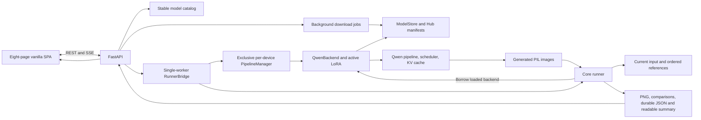

# Repository Context

Last updated: 2026-09-29 (Asia/Dhaka). Current resume source of truth.
Detailed history is in [CONTEXT_HISTORY.md](docs/CONTEXT_HISTORY.md): the complete
1,310-line pre-compaction context, preserved byte for byte from `95e0f22`.
Read this file completely on resume; consult archive sections only as needed.
Historical instructions in the archive do not replace this handoff.

## Project Overview

`qwen_workflow_runner` implements a ComfyUI Qwen Image 2.1 conditioning workflow.
`run.py` provides the CLI; FastAPI plus a vanilla JS SPA provides eight pages:
Dashboard, Inference, Batch, History, Outputs, Models, LoRAs, System.
Production inference is the default. Explicit synthetic demo is input-derived,
labeled, and never substituted silently for a failed production runtime.

Checkout: `/mnt/lab/farzine/qwen_workflow_runner`, remote
`https://github.com/Farzine/qwen_workflow_runner.git`. The originally supplied
`/mnt/lab/farzine/projects/qwen_workflow_runner` was absent during the audit.

## Current Goal

Maintain a correct, responsive inference/management application with persistent
resume state. Phases 0–9 and 10.1–10.9 are complete within the recorded validation
scope. Broader model families, arbitrary adapters and production portrait-quality
benchmarks are not implied by that completion. Operating limits remain below.

## Active Task

Documentation, cleanup and sharing-assets request **complete** (2026-09-29).
Starting HEAD `3dd5fdb` committed the four Phase 10.9 paths; working tree was clean.
User chose neutral public samples and fresh real-model GPU captures. Rewritten
README, preserved detailed usage, 14 feature screenshots, editable workflow plus
PNG/SVG exports, and five LinkedIn PNGs/caption are integrated and validated.
Removed only obsolete TEST_READY/TEST_INFRA summaries and regenerable Python/pytest
caches; existing runtime assets/environment and production source remain intact.
No commit or external post was created. No further implementation task is queued.
Evidence/work root: `/tmp/qwen-docs-4ap3gcp7`; public proof is
[docs/SCREENSHOTS.md](docs/SCREENSHOTS.md) and its linked capture JSON.

## Repository Map

| Path | Responsibility |
| --- | --- |
| `run.py`, `benchmark.py` | CLI entry points and repeated benchmark summaries. |
| `qwen_runner/config.py` | Model/generation/runtime dataclasses, validation, serialization. |
| `qwen_runner/runner.py` | Input/repeat expansion, operation callbacks, outputs/comparisons/records/errors. |
| `qwen_runner/images.py`, `sampling.py`, `kv_cache.py` | Ordered EXIF-corrected images/canvas, sigma schedule, lossless conditioning cache. |
| `qwen_runner/backend.py`, `pipeline.py`, `gguf_loader.py` | Device/model/adapter loading, Qwen encoding/denoising/decoding, strict supported GGUF tensors. |
| `qwen_runner/resources.py` | PipelineManager: exclusive per-device leases, compatible reuse/replacement, unload/shutdown. |
| `qwen_runner/models.py`, `record_metadata.py`, `metrics.py`, `system.py` | Hub manifests/provenance, readable summaries, timing/memory, runtime/device probes. |
| `ui/app.py`, `server.py` | Uvicorn CLI/lifecycle, directory configuration, REST/SSE routes and path confinement. |
| `ui/runner_bridge.py` | Single-worker jobs, output capture, batch events/replay, persistent production leases, explicit DemoBackend. |
| `ui/model_catalog.py`, `download_jobs.py`, `model_deletion.py` | Stable compatible IDs, measured download jobs, safe direct/manifest/shared-blob deletion. |
| `ui/templates/index.html`, `static/js/app.js`, `static/css/style.css` | Shared 208-ID DOM, client controllers/state/navigation, responsive task pages/help/viewers. |
| `tests/`, `ui/tests/` | Core/runtime/resource and API/DOM/E2E/Node checks; UI conftest guards runtime file metadata. |
| `scripts/validate_browser_production.js`, `validate_hub_download.py` | Opt-in real browser/hardware and pinned bounded Hub checks. |
| `workflow/original.json`, `PORTING_NOTES.md`, `source_manifest.json`, `reviewed_gguf_tensor_inventory.json` | Source graph, parity decisions, provenance, reviewed tensor inventory. |
| `README.md`, `ui/README.md`, `PROJECT.md`, `VALIDATION_MATRIX.md` | Launch/test instructions, feature/API contracts, roadmap, exact validation scope/evidence. |
| `models/`, `inputs/`, `outputs/`, `.cache/`, `.venv/` | Ignored runtime state: preserve existing assets and environment. |

## Architecture

```mermaid
flowchart LR
    UI[Eight-page vanilla SPA] <-->|REST and SSE| API[FastAPI]
    API --> Catalog[Stable model catalog]
    API --> Downloads[Background download jobs]
    Downloads --> Store[ModelStore and Hub manifests]
    API --> Bridge[Single-worker RunnerBridge]
    Bridge --> Manager[Exclusive per-device PipelineManager]
    Manager --> Backend[QwenBackend and active LoRA]
    Bridge --> Runner[Core runner]
    Runner --> Images[Current input and ordered references]
    Runner -->|Borrow loaded backend| Backend
    Backend --> Store
    Backend --> Pipeline[Qwen pipeline, scheduler, KV cache]
    Pipeline --> Generated[Generated PIL images]
    Generated --> Runner
    Runner --> Disk[PNG, comparisons, durable JSON and readable summary]
    Disk --> API
    API --> UI
```

The original audit used Python AST imports plus Mermaid because specialized
Graphiphy/Graphviz tools were unavailable. Full dependency and sequence diagrams
remain in [archived architecture](docs/CONTEXT_HISTORY.md#architecture).

Request flow: UI role selection/parameters → selected-ID resolution/path validation
→ bridge job/per-device lease → load/reuse model, apply LoRA/device → runner expands
`[current_input, *references]` → EXIF/RGB/resize/canvas preprocessing → seeded CPU
float32 noise, prompt/image encoding, target-only denoising and VAE decoding →
PIL → saved PNG/hash/comparison/JSON → batch/status/log/complete SSE → live viewer
and durable history. Demo uses a separate explicit synthetic backend.

## Decisions and Contracts

- **Model authority:** compatible `selected_model_id` resolves server-side to actual source/companions; advanced/download fields cannot override it. Legacy direct-source API/CLI callers remain supported. Catalog supports Qwen Image 2.1 complete pipelines and supported transformer-only weights with exactly one compatible local companion. Logical snapshot paths preserve GGUF format and manifest identity.
- **Images:** 1–10 ordered independent inputs; 0–9 ordered shared references, at most ten conditioning images per call. Explicit fields take precedence over legacy combined `images`; inactive legacy data serializes as empty. Each input attempt has its own durable record; ordinary item failures continue with partial-success aggregation. Legacy corrupt images retain setup-error behavior.
- **Seeds/output counts:** repeats share one seed across inputs; incrementing advances between repeats. Batch/warmup expansion is preserved; successful warmups cannot hide failure of every requested output. Setup time is in elapsed time; ETA uses measured finished-attempt durations and is unavailable until one finishes. No automatic inference retry that drops LoRA/reference conditioning.
- **LoRA:** user directory `/mnt/lab/farzine/qwen_workflow_runner/models/loras`; original `bfs_head_v1.1_qwen_2.1.safetensors` (260,096,144 bytes) must remain untouched. One local SafeTensors adapter, strength 0–2, active name `qwen_workflow_lora`, unfused application/effective hash/state in records. AI-Toolkit fused gate/up updates split B rows with shared A after normalizing alpha; weights themselves are not rewritten. Demo records not-applied state.
- **Resources:** one compatible resident pipeline per normalized device (`cuda` = `cuda:0`); one executor worker. Lease spans the whole job and excludes resource switching/deletion. Compatibility includes backend/model/revision/file/quantization, companions/text encoder, cache directory, device/dtype/offload/VAE tiling; excludes generation/image parameters and LoRA so compatible weights can be reused. Idle adapter replacement/rescaling uses existing Diffusers APIs.
- **Device/lifecycle:** System Apply affects the next job. CPU normalizes to float32/no offload; MPS to no offload. Generation failure invokes existing offload-hook cleanup and preserves the original error if cleanup fails. Shutdown rejects submissions, drains work, unloads adapters/hooks/components, drops references, collects garbage, synchronizes CUDA and clears allocator/IPC caches; process exit releases the CUDA context.
- **Storage:** omitted/empty web output paths honor configured server defaults (CLI/state before env); explicit nested/flat/relative paths remain authoritative and confined. Default-root history survives restart; session custom roots are registered only in memory. Model upload uses non-replacing atomic hard links for both single/chunked paths; occupied files/symlinks return conflicts. Upload success is storage, not compatibility/checksum proof.
- **Deletion:** confirmed real API actions for catalog models, LoRAs and whole finished runs. Protect queued/running/download/leased resources, unload idle slots, preserve shared Hub blobs/artifacts, evict finished in-memory aliases. Web locks do not cover independent CLI processes.
- **Metadata/UI:** schema-v1 durable records plus `summary_version: 1`; legacy summaries projected on API reads without migration. Actual file facts or explicit unavailable/null values; never invent parameter counts. Shared viewers preserve saved inspection through background completion; pending completion is shown once on returning to Inference/Batch. Selection/deletion counters reject stale responses.
- **Monitoring:** Stop monitoring closes only this tab's SSE. Keep job identity/unverified state and block submission until recognized terminal completion. Manual Reconnect uses the same URL without POST; guard callbacks by stream identity. Capture history/subscription atomically; after 5,000 retained ordinary events replay one immutable latest full batch snapshot before live/complete. Later ordinary logs remain omitted.
- **Logs/help:** immediate ordered text with native once-per-frame auto-scroll, callback toggle check, Clear cancellation, 60vh phone terminal bound. Copy reads complete current text. 41 implementation-backed accessible help controls; negative conditioning is `CFG != 1`; strength selects the schedule tail, not input-pixel blending; `resolution=0` keeps native references.
- **Dashboard:** health/resources are timestamped snapshots refreshed on startup/configuration/completion/request; batch/download activity monitors this tab. No fabricated polling, global queues/download listings or storage totals.

## Dependency / Runtime State

`requirements.txt` and `requirements-cu126.txt` describe the supported stack.
Previously verified: PyTorch `2.11.0+cu126`, torchvision `0.26.0+cu126`, CUDA 12.6,
Triton 3.6.0, setuptools 81.0.0, PEFT 0.21.0, Diffusers `0.41.0.dev0`, Hub 1.32.0.
Host evidence covers two RTX A6000s (~48 GiB each), driver 560.28.03, i9-12900K,
~125.6 GiB RAM. These are retained probe-time facts, not fresh capacity checks.
Old CUDA 13 packages remain in `.venv/runtime-backups/cu130-20260923/site-packages`.
Native Node 22.22.0 supplies diagnostic `fetch`/`WebSocket`; the application needs
no Node service. GPU work needs host device access, and TestClient SSE needs host
IPC/loopback; sandbox hangs were reproduced independently of application code.

## Completed Tasks

| Phase | Completed scope |
| --- | --- |
| 0–2 | Full audit/graphs/reference comparison; same-image root cause; explicit production/demo, runtime diagnostics, CUDA correction, real inference. |
| 3–5 | Ordered multi-input/reference upload/preview/removal/validation; LoRA discovery/upload/application; manual device and System information. |
| 6–8 | Responsive/accessibility/workflow states, 41 help entries, real browser-to-output validation. |
| 9.1–9.3 | Per-device reusable resources/shutdown; authoritative model IDs; truthful Hub progress/cancel/retry. |
| 9.4–9.6 | Protected model/LoRA/run deletion; readable common metadata; aggregate per-item batch stages/counts/timing/ETA. |
| 9.7–9.8d | Eight task pages; integrated routes/errors; full-model/offload recovery, Hub HTTP/Xet, selected GGUF, fused pretrained LoRA and stabilization. |
| 10.1–10.4 | Collision-safe uploads, isolated UI test storage, uploaded-ID selection, configured output defaults/history. |
| 10.5–10.8 | Saved inspection, truthful stop/reconnect, batch replay beyond event cap, responsive default log scrolling. |
| 10.9 | Concise handoff, lossless full-history archive, current Git reconciliation, evidence/link/source/runtime checks. |
| Docs/assets, 2026-09-29 | Selective cleanup, professional README/customization guide, 14 real UI screenshots, workflow SVG/PNG, fresh production samples, LinkedIn caption and five slides. |

Per-task files, failed diagnostics and all original evidence remain in
[archived completed tasks](docs/CONTEXT_HISTORY.md#completed-tasks),
[file history](docs/CONTEXT_HISTORY.md#files-modified) and
[tests](docs/CONTEXT_HISTORY.md#tests-performed).

## Remaining Tasks

No unfinished work for the documentation/assets request or the completed supported
roadmap. The post assets are ready for the user to publish manually; no publication
was requested. Known product/runtime limits below remain. Select further work only
from a concrete new request or reproduced defect.

## Current Problems

No new application defect was introduced or reproduced in this task. The original
same-image cause remains historical: silent synthetic fallback with an incompatible
CUDA runtime. Production now reports setup errors and never silently uses demo.

The prior setup-error record `outputs/20260929T083542_9ec66f4252_setup_error.json`
was already absent from the starting runtime snapshot. Earlier 5,268/5,269 runtime
counts are historical; this session guarded 236 existing runtime file/symlink entries.
Actual storage state takes precedence; no existing runtime entry was removed or
changed by this task. Incompatible small model fixtures remain in the catalog and
are documented as incompatible, rather than removed as presumed user data.

Temporary extra-capture driver initially raced DOM readiness and later captured a
closed help popover. It was corrected to wait for initialization/selected inputs,
use keyboard focus, verify the open help state, and capture the viewport. These
were diagnostic-driver corrections only; no application code was changed.

## Important Technical Findings

- AI-Toolkit `img_mlp.gate_up` fused updates do not directly target Diffusers `gate_layer`/`proj`; the shared loader conversion and numerical/full-model tests cover the supplied adapter.
- Failed Accelerate transfers could leave mixed CPU/GPU tensors; existing hook cleanup on generation failure restores reusable placement when possible.
- Upload filename and hashed catalog ID differ. Only a confirmed final receipt path plus a successfully refreshed compatible catalog may change selection.
- Viewer completion, monitor lifecycle and replay retention are distinct: defer viewer delivery, retain unresolved job lock, retain one latest full published batch snapshot after the ordinary event ceiling.
- Per-line geometry reads forced repeated layout; one native frame coalesces both append paths. Phone auto-height required a separate console height bound. Prior on-mode/phone diagnostics failed before these fixes.

## Reference Implementations

`/mnt/lab/farzine/projects/Nunchaku-Generic-Form/klein_generic_infer.py` is a
528-line client for remote Flux.2 Klein, not a local Qwen loader. It reuses uploaded
source IDs, separates references/adapter names, tracks batch success/failure/time/
ETA, polls/downloads results and saves comparisons/metadata. Device/model loading
is remote. Its optional-feature-dropping retries and Flux endpoint/prompt contract
are intentionally not copied. Detailed comparison and the upstream fused-adapter
reference are [archived](docs/CONTEXT_HISTORY.md#reference-implementations).

## Files Modified

- `README.md` — user-facing overview, install/quickstart, all-feature gallery, workflow, CLI, How to Modify, testing, supported limits and license.
- `docs/USAGE.md` — retain the prior detailed CLI/model/cache/benchmark instructions; update moved links.
- `ui/README.md` — correct the installation anchor to the rewritten root README.
- `docs/SCREENSHOTS.md`, `docs/assets/` — capture provenance, settings, 14 screenshots, three original sample inputs/four generated outputs, hashes/measurements, editable SVG and PNG workflow.
- `linkedin-post/` — requested-tone caption, posting instructions, editable native HTML composition, five 1200×1500 PNG slides. Nothing published.
- `.gitignore` — ignore `.pytest_cache/`.
- Deleted `TEST_READY.md`, `TEST_INFRA.md` — redundant initial test summaries with obsolete counts; current testing instructions/provenance remain in UI/usage guides, PROJECT and VALIDATION_MATRIX. Historical TEST_REPORT/context/licensing/source workflows retained.
- Removed eight ignored Python/pytest cache directories (87 files, 1,131,051 bytes); do not remove `.venv`, its rollback backup, `.cache`, user assets, or agent/private configuration.
- `CONTEXT.md`, `VALIDATION_MATRIX.md` — checkpoint current task and record fresh bounded validation.

Production Python/JS/CSS/template/JSON files match HEAD byte for byte. Starting
HEAD `3dd5fdb` already contains Phase 10.9; its four paths are no longer pending.
The lossless context archive is unchanged.

## Tests Performed

**Fresh documentation/assets validation:**

- Actual production UI + native Chrome: two independent robot inputs and one shared palette reference, then repeat with supplied LoRA strength 0.8; four successful PNGs/records, selected full-model ID/revision, `cuda:1`, BF16/model offload, 4 steps, CFG 1, seed 1070478148268574, 384×384 outputs. Output bytes/hashes served and saved; all outputs differ from resized inputs. Adapter-vs-baseline MAE 24.690/21.519, changed pixels 99.142%/98.756%. Functional smoke samples, not quality/head-swap benchmarks.
- Production resource evidence: one base load and one compatible job reuse; all leases released and slots empty on graceful shutdown. Before process exit PyTorch retained 9,568,256 allocated / 29,360,128 reserved bytes; owned server/browser processes exited. No zero-memory claim while the CUDA context was alive.
- Existing browser navigation validation: 24 page/viewport checks (8 pages × widths 1440/900/390), no overflow, preserved configuration and injected status-error recovery passed. Additional captures show full Models download/upload controls and an actually open parameter help popover; no inference in that second server session.
- Fourteen screenshot PNGs decoded/dimensions/hashes verified; all linked in README. Five 1200×1500 post PNGs rendered with native Chrome; actual HTML geometry checks reject footer overlap. Workflow SVG parses and SVG/PNG/slides visually inspected.
- Local Markdown links/anchors, HTML image sources/alt text, artifact hashes, unchanged production source, all 236 starting runtime file/symlink modes/sizes/mtimes, and full original adapter SHA-256 checked. `git diff --check`, `run.py --help`, and `run.py --dry-run` passed. Eight generated caches removed; no unrelated runtime data deleted.
- Evidence: `/tmp/qwen-docs-4ap3gcp7/{baseline,lora}-browser.json`, `{baseline,lora}-system.json`, `navigation.json`, `shutdown.json`, `slides-validation.json`, `extra-validation.json`, `cleanup.json`, `documentation-validation.json`. Temporary helpers `/tmp/qwen_docs_*.py/.js`; no new dependency/framework or production behavior.
- Public settings/hash/measurement evidence: [docs/SCREENSHOTS.md](docs/SCREENSHOTS.md), [capture-evidence.json](docs/assets/capture-evidence.json). Full regression suites/Hub downloads were not rerun for documentation-only changes; prior results below are retained observations.

**Latest retained results (not newly run):**

| Validation | Result / scope | Evidence root |
| --- | --- | --- |
| Phase 10.9 archive | Original context equals git 95e0f22; 16 handoff headings, 19 links, 82 protected tracked files, 5,268 original runtime entries preserved | `/tmp/qwen-phase109-validation.json` |
| UI/API/E2E, Phase 10.8 | 450 passed + 15 replay subtests; runtime metadata guard | [Matrix](VALIDATION_MATRIX.md#phase-108-log-replay-responsiveness) |
| Node, Phase 10.8 | 57/57 frontend, 15/15 stress | [Archive tests](docs/CONTEXT_HISTORY.md#tests-performed) |
| Core, Phase 9.8c3 | 43 tests + 13 subtests; adapter math/lifecycle | `/tmp/qwen-lora-validation-hyd258je` |
| Auto-scroll, Phase 10.8 | Three CPU demo UI jobs, 4,995 retained lines, 4/3/4 geometry reads; scrolling/Copy/Clear/results | `/tmp/qwen-autoscroll-browser-gzglllpu` |
| Full production, Phase 9.8b | Four real outputs, conditioning/model/device/hash/serving/reuse/shutdown | `/tmp/qwen-phase98b.AJEcJM` |
| GGUF, Phase 9.8c2 | Four real outputs, model replacement/reuse/shutdown | `/tmp/qwen-gguf-validation-9znq346l` |
| Pretrained LoRA, Phase 9.8c3 | Eight real outputs: baseline/existing/uploaded/cleared; controlled effect/reuse/shutdown | `/tmp/qwen-lora-validation-hyd258je` |
| Hub HTTP/Xet, Phase 9.8c1 | Pinned tiny 484,951 bytes, callbacks/hashes/cancel/retry/cache | `/tmp/qwen-hub-validation-hbikkfmd` |
| Hub browser, Phase 9.8c1 | Real tiny download, failure/new-ID retry/phone controls | `/tmp/qwen-hub-validation-cax0tm3q` |

Temporary evidence is local/disposable; committed provenance preserves results if
it disappears. Historical test counts are not current whole-project guarantees.

## Known Issues

- Catalog compatibility is limited to supported Qwen Image 2.1 layouts; structural checks/upload headers cannot prove exact loader shapes. Other model families/ambiguous companions/unsupported quantization are rejected. Tested GGUF is revision `40319fb...` with `790c926...` companions; its ~4.15 GB transformer still had ~18.81 GB full-pipeline peak.
- Supplied pretrained LoRA is proven at tested prompt/settings; quantized-transformer LoRA, unrelated layouts, exact head/background preservation and broad portrait-quality benchmarking are unproven. Multi-reference transport/effect is proven; hairstyle adherence was weak in one controlled sample.
- Native `resolution=0` can retain huge references and exhaust memory/degrade quality. System memory/readiness is a snapshot, not reservation; other host processes can cause OOM. Hook cleanup cannot guarantee recovery from a permanently broken CUDA context. SIGKILL/exit 137 bypasses graceful shutdown.
- Stop monitoring is not inference cancellation. Manual reconnect needs the same tab/job ID; missing jobs/invalid completion remain unverified and locked. Reload/new tabs do not recover active streams, pending viewer results, batch/download state or aggregate events after restart. Durable per-attempt/default-root history remains.
- Ordinary replay logs beyond the first 5,000 events are omitted; latest batch snapshot is retained. Live DOM logs are unbounded until Clear/next job/reconnect, not virtualized or benchmarked indefinitely. Native frames can pause in hidden tabs while text still appends. Historical logs are not independently persisted.
- History/Outputs payloads and DOM are unpaginated; lazy previews bound image requests, not large-library API/DOM costs. Dashboard has snapshots and this-tab monitors, not global job/download queues or storage totals. Custom per-run output roots are not rediscovered after restart.
- Deletion is whole-run/unshared-artifact cleanup, not individual output deletion or orphan browsing. Global active-job guard blocks deletion while inference runs; independent CLI processes are outside locks. Multi-file cleanup is best effort and filesystem failures can leave orphaned images after record removal.
- Upload publication requires hard-link support and never overwrites as fallback. Permission/disk failures may prevent cleanup; abandoned chunk sessions have no automatic expiry. Distinct upload IDs were raced; session identity/retry/quota/checksum management is unchanged.
- Hub cancellation is cooperative at file boundaries/before manifest publication; current file may already be materialized. Byte speed is reconstructed/materialized file speed, not wire throughput. Large-checkpoint/proxy/rate-limit/interrupted-network recovery remains untested. Tiny download fixtures are incompatible and never inference proof.
- Legacy records are projected without migration; inaccessible files give unavailable facts. Parameter counts are not inferred from names; directory model size needs a matching completed manifest. Run Details preview is first-output; Outputs selects every recorded artifact exactly.
- Pytest isolates inputs/history/thumbnails and guards repository runtime file metadata, not large-file content hashes, external directories, directory-only changes, direct unittest or abrupt termination. Earlier synthetic records are preserved. Known Starlette/AnyIO deprecations remain; attempted httpx2 2.13.1 broke TestClient and was removed; existing HTTPX 0.28.1 needs host IPC for SSE tests.

## User Decisions / Required Input

None. User selected neutral original public sample imagery and fresh GPU model
runs for documentation. Keep existing user/model/LoRA/runtime/environment assets,
use native tooling and no new dependencies; only verified disposable caches and
redundant initial test summaries were removed. LinkedIn assets are prepared for
manual posting; no publishing/message-sending authorization is implied.

## Next Action

The requested cleanup, documentation, screenshots, workflow and LinkedIn assets
are complete. On resume, read this file and inspect Git state; reconcile any user
commit of the current docs/assets/deletions without regenerating screenshots or
running models again. No implementation task remains queued. Handle a new request
or reproduced defect; otherwise report this clean checkpoint and existing limits.
Do not delete incompatible catalog fixtures, runtime assets or historical context
merely because this task was called cleanup.

## Resume Instructions

1. Read root CONTEXT.md completely; use linked archive sections only for relevant detail.
2. Check `git status --short`, recent commits and scoped diffs; actual code outranks stale state.
3. Reconcile HEAD/pending paths above. Preserve unrelated user changes and ignored models/inputs/outputs/cache/environment.
4. Follow Active Task/Next Action; never resume a historical archive instruction as current work.
5. Complete one authorized, independently testable slice; no audit or completed work repetition without a concrete verification reason.
6. Validate affected behavior; use temporary storage for destructive/upload/demo checks, host IPC for SSE, explicit host GPU access for hardware. No fake inference proof.
7. Update this concise file after meaningful tasks and keep detailed new history in documentation when needed; preserve evidence scope and distinguish fresh checks from retained results.
8. End with TASK COMPLETED / VERIFIED / CHANGES / CONTEXT UPDATED / USER INPUT REQUIRED / NEXT TASK; stop at a coherent checkpoint.
