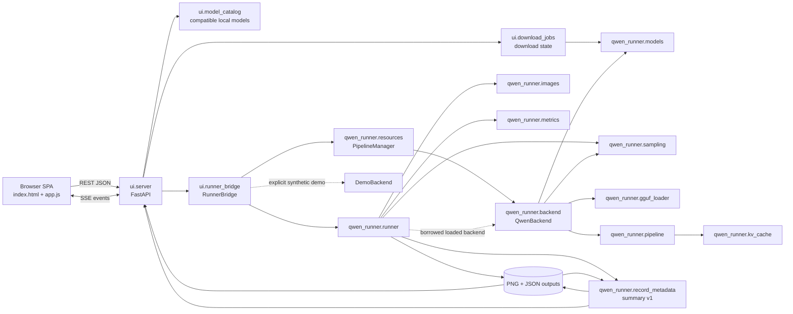

# Context History

Historical snapshot of root CONTEXT.md from commit `95e0f22`, archived on
2026-09-29 during Phase 10.9. The complete original file below is preserved
byte for byte, including failed diagnostics, decisions, limits, and old handoffs.
Its Git states and task instructions describe their original checkpoints.
Use [current CONTEXT.md](../CONTEXT.md) for the active state and next action.

Original SHA-256: `db717da88e5c06c549b43c4f9c89f71f0bfb15075e491bed0a4015963a92af62`.

Jump to [architecture](#architecture), [completed tasks](#completed-tasks),
[technical findings](#important-technical-findings), [file history](#files-modified),
[test evidence](#tests-performed), or [known issues](#known-issues).

<!-- BEGIN PRESERVED CONTEXT -->
# Repository Context

Last updated: 2026-09-29 (Asia/Dhaka)

## Project Overview

`qwen_workflow_runner` is a Python implementation of a ComfyUI Qwen Image 2.1 workflow with two entry surfaces:

- A command-line runner (`run.py`) backed by `qwen_runner`.
- A FastAPI application (`ui`) with a vanilla HTML/CSS/JavaScript single-page interface, background execution, SSE progress events, model discovery/download/upload, output history, and image comparison.

The core production backend loads the Qwen Image 2.1 Diffusers pipeline and reproduces the source workflow's image conditioning, Euler flow sampling, optional GGUF transformer loading, KV caching, output persistence, and run metadata. The web server retains one compatible production pipeline per device through a shared `PipelineManager`; the web layer also contains a synthetic `DemoBackend` intended for quick UI testing.

The active checkout is `/mnt/lab/farzine/qwen_workflow_runner`. The path originally supplied as the primary checkout, `/mnt/lab/farzine/projects/qwen_workflow_runner`, did not exist during the audit. The Git remote is `https://github.com/Farzine/qwen_workflow_runner.git`.

## Repository Map

| Path | Purpose |
| --- | --- |
| `run.py` | CLI entry point for legacy conditioning sequences or explicit multi-input generation batches. |
| `benchmark.py` | Repeated benchmark entry point and summary writer. |
| `qwen_runner/config.py` | `ModelConfig`, `GenerationConfig`, `RuntimeConfig`, validation, and JSON serialization. |
| `qwen_runner/images.py` | Ordered conditioning-image loading, EXIF correction, resize/canvas selection, and comparison saving. |
| `qwen_runner/models.py` | Hugging Face/local model reference parsing, download/cache resolution, manifests, and model provenance. |
| `qwen_runner/gguf_loader.py` | Qwen transformer GGUF loading and tensor conversion. |
| `qwen_runner/sampling.py` | Comfy-compatible sigma schedule creation. |
| `qwen_runner/kv_cache.py` | Lossless transformer prefix KV cache and GPU/CPU placement policy. |
| `qwen_runner/pipeline.py` | Custom `WorkflowQwenImage21Pipeline`: prompt/image encoding, conditioning latent assembly, denoising, and VAE decoding. |
| `qwen_runner/backend.py` | Production `QwenBackend`: device/model initialization and pipeline invocation. |
| `qwen_runner/resources.py` | Exclusive per-device pipeline leases, compatibility keys, reuse/replacement telemetry, and shutdown cleanup. |
| `qwen_runner/metrics.py` | Inference timing and memory metrics. |
| `qwen_runner/runner.py` | End-to-end orchestration, durable JSON records, output PNG saving, comparisons, and error records. |
| `qwen_runner/record_metadata.py` | Versioned readable projection of durable records and actual image/adapter file facts. |
| `ui/app.py` | Uvicorn launcher, CLI flags, directory setup, and port selection. |
| `ui/server.py` | FastAPI routes for health, inputs, thumbnails, models, validation, runs, SSE, history, and outputs. |
| `ui/model_catalog.py` | Stable downloaded-model IDs, local Qwen Image 2.1 compatibility inspection, and selected-ID resolution. |
| `ui/download_jobs.py` | Thread-safe background download state, measured byte/file progress, cancellation, and terminal status. |
| `ui/runner_bridge.py` | Background job bridge, stdout/stderr capture, event fan-out, `DemoBackend`, and backend selection. |
| `ui/templates/index.html` | Single-page UI markup with primary Dashboard, Inference, Batch, History, Outputs, Models, LoRAs, and System destinations. |
| `ui/static/js/app.js` | Client state, hash-based task navigation, server-side image browser, ordered selection, forms, run submission, SSE, history, and comparison viewer. |
| `ui/static/css/style.css` | Three-panel inference workspace, focused management views, and responsive styling. |
| `tests/` | Core configuration, sampling, image, GGUF, cache, and small runtime tests. |
| `ui/tests/` | API, security, concurrency, workflow, DOM, and JavaScript state-machine tests. `conftest.py` isolates pytest thumbnails and guards repository runtime file metadata. |
| `workflow/original.json` | Original ComfyUI workflow graph. |
| `workflow/PORTING_NOTES.md` | Workflow parity decisions and current limitations. |
| `workflow/reviewed_gguf_tensor_inventory.json` | Reviewed GGUF tensor inventory. |
| `workflow/source_manifest.json` | Source model/workflow provenance. |
| `scripts/download_examples.py` | Example input download helper. |
| `scripts/summarize_logs.py` | Durable run-log summarizer. |
| `scripts/validate_hub_download.py` | Opt-in pinned, size-bounded real HTTP/Xet/API download/cancel/retry/cache/hash/catalog validation without inference. |
| `scripts/validate_browser_production.js` | Hardware-gated Chrome DevTools driver for real UI selection, production submission, SSE/result inspection, and screenshots. |
| `VALIDATION_MATRIX.md` | Final scenario-by-scenario automated and live-hardware evidence, including remaining asset-dependent limitations. |
| `models/`, `outputs/`, `inputs/`, `.cache/` | Ignored runtime assets, results, configured inputs, and thumbnails. |

The repository had 62 tracked files and about 24,478 tracked lines at the audit. The local virtual environment and model/output data are intentionally ignored. The cached full model manifest reports approximately 33.13 GB of selected files.

## Architecture

No Graphiphy, Graphviz, `dot`, `pyreverse`, `pydeps`, or `madge` executable/tool was installed or exposed in the environment. The dependency map below was generated by parsing Python imports with `ast`, then augmented with the browser and runtime data flow. Mermaid provides the requested graph visualization in this persistent document.



The AST-derived internal import edges are:

```text
qwen_runner.backend -> qwen_runner.gguf_loader, models, pipeline, sampling
qwen_runner.pipeline -> qwen_runner.kv_cache
qwen_runner.runner -> qwen_runner.backend, images, metrics, record_metadata, sampling
ui.app -> ui.server
ui.server -> qwen_runner.config, qwen_runner.models, ui.model_catalog, ui.download_jobs, ui.runner_bridge
ui.runner_bridge -> qwen_runner.backend, qwen_runner.config, qwen_runner.resources, qwen_runner.runner, ui.server
```

### Current request flow

```mermaid
sequenceDiagram
    participant U as User
    participant JS as app.js
    participant API as FastAPI
    participant B as RunnerBridge
    participant R as qwen_runner.runner
    participant E as Selected backend
    participant F as Filesystem

    U->>JS: Select/upload ordered inputs and optional references
    JS->>API: POST /api/run (selected_model_id, generation, runtime, demo_mode)
    API->>API: Resolve catalog ID to source and companions; validate paths
    API->>B: submit_run(config, demo_mode)
    B->>B: resolve_backend_factory
    B->>B: acquire exclusive per-device pipeline lease
    B->>E: load or reuse compatible backend; switch LoRA if needed
    B->>R: run(config, borrowed loaded backend)
    loop Each explicit input (legacy requests have one)
        R->>F: Load [current input, ordered shared references]
        R->>E: generate(images, canvas, seed)
    end
    alt DemoBackend
        E->>E: Resize/blend images[0] and draw overlays
    else QwenBackend
        E->>E: Start from seeded CPU noise, condition on all images, denoise, decode
    end
    R->>F: Save PNG, optional comparison, and JSON record
    B-->>API: Status/log/step + aggregate batch events
    API-->>JS: SSE complete event and output URLs
    JS-->>U: Display generated image and comparison
```

### Production inference flow

1. New callers use `GenerationConfig.input_images` plus `reference_images`. The runner expands these into one inference per input with `[current_input, *reference_images]`. Legacy `images` remains one combined sequence whose first image is the input/canvas.
2. `load_references` opens each expanded conditioning sequence with Pillow, applies EXIF orientation, converts to RGB/RGBA, rounds sizes to model-compatible values, and returns images plus canvas metadata.
3. `PipelineManager` exclusively leases the selected device for the complete job. It reuses a compatible resident backend or unloads only that device's prior backend before calling `QwenBackend.load`. Compatible requests can change LoRA state without rebuilding base weights.
4. `QwenBackend.load` validates the selected device, resolves the main model and optional companion files, loads a Diffusers or supported GGUF transformer, builds `WorkflowQwenImage21Pipeline`, installs the flow-matching scheduler, and applies device/offload settings.
5. `QwenBackend.generate` constructs deterministic CPU `float32` noise, applies the configured sigma schedule, packs the empty starting latent, and supplies the prompt and all conditioning images to the pipeline.
6. The pipeline encodes text and images with Qwen3-VL and the VAE, concatenates reference conditioning, denoises only the generated target latent, and decodes it to PIL images.
7. `qwen_runner.runner.run` preserves input order, uses the same seed for all inputs in a repeat, and saves one durable record/output group per input attempt. Explicit multi-input jobs isolate ordinary per-input failures and report mixed outcomes as `partial_success` through the API.

The original ComfyUI graph follows the same broad semantics: its `KSampler` receives an empty latent selected by the graph's switch, while the loaded images feed `TextEncodeQwenImage21` as conditioning. It does not use the first image as the starting latent.

## Current Goal

Extend the validated Qwen workflow into a production-quality management application with authoritative compatible-model selection, efficient per-device resource reuse, observable downloads, safe deletion, human-readable records, dedicated batch workflow, and task-oriented responsive pages.

Phases 0–9 and Phases 10.1–10.8 are complete within the recorded validation scope. Uploaded-model selection uses authoritative catalog IDs; browser/API/singleton output defaults honor configured storage. Background/replayed completion preserves saved inspection until returning to Inference/Batch. Stopping or losing monitoring retains an unverified job and reconnects its existing stream without another submission. Latest full batch replay now survives the 5,000-event history ceiling. Log scrolling now uses native animation frames and the phone console is bounded. Next is Phase 10.9: compact the persistent handoff while preserving completed evidence in an archive. Broader model-family/quantized-LoRA support and quality benchmarking are not implied by the completed roadmap.

## Active Task

Phase 10.8 is complete. HEAD remains `798caee`; all six pending Phase 10.7
paths were preserved. Nine paths are now modified: the bridge/backend tests from
10.7, plus app JS, CSS, Node tests and the four shared documentation paths.
No commit was created. Both TerminalViewer append paths share one native
animation-frame scroll update; Clear cancels it and callbacks check the current
toggle. Text/order/error formatting remain synchronous; Copy reads complete text. Phone terminal
height is bounded at 60vh, fixing its content-growing layout.
Node 57/57 and stress 15/15; final UI 450 plus 15 subtests in 14.22s.
Pre-fix Node check reproduced 5,002 per-line geometry reads; pre-CSS real phone
check failed because its terminal grew instead of scrolling. Final real CPU
demo/native Chrome replay at 1440/900/390px with Auto-scroll on restored current
batch state in 255/255/267ms, with 4/3/4 scroll-height reads for 4,995 retained
lines. Native clipboard, Clear/toggle, same-job reconnect, completion, eight
PNG hashes/seven records and unchanged 5,268 runtime entries verified.
Evidence: `/tmp/qwen-autoscroll-browser-gzglllpu`; server/Chrome exited 0.
Next: Phase 10.9 persistent-context maintenance only; no user input pending.

## Completed Tasks

- [x] Completed Phase 10.8 log replay responsiveness: shared native frame scheduling, pending-frame cancellation, unchanged text/error/Copy/toggle behavior, bounded phone console, pre-fix rejection, full UI/Node and real on-mode browser validation.
- [x] Completed Phase 10.7 latest full batch replay beyond the event-history cap: bounded snapshot retention, immutable item copies, atomic snapshot/subscription, terminal ordering, boundary/race/real API/demo/browser regressions, and documentation.
- [x] Completed Phase 10.6 monitoring truthfulness: unresolved-job submission lock, shared stop/reconnect action, retained batch identity/last-known timing, old-stream guards, terminal validation, saved-inspection preservation, Node/full UI/native browser regressions, and documentation.
- [x] Completed Phase 10.5 saved-result inspection: deferred viewer completion, immediate status/history/errors, live-page result delivery, failure clearing, deletion/late-response/launch guards, Node/full UI/native browser regressions, and documentation.

- [x] Completed Phase 10.4 configured output defaults: shared web resolution, singleton/history precedence, safely rendered native browser default/presets, explicit overrides preserved, type/confinement checks, real temporary demo/API/browser persistence, regression tests, and documentation.

- [x] Completed Phase 10.3 uploaded-model selection: final receipt/path validation, refreshed compatible catalog ID, existing controller/visible state, preserved prior selection on failure, ID-based validation/run payloads, Node/API/browser regressions, and documentation.

- [x] Inspected Git state, tracked source, documentation, workflow artifacts, entry points, tests, runtime directories, and recent history.
- [x] Mapped frontend, API, job bridge, core model, sampling, image, caching, persistence, and output-display flows.
- [x] Generated an AST-based dependency graph and Mermaid architecture/inference visualizations because specialized graph executables were unavailable.
- [x] Traced UI input through preprocessing, backend selection, inference, saving, history, and result display.
- [x] Studied and compared the reference `klein_generic_infer.py` implementation.
- [x] Identified and empirically validated the immediate same-image root cause.
- [x] Diagnosed the runtime condition preventing the production backend from loading.
- [x] Established baseline core, targeted UI, and JavaScript validation.
- [x] Created the persistent repository context and prioritized modular plan.
- [x] Made production inference the UI/API/bridge default and made synthetic demo mode an explicit opt-in.
- [x] Removed the CUDA-dependent fallback from real requests to `DemoBackend`.
- [x] Added a reusable runtime capability probe, `/api/system`, visible header/footer readiness, and actionable production setup errors.
- [x] Added strict `demo_mode` validation and tests proving a production request cannot be reported as demo output.
- [x] Updated synthetic E2E fixtures to request demo mode explicitly and completed the full UI suite.
- [x] Replaced the incompatible CUDA 13 PyTorch runtime with a locally verified CUDA 12.6 stack while retaining the prior packages for rollback.
- [x] Verified both RTX A6000 GPUs, BF16 execution, explicit device selection, `/api/system`, and the runtime class check.
- [x] Completed the first real cached-model inference with `QwenBackend` and proved that the output is a prompt-directed transformation rather than a copied input.
- [x] Exercised real production inference through `/api/run`, SSE, run history, record retrieval, output serving, and comparison serving with matching hashes.
- [x] Validated ordered two-reference propagation on both GPUs and isolated native 4000x6000 reference sizing as the cause of unusable output and extreme memory use in the failing case.
- [x] Proved the second reference materially changes inference and documented the remaining reference-adherence quality limitation.
- [x] Added explicit ordered `input_images` and `reference_images` fields while retaining the legacy combined `images` contract.
- [x] Expanded explicit requests into one independently recorded generation per process input using `[current_input, *reference_images]` and one shared model load.
- [x] Preserved repeat seed semantics, input/reference order, per-input output/comparison metadata, and legacy setup-error behavior.
- [x] Added API aggregation for all multi-input artifacts and `partial_success` records when one input fails while later inputs succeed.
- [x] Added core, runner, API, SSE, and compatibility coverage for explicit image batches and documented the CLI/REST contract.
- [x] Added atomic, confined multi-image upload with content decoding, extension/format matching, size/count/pixel limits, collision-safe names, and actionable validation errors.
- [x] Replaced the combined browser tray with independent ordered process-input and shared-reference state, controls, previews, counts, reordering, removal, and role-aware upload/drop behavior.
- [x] Made the browser emit only explicit `input_images`/`reference_images`, retain non-enumerable migration aliases for embedded integrations, display every successful batch artifact, and preserve outputs during `partial_success` failures.
- [x] Restored narrow-screen access to the input panel and validated desktop/narrow rendering with headless Chrome in addition to DOM, accessibility, API, and JavaScript state-machine coverage.
- [x] Added optional LoRA path/strength configuration, CLI overrides, validation, and durable requested/effective adapter metadata.
- [x] Added confined LoRA directory discovery plus streamed, size-limited, atomic SafeTensors upload with A/B or down/up tensor-pair validation and actionable invalid-file diagnostics.
- [x] Applied one named, unfused Qwen transformer LoRA through Diffusers/PEFT, verified activation and strength, supported explicit unload/replacement, and included the adapter SHA-256 in run records.
- [x] Added a separate browser LoRA catalog with refresh, upload/drop, selection, strength, clear state, invalid-entry visibility, and production/demo application messaging.
- [x] Proved actual adapter application with a real tiny Qwen Image 2.1 transformer and completed the core, API, DOM, and JavaScript regression suites.
- [x] Extended the shared runtime probe with CPU/RAM inventory and live per-GPU total/free/used plus process-allocated/reserved memory without loading model weights.
- [x] Added a dedicated System tab with dynamically discovered CPU, MPS, and CUDA choices, readiness diagnostics, software/host summaries, GPU memory cards, and explicit next-run configuration application.
- [x] Exposed truthful per-run model lifecycle state, including active requested model/device/LoRA and effective last-run metadata when held by the current server process.
- [x] Recorded production device/offload metadata and verified both RTX A6000 GPUs accept BF16 allocation and report ready through the same probe used by `QwenBackend`.
- [x] Completed Phase 5 core, API, DOM, JavaScript, full UI regression, and live desktop/narrow rendering validation.
- [x] Added a compact Inputs → Configure → Results navigator for tablet and phone layouts, including direct section jumps on phones and a focused Results drawer on tablets.
- [x] Added accessible Results drawer state, backdrop/click/Escape dismissal, focus restoration, run/output `aria-busy` state, and a visible running spinner.
- [x] Moved validation feedback into normal document flow so it no longer covers configuration tabs, and preserved actionable alert content with bounded scrolling.
- [x] Fixed the folder-chip class mismatch, bounded large folder lists, restored readable truncation, made gallery empty/loading states span the grid, and validated live desktop/tablet/phone rendering.
- [x] Added keyboard-, hover-, click-, and touch-accessible information controls for 41 generation, runtime, device, model, LoRA, output, and demo settings.
- [x] Derived every help entry from the implemented config, image resizing, sigma schedule, KV cache, runner, model loader, and validated production behavior, including higher/lower effects, ranges, interactions, and resource trade-offs.
- [x] Corrected the negative-prompt activation text to match `CFG != 1`, added an explicit native-resolution VRAM warning, and corrected the float32 option description.
- [x] Validated help discovery, content, focus/Escape behavior, click/touch dismissal, advanced-model coverage, and desktop/phone collision handling in a real browser.
- [x] Completed the documented Phase 8 validation matrix across inputs, references, LoRA, GPUs, inference, outputs, UI states, responsive layouts, and parameter help.
- [x] Drove a real two-input plus one-reference production batch through the actual browser controls on `cuda:0`, observed SSE completion at 100%, rendered both outputs/comparison/history, and verified every durable artifact.
- [x] Quantified both full-model outputs against their respective sources, confirming record hashes and 97.47%/98.30% changed pixels at the selected threshold.
- [x] Reconciled the root/UI/project/porting documentation with final behavior, evidence, supported launch/test commands, and remaining asset-dependent limits.
- [x] Added `PipelineManager` with one exclusive cache slot per normalized device, exact compatibility keys, safe replacement, load/reuse counters, failure recovery, snapshots, manual unload, and idempotent shutdown.
- [x] Reused compatible full-model pipelines across web jobs and switched or rescaled LoRAs without rebuilding matching base weights.
- [x] Added FastAPI shutdown draining and explicit Diffusers hook removal, CPU transfer, reference release, garbage collection, CUDA synchronization, and allocator cleanup.
- [x] Exposed resident model/device/LoRA and cache lifecycle state through `/api/system` and the System page.
- [x] Proved full-model cache reuse with two real `cuda:0` jobs and a single model load, then verified the manager slot becomes empty after shutdown.
- [x] Added stable downloaded-model IDs, conservative Qwen Image 2.1 compatibility inspection, and explicit reasons for incompatible local/manifest entries.
- [x] Made the selected catalog ID authoritative in web validation and run requests; removed advanced source/base authority from the browser while preserving legacy direct-source API and CLI behavior.
- [x] Verified selected-model resolution with API tests and a real `cuda:1` full-model run whose requested source was deliberately wrong before server resolution.
- [x] Replaced synthetic 25% model-download progress and false 100% errors with measured file/byte state, unknown-total handling, speed/ETA where measurable, and explicit terminal errors.
- [x] Added cooperative cancellation at Hub file boundaries, retry using a new task ID and existing cache, and JSON/SSE terminal-state reporting.
- [x] Wired the browser model card to current-file, completed/remaining-file, byte, speed, ETA, indeterminate-progress, cancel, retry, success, and failure states.
- [x] Added confirmed LoRA deletion with actual filesystem removal, invalid-file visibility, selected-state refresh, traversal/symlink rejection, active-job conflict, and idle-pipeline unload.
- [x] Added confirmed catalog-model deletion with direct-storage removal, reference-aware Hub cleanup, active download/job/lease protection, idle-pipeline unload, and selected-state reset.
- [x] Added confirmed finished-run deletion with shared-artifact preservation, active-job protection, custom-output-directory support, and history/result refresh.
- [x] Added `summary_version: 1` to new success/error/setup records, with legacy history/detail projection and explicit unavailable values for unknown facts.
- [x] Added readable Run Details cards and history input/model context while retaining the original JSON as an optional technical view.
- [x] Added truthful batch operation callbacks, SSE snapshots/replay, queued and active per-item stages, elapsed/ETA/counts, and browser details links for finished attempts.
- [x] Corrected explicit-batch completion classification so warmup success cannot hide failure of all requested outputs.
- [x] Added primary Inference, Models, LoRAs, and System destinations, retaining existing manager DOM/state and hash-compatible configuration tabs.
- [x] Kept the Inference three-panel workflow intact while giving management pages focused layouts on desktop and phone; scoped inference validation and launch controls to that workflow.
- [x] Added the full-width Batch destination using the existing execution DOM, event stream, aggregate state, results, and per-item Details; verified active navigation and partial failure with a live synthetic batch.
- [x] Added the dedicated History destination with responsive list/result layout, loading/error/retry states, full timestamps, accessible selection, and existing confirmed deletion.
- [x] Added the responsive Outputs destination using saved-record artifacts and existing preview/comparison/download/details/delete flows; verified exact non-first-image selection, 33 artifacts, missing files, active navigation, and confirmed temporary-file cleanup in Chrome.
- [x] Added the responsive Dashboard using shared runtime/catalog/monitor/history state; verified loading/empty/error/recovery, native recent-run access, live success/failure batches, unknown download totals, and three viewport widths without adding polling.
- [x] Completed Phase 9.8c1 live HTTP/Xet transfer, source hashes, cancel/retry, manifest reuse, SSE/catalog, and actual desktop/phone Models-page verification.
- [x] Completed Phase 9.8c2 selected-ID cached GGUF browser inference, strict tensors, four outputs, full-to-GGUF replacement, compatible reuse, artifacts, resources, and shutdown.
- [x] Completed Phase 9.8c3 fused Qwen 2.1 LoRA loading fix and eight full-model browser outputs, native upload, exact hashes/effect/removal, one-load reuse, regressions, and shutdown.
- [x] Completed Phase 9.8d stabilization review, committed-state reconciliation, retained-artifact verification, focused LoRA regression, accurate documentation/milestone status, and concrete upload-defect diagnosis.
- [x] Completed Phase 10.2 UI test-output isolation: independent stress fixtures, confined history, exact generated-file hash/bytes, drained sibling/E2E runners, temporary thumbnails, runtime regression guard, and 444-test/artifact snapshot verification.
- [x] Completed Phase 10.1 model upload collision protection for single/chunked uploads, atomic racing publication, existing/active file preservation, cleanup, visible frontend errors, real API/Node/browser checks, and documentation.
- [x] Completed Phase 9.8b real UI selected-model inference, four saved/served outputs, compatible cache reuse, resident-resource pages, explicit shutdown, and interrupted-offload recovery regression.
- [x] Completed Phase 9.8a integrated eight-route/three-width checks, active synthetic batch navigation, Dashboard retry, production-checker missing/demo evidence guards, and current documentation reconciliation.
- [x] Made output-strip selection keyboard accessible, cleared deleted artifacts by owning run, invalidated pending selection after deletion, and corrected an asynchronous durable-record regression test.
- [x] Fixed the shared element helper's native `disabled=false` handling, failed-record stale outputs, and out-of-order history responses; verified real browser cancellation and deletion using temporary assets.
- [x] Fixed missing toast styles that made notifications consume workspace height, and prevented readable-record labels from shrinking beside long model paths.

## Remaining Tasks

- [x] Phase 2.1: make real/demo selection explicit, default to real inference, eliminate silent fallback, and add runtime capability diagnostics.
- [x] Phase 2.2: install/use a PyTorch build compatible with the NVIDIA driver (or update the driver), then run and validate real Qwen inference at a safe resolution.
- [x] Phase 2.3: verify actual transformation quality, parameter propagation, image conditioning, persistence, and UI display with the full model.
- [x] Phase 3.1: introduce separate ordered `input_images` and `reference_images` request concepts; define each input as an independently generated output while applying the chosen reference set.
- [x] Phase 3: add multi-file image upload, drag-and-drop, previews, ordering, individual removal, validation, and clear empty/error states.
- [x] Phase 4: add LoRA directory discovery, validated upload, selection, active-state reporting, backend loading/application, metadata, and tests.
- [x] Phase 5: add system/GPU inventory and configuration API/page; validate and honor manual device selection.
- [x] Phase 6: reorganize the UI around the production workflow and improve responsive behavior, accessibility, loading, progress, and long-list states.
- [x] Phase 7: add implementation-backed information controls for all meaningful parameters.
- [x] Phase 8: run the complete input/reference/LoRA/GPU/inference/UI validation matrix, fix remaining failures, and stabilize documentation.
- [x] Phase 9.1: add reusable per-device pipeline ownership, LoRA-aware reuse, concurrency protection, lifecycle telemetry, and shutdown cleanup.
- [x] Phase 9.2: make a stable, compatible downloaded-model catalog selection authoritative for inference; remove advanced-field authority and expose incompatibility reasons.
- [x] Phase 9.3: add truthful byte/file-aware Hugging Face download progress, retry/cancel state, and responsive background behavior.
- [x] Phase 9.4a: add safe LoRA deletion API and confirmed UI action with active-resource protection.
- [x] Phase 9.4b: add safe model deletion with manifest/blob sharing and active/download-resource protection.
- [x] Phase 9.4c: add output/run deletion with record-artifact consistency, active-job protection, and confirmed UI actions.
- [x] Phase 9.5: introduce a versioned common run metadata model and human-readable history/output details while preserving legacy record reads.
- [x] Phase 9.6: add aggregate batch operations, per-item stages, counts, timing, ETA, failures, and result inspection based on the reference workflow concepts.
- [x] Phase 9.7a: add responsive Inference, Models, LoRAs, and System task navigation using existing functional controls.
- [x] Phase 9.7b1: add the dedicated Batch monitor/result destination without duplicating job state.
- [x] Phase 9.7b2: add the dedicated Run History destination using the existing durable history API and controls.
- [x] Phase 9.7b3: add an Outputs destination for durable multi-output browsing and supported deletion.
- [x] Phase 9.7b4: add Dashboard status/activity using the existing runtime, catalog, download, and history state.
- [x] Phase 9.8: run the expanded regression/hardware/browser matrix and reconcile all documentation within the stated supported scope.
- [x] Phase 9.8a: reconcile documentation and run integrated route/state/error/browser regression without loading full weights.
- [x] Phase 9.8b: repeat selected full-model production UI, compatible cache reuse, resident-resource display, saved artifacts, and shutdown cleanup after final navigation changes.
- [x] Phase 9.8c1: bounded fresh online Hub download/progress/cache-discovery smoke test using isolated storage.
- [x] Phase 9.8c2: selected-ID GGUF/alternate compatible model hardware validation where assets/resources permit.
- [x] Phase 9.8c3: full pretrained LoRA validation using the supplied compatible adapter; former asset blocker resolved.
- [x] Phase 9.8d: final stabilization/diff/documentation review, reconcile completion state and explicit supported-scope limitations.
- [x] Phase 10.1: prevent model uploads from replacing existing storage, including files used by active jobs; collision-safe atomic publication for single/chunked requests, meaningful conflicts, cleanup, concurrency and UI/API regressions.
- [x] Phase 10.2: isolate legacy UI stress tests from real output/history storage, generate temporary inputs, drain/reset sibling/E2E runners, isolate thumbnails, and guard repository runtime artifacts. Final 444 tests pass with unchanged 5,268-entry snapshots.
- [x] Phase 10.3: final receipt path resolves the refreshed compatible catalog ID; prior valid selection survives incompatible/missing uploads, refresh failures, malformed receipts, and conflicts. Node 51/51, stress 15/15, UI 444, native desktop/phone uploads and real API validation passed.
- [x] Phase 10.4: configured output defaults agree across browser/presets/API/singleton/history; explicit nested/flat/relative overrides are retained. CLI/env/default integration 3 passed, UI 447, Node 52/52 plus stress 15/15, and three native desktop/phone CPU demo jobs verified.
- [x] Phase 10.5: preserve exact saved inspection during background success/partial/error, deliver current-job results on live-page return, and guard deletion/late responses/launch. Node 54/54, stress 15/15, UI 447, native demo/browser regressions passed.
- [x] Phase 10.6: truthful stopped/disconnected monitoring, shared same-job reconnect, locked submission until verified completion, stale-event/invalid-completion guards, and saved-view preservation. Node 56/56, stress 15/15, UI 447, real temporary demo/browser checks passed.
- [x] Phase 10.7: latest full batch snapshot survives the history cap and precedes live/terminal events; current items/counts/timing/steps and subscriber cleanup verified. UI 450 plus 15 subtests, Node 56/56/stress 15/15, real capped demo/API/browser passed with Auto-scroll off.
- [x] Phase 10.8: coalesce shared scrolling into native frames and bound phone terminal height; preserve order/format/errors/Clear/Copy/toggle/reconnect. Node 57/57, stress 15/15, UI 450 plus 15 subtests, real three-width Auto-scroll-on replay/clipboard/storage/shutdown passed.
- [ ] Phase 10.9: compact CONTEXT.md into a practical resume handoff, moving detailed completed-task/file/test history into a linked repository archive without losing evidence or decisions. No production behavior change; preserve Git/assets and verify archive/link coverage.

## Current Problems

### Inference truthfulness

- Production is now the default in HTML, client state, request payloads, API handling, and `RunnerBridge`.
- `resolve_backend_factory(False)` always selects `QwenBackend`; CUDA failure produces a setup error instead of demo output.
- Synthetic demo remains available only through the unchecked UI toggle, `demo_mode: true`, `--demo`, or `DEMO_MODE=1`, and the UI labels it as input-derived with no model inference.
- `demo_mode` must be a JSON boolean, preventing strings such as `"false"` from being treated as true.
- The same-image symptom is contained to the clearly labeled synthetic mode. A real request can no longer return a successful demo image silently.

### Runtime state

- NVIDIA kernel driver 560.28.03 exposes CUDA 12.6 and two RTX A6000 GPUs with about 48 GiB each.
- The project environment now uses PyTorch `2.11.0+cu126`, torchvision `0.26.0+cu126`, Triton `3.6.0`, and setuptools `81.0.0`; `pip check` reports no broken requirements.
- The previous CUDA 13 package directories are preserved at `.venv/runtime-backups/cu130-20260923/site-packages` for local rollback.
- Filesystem-sandboxed commands cannot see `/dev/nvidia*`; GPU diagnostics and inference must run with host device access. This isolation explained the earlier sandboxed `nvidia-smi` failure.
- GPU 0 was using about 40 GiB during the smoke test, so the validated run explicitly selected the otherwise free `cuda:1` device.
- `/api/system` now reports the host CPU name/core counts, system RAM, Python/PyTorch/CUDA versions, dynamically available CPU/MPS/CUDA devices, compute capability, and per-GPU total/free/used and process memory. Probe failures remain diagnostic data rather than crashing the endpoint.
- The browser System tab builds its selector from that report. Apply Configuration writes the selected device/dtype/offload into the exact `RuntimeConfig` sent by the next run; CPU is normalized to float32/no-offload and MPS to no-offload.

### Inputs and references

- The browser now maintains up to ten ordered process inputs and nine ordered shared references in separate sections. Gallery clicks and multi-file uploads target the visibly selected role; both lists provide previews, counts, ordering, individual removal, clear actions, distinct empty states, and ellipsized long names while retaining the full original upload name in the card metadata.
- `POST /api/inputs/upload` validates one to ten decoded JPEG/PNG/WebP/BMP/GIF files atomically, enforces a 64 MiB per-file and 100-megapixel limit, matches detected content to the extension, sanitizes names, and confines collision-safe files to `inputs/uploads`.
- The client emits only `generation.input_images` and `generation.reference_images`. Non-enumerable `selected`/`images` aliases preserve older embedded tests/integrations without reintroducing the retired field into request JSON.
- Successful batch outputs retain their per-input source and comparison metadata. `partial_success` renders those outputs, uses a warning state, and surfaces every failed input in the alert and terminal.

### LoRA and device management

- One local Qwen Image adapter is now supported. The UI discovers `.safetensors` files from `models/loras/` (or `LORAS_DIR`/`--loras-dir`), preserves invalid discoveries with diagnostics, validates uploads, and submits the selected absolute path plus a 0–2 strength.
- `QwenBackend` loads the adapter locally under the fixed name `qwen_workflow_lora`, calls `set_adapters` with the requested strength, verifies it is active, keeps it unfused, and records its path, filename, hash, scale, active/available adapter state, and application status. Demo mode explicitly records that a selected adapter was not applied.
- PEFT 0.21.0 is now an explicit runtime dependency. A real tiny Qwen transformer test proves that enabling the saved adapter changes transformer-layer output and that clearing the selection unloads it. Phase 9.8c3 now proves full pretrained inference with the user-supplied AI-Toolkit adapter, including existing/uploaded copies, measured effect, and exact control restoration after removal.
- The static device list has been replaced. Only devices reported by the runtime are offered, while a configured unavailable device remains visible with a blocked diagnostic. The page shows both A6000s independently and the selected choice is used by `QwenBackend` through `torch.cuda.set_device` and exact pipeline/offload placement.
- The web runner now retains one compatible production backend per normalized device (`cuda` aliases `cuda:0`). A device lease spans the complete job, so a model or LoRA cannot be replaced during an active batch. The existing executor remains single-worker, while per-device locking keeps the cache safe if scheduling expands later.
- Pipeline compatibility includes backend type, model source/revision/file/quantization, companion and text-encoder sources, cache directory, device, dtype, offload, and VAE tiling. Generation/image parameters and LoRA selection are deliberately excluded so compatible weights can be reused.
- Server shutdown rejects new submissions, drains queued work, unloads adapters and Diffusers hooks, moves remaining components to CPU where possible, drops pipeline references, runs garbage collection, synchronizes CUDA, and clears allocator/IPC caches.

### Validation and maintainability

- The completed-job SSE hang was caused by running Starlette `TestClient` inside the restricted command sandbox. The exact test and full UI suite pass with the local IPC/loopback access already required by these tests; no streaming code change was needed.
- Backend choice is explicit. The new runtime probe validates the selected device/dtype/offload combination before model loading and returns the same actionable message used by `QwenBackend`.
- Every meaningful configuration field now has a consistent information control backed by verified implementation behavior. Validation remains inline and outside the help cards.
- The UI suite now contains 450 tests plus 15 replay subtests and completes in about 14 seconds after Phase 10.2 isolation when local loopback sockets are permitted. The frontend Node harness has 57 checks plus 15 stress checks. Core broad validation remains 43 tests/13 subtests from Phase 9.8c3; Phase 10.2 changes only tests/docs; Phase 10.1 changed web upload/storage behavior.

### Model upload collision safety (Phase 9.8d finding; fixed Phase 10.1)

- Phase 9.8d reproduced both branches publishing with `Path.replace`, silently replacing model bytes without a bridge/lease check. Phase 10.1 now rejects occupied paths early and shares atomic `os.link` publication; the complete first upload wins even if another writer races after the early check. All existing files are protected, including queued/running source paths, without unloading a resident model.
- Logical destination paths remain un-followed at publication; the separate resolved confinement check is retained. Dangling symlinks are rejected as occupied. `finally` removes temporary publication files and assembled session parts; an early chunk conflict clears that request's relevant parts and preserves unrelated uploads.
- Upload still checks extension, path, chunk fields, and non-empty content; catalog/loader compatibility inspection occurs separately. Arbitrary non-empty `.gguf` bytes can be stored, with no expected-checksum comparison. Storage needs hard-link support and fails safely if unavailable; no replacement fallback exists.
- Phase 10.3 fixes the filename-versus-hashed-ID auto-selection defect. Only the final confirmed saved path can identify the refreshed compatible catalog entry; failed refreshes cannot select stale cached entries. Selected-ID validation and run submission were verified through the actual controllers; browser/API checks used structural fixtures, not inference weights.
- Phase 10.4 fixes the independently confirmed default-root mismatch: browser initialization/presets read the safely rendered input default, shared config conversion resolves omitted/empty values, and singleton construction uses `get_outputs_dir`. Explicit paths (including the literal relative `outputs`) are preserved; flat overrides now receive the same confinement checks. History retains this session's registered job roots plus the current configured root, honoring CLI/state precedence over a conflicting environment root. No core CLI default changed.

### Test storage isolation (Phase 10.2)

- `RunnerBridge._get_search_output_dirs` merges bridge/custom roots, OUTPUTS_DIR, the server getter, and app.state.outputs_dir. Patching only the bridge left real history visible. The stress fixture now controls all four sources and restores environment/state after draining its runner.
- The old SHA check selected an arbitrary existing record and inspected an optional filename field, allowing it to assert nothing. Durable output entries have path/sha256; the new check always creates its own record, derives the filename from path, and compares served bytes to disk and the recorded hash.
- History scaling now generates exactly 20 records in an initially empty fixture, so it passes alone and cannot rely on the burst case or old user history. Bounded done_event waits replace fixed sleeps.
- Shared E2E setup resets runner history roots; sibling suites reset/drain their singleton before directory changes/cleanup. Backend API tests patch server dispatch to their existing owned bridge. Nested E2E clients restore environment/state and close/drain before cleanup.
- `ui/tests/conftest.py` redirects thumbnails and compares repository outputs/inputs/models/.cache file/symlink metadata before/after the pytest session. This guard does not hash large weights or cover external directories, directory-only mutations, direct unittest invocation, or forced process death. Separate real snapshots hash output/input/cache/small model files; large-weight content hashes were not rerun.

### Responsive workflow UI

- Desktop retains the three-panel workspace. Validation errors now consume a bounded row between the header and workspace, so the alert cannot cover configuration tabs or controls.
- Widths from 769–1024 px show an Inputs/Configure/Results navigator. Results opens the existing output panel as a modal-style drawer with a backdrop, focused close control, Escape dismissal, and truthful `aria-expanded` state.
- Widths up to 768 px keep all panels in document flow and expose the same navigator as a fixed bottom bar. Configure and Results scroll/focus their target panels directly, avoiding the previous requirement to traverse the entire input panel.
- Starting a run now marks both the launch button and output panel busy, adds a spinner, and exposes the Results state; tablet runs reveal the output drawer automatically.
- The dynamic input browser creates `subfolder-chip` elements. Its stylesheet previously targeted only `folder-chip`, producing default white buttons and allowing a large folder set to consume most of the input panel. Both classes now share bounded, ellipsized dark-theme styling.

### Parameter guidance

- A shared `role="tooltip"` card is populated from a 41-entry registry. Each runtime-created information button has an accessible name, `aria-controls`, `aria-describedby`, and truthful expanded state while preserving the static 208-ID DOM contract.
- Help opens on hover, keyboard focus, click, or touch. It closes after pointer/focus departure, outside interaction, scrolling, resizing, or Escape; Escape returns focus to the triggering button.
- The card uses collision-aware fixed positioning on desktop and a bounded, scrollable full-width layout on phones. Required validation messages never depend on the help card.
- Content covers prompt image-token order, negative conditioning, steps/strength/schedule behavior, seed/repeat semantics, resolution/canvas sizing, batch multiplication, RGB/RGBA handling, lossless KV-cache placement, VAE tiling, warmup artifacts, memory polling, output confinement, device/dtype/offload constraints, model compatibility, LoRA application, offline mode, and synthetic demo limitations.

## Important Technical Findings

- Phase 10.5 resume: user commit `f6f498f` contains the exact eleven Phase 10.4 paths; initial Git was clean. Full context and scoped viewer/controller/navigation/deletion/SSE callers reviewed; no repository audit repeated.
- Saved-view overwrite root cause: `handleComplete` directly assigned shared currentOutputs/currentRecord and rendered outputs/comparison/JSON/tab on every completion. Failure also switched to logs. `pendingCompletion` separates result delivery from job status without duplicating the viewer. Live-page return invalidates earlier record requests before delivering completion once. Batch detail fetches now share the existing selection counter; launch receipts preserve saved-page tabs.
- Deletion must also evict pending completion because a completed job may not yet own the displayed viewer. Filtering by actual run IDs preserves undeleted siblings; deleting the primary chooses a remaining sibling record/comparison. The existing backend active-job/filesystem guards are unchanged.
- Phase 10.6 root cause: `cancelRun`/SSE `onerror` closed only this tab's stream, called `setRunningState(false)`, and falsely marked the job idle. The control had a cancellation title without calling a cancellation API. Fixed by separate monitorStatus plus retained unresolved run state; the existing submission guard remains authoritative. The shared header button reconnects existing SSE history/live events; lastServerStatus is retained, batch timing freezes when unverified, and actual terminal payload validation unlocks submission.
- Phase 10.6 stream identity guards cover all listeners/error callbacks, preventing an old closed stream from clearing or completing its replacement. Native open/status distinguish connecting/connected; queued jobs remain locked. Reconnection clears retained terminal logs before full replay. Invalid completion/constructor failure retains the job as disconnected. History/Outputs completion stays deferred through Phase 10.5's original guard.
- Node fixture App.init already called RunController.init synchronously, while the harness also called its RunHub alias init. This double-bound the monitor click, causing stop/reconnect in one click; removed only the duplicate fixture initialization, not production behavior.
- Phase 10.7 root cause: push_event capped ordinary history at 5,000; later batch deltas reached live subscribers but were absent from replay. The existing planned batch_items already hold full authoritative state. push_event now retains one full latest snapshot only when a batch is omitted; copied items and published scalars freeze it independently of worker mutation. event_generator captures it under the same history/subscription lock and inserts it before the first complete or live queue. Earlier event history and log ceiling are unchanged.
- Phase 10.7 resume: `798caee` commits the exact seven Phase 10.5/10.6 paths; initial Git was clean. Scoped backend/progress/SSE/frontend-consumer/test tracing only, no full audit repeated.
- Phase 10.8 root cause: both shared append paths changed DOM then synchronously read scrollHeight/write scrollTop for every line. The new regression records 5,002 reads before the fix; one pending requestAnimationFrame now coalesces geometry without deferring text. Clear cancels pending work, and the callback checks the current toggle.
- Phase 10.8 responsive finding: the phone page has auto height, so the flexible terminal grew to fit all lines instead of scrolling. A real pre-CSS phone assertion failed; the existing mobile media query now bounds terminal max-height at 60vh. Final native terminal has positive scrollTop and scrollHeight greater than clientHeight at every width.

- Phase 10.4 resume: the seven pending Phase 10.3 paths were preserved and then committed as `482304d` during work. The commit contains the exact previous slice only; current follow-up remains uncommitted.
- Output-default root cause: native HTML, client initial state, and presets hard-coded `outputs`; singleton construction also used relative `outputs`; validation kept the core default while submission substituted only for omitted nested fields. Flat explicit output paths could be discarded at submission. Shared web conversion now resolves defaults once, and run confinement checks the actual resolved config. HTML path escaping is required because configuration paths may contain quotes or markup characters; a standard-library HTMLParser regression and native browser prove those values round-trip.

- Phase 10.3 resume: user commit `5c0c29f` contains all 22 recorded pending paths; Git was clean. Scoped upload/catalog/controller/API tracing confirmed the filename/hashed-ID defect. No full repository re-audit, model load, or asset replacement. `loadModels` now returns success/failure so uploads cannot select stale catalog entries; ordinary callers retain their existing behavior.

### Root cause evidence

- There were 426 pre-fix durable `*_run_*.json` records in `outputs`; all 426 identify `DemoBackend` and demo mode. New production validation records under `/tmp/qwen-ui-*` now prove successful `QwenBackend` inference without mixing diagnostics into the user's output history.
- The latest record, `outputs/20260923T093734_6af8c9910b_run_000.json`, reports `DemoBackend`, `WorkflowQwenImage21Pipeline[Demo]`, and an inference time of about 0.009 seconds for a 960x1280 image.
- The latest source/output diagnostic measured whole-image MAE 27.7122, RMSE 46.6755, and correlation 0.834826. Excluding the demo header/footer regions, source/output correlation rises to 0.991248 with MAE 17.7808. This matches the backend's 85% source-image blend and proves that the apparent non-transformation occurs before production inference.
- Before Phase 2.1, calling `resolve_backend_factory(False)` returned `DemoBackend` in this environment. It now returns `QwenBackend` and raises the documented CUDA compatibility setup error during `load()`.
- The production backend's generation path does not directly return an input image. It starts from seeded noise and passes all references only as conditioning, consistent with the original graph.
- Phase 9.8c3 found a separate real-adapter compatibility gap: AI-Toolkit stores fused `img_mlp.gate_up` updates, while the installed transformer exposes `gate_layer` and `proj`. Shared loading now splits B rows with the same A, preserving alpha scaling. Eight controlled full-model outputs prove adapter effect, equivalent uploaded/selected copies, exact control restoration after removal, and compatible pipeline reuse.
- Phase 9.8d source review confirms one managed inference thread (`ThreadPoolExecutor(max_workers=1)`), not isolated inference subprocesses. Optional browser diagnostics rely on native Node `fetch`/`WebSocket`; local Node 22.22.0 provides both. No Node dependency is required by the Python application itself.

### Model and workflow findings

- The cached full Diffusers snapshot has a valid manifest for the selected files at model revision `790c926...`; model absence is not the immediate cause of demo output.
- `QwenBackend` supports full Diffusers directories, a supported GGUF transformer plus companion model, and floating-point single-file transformer weights. It intentionally rejects incompatible older Qwen pipeline classes and Comfy `int8_convrot` files.
- The core applies the requested `runtime.device` with `torch.cuda.set_device` or pipeline placement/offload. The System tab now discovers available devices and validates the exact requested placement before submission.
- Output persistence is structurally sound: generated PIL results are saved, hashed, recorded, and exposed through output APIs. In the failing scenario the wrong backend produced the image; saving/display did not replace a valid production result with the input.
- `qwen_runner.system.probe_runtime_capabilities` reports Python/PyTorch versions, CUDA/MPS state, devices, diagnostics, and readiness for the requested device/dtype/offload without loading model weights.
- `/api/system` adds explicit server demo-default metadata. The browser uses this endpoint at startup and whenever the selected device changes.
- Host-side runtime validation now sees both A6000s, completes a BF16 matrix multiplication on `cuda:0`, and reports production readiness for the requested CUDA device.
- The first real run used `cuda:1`, `bfloat16`, model CPU offload, a 256x256 canvas, four steps, one conditioning image, and cached revision `790c92633540aa0cb11d9abf19eb46d861714758`.
- That run completed with `WorkflowQwenImage21Pipeline` in 43.2568 inference seconds. The watercolor result preserved the subject while visibly applying the prompt; against the resized source it measured MAE 38.2183, RMSE 55.2425, and a changed-pixel fraction of 1.0.
- The durable smoke record is `/tmp/qwen-real-smoke/20260923T125112_2a61ac789a_run_000.json`; its output SHA-256 is `32b1c1132ead2daf84c66666e39cd508cf98a412ff09b2dbfdee73c1cbafbb5a`.
- The production web-path run `/tmp/qwen-ui-production/20260923T132805_5052093b2e_run_000.json` completed on `cuda:0` in 19.2492 seconds. SSE, record, history, output, and comparison endpoints all succeeded, and the served PNG hash matched the SSE and durable record (`9b1694ec...`).
- Its colored-pencil output differed from the resized input with MAE 42.6208, RMSE 65.0392, changed-pixel fraction 0.999985, and correlation 0.662812.
- An unbounded two-reference run kept a 4000x6000 second image at native size, peaked at 39.84 GB allocated / 48.47 GB reserved GPU memory, took 137.05 seconds with cache and decoded an unusable textured frame. The cache-disabled control took 313.02 seconds and decoded an almost uniform frame.
- Setting `generation.resolution=512` resized the same ordered references to 608x416 and 416x640. The result became coherent, inference fell to 17.00 seconds, and GPU peak allocation fell to 18.38 GB.
- A bounded 25-step two-reference run finished in 18.26 seconds with KV caching. Against an otherwise identical one-reference control, the second reference changed 85.8063% of pixels (MAE 28.6991, correlation 0.748863), proving it reaches model conditioning. In this sample the requested dark hairstyle appeared only in the text-only control, so reference adherence remains a quality limitation rather than a transport failure.
- Explicit image mode is selected whenever either new field is non-null. `input_images` must contain 1-10 non-empty paths; `reference_images` may contain 0-9, preserving the model's ten-image conditioning limit. Explicit fields take precedence over a serialized legacy `images` value, so validated configs round-trip without ambiguity.
- When explicit image mode is active, `Config.as_dict()` serializes the inactive legacy `images` field as `[]`; API responses and durable records therefore cannot imply that ignored default example paths participated in inference.
- A request with two inputs and two references expands deterministically in input order. Each repeat uses one seed for all inputs; `increment_seed` advances between repeats. Tests prove the backend `load()` hook runs once across the expanded batch and each backend call receives exactly `[current_input, *references]`.
- Legacy corrupt-image requests still decode before backend loading and write `*_setup_error.json`. Explicit multi-input requests decode per input, write a durable error record for a corrupt item, continue ordinary `Exception` failures, and retain successful later outputs. Process-level interruptions continue to propagate.
- Installed Diffusers `0.41.0.dev0` exposes `QwenImageLoraLoaderMixin` on `WorkflowQwenImage21Pipeline`. Its supported lifecycle is `load_lora_weights(..., adapter_name=...)`, `set_adapters(..., adapter_weights=...)`, `get_active_adapters()`, `get_list_adapters()`, and `unload_lora_weights()`.
- The production loader passes the adapter directory and exact filename with `local_files_only=True` and `use_safetensors=True`; it never treats an adapter as a full transformer checkpoint and never contacts the Hub for a local selection.
- SafeTensors upload validation reads only the header/key inventory, requires a matching LoRA A/B or down/up pair, and rejects ordinary model tensors. This catches corrupt and obviously wrong files early, while architecture/shape compatibility remains authoritatively checked by Diffusers during model loading.
- A PEFT-generated adapter saved through `WorkflowQwenImage21Pipeline.save_lora_weights` loaded into a real tiny `QwenImage21Transformer2DModel`, became the sole active adapter at strength 0.7, changed the layer output, produced matching SHA-256 metadata, and unloaded without residual adapters.
- The live Phase 5 probe reported a 12th Gen Intel i9-12900K (16 physical/24 logical cores), about 125.6 GiB RAM, PyTorch `2.11.0+cu126`, CUDA runtime 12.6, and two RTX A6000 GPUs with compute capability 8.6 and about 47.4 GiB each.
- At validation time `cuda:0` reported about 33.8 GiB free and `cuda:1` about 45.8 GiB free. A BF16 tensor allocation completed after explicitly calling `torch.cuda.set_device` on each GPU, and both selected-device reports returned production `ready: true`.
- `QwenBackend.load` already honored `runtime.device`; Phase 5 made that contract visible and testable. It calls `torch.cuda.set_device(device)` before loading, passes the same device to Accelerate model/sequential offload or `pipe.to(device)`, and now records `device` and `offload` in backend metadata.
- `RunnerBridge.runtime_snapshot` now reports truthful persistent per-device slots, lease state, requested model identity, active LoRA, pipeline type, load/reuse counts, timestamps, and last error alongside active/last-run state.
- A live two-job `cuda:0` validation loaded `WorkflowQwenImage21Pipeline` once: record one reported `reused: false`, `load_count: 1`; record two reported `reused: true`, `load_count: 1`, `reuse_count: 1`. Inference completed in 15.33 and 14.70 seconds. Explicit shutdown emptied the slot and reduced the 18.8 GB peak allocation to about 9.6 MB allocated/20 MB reserved inside the still-running validation process; process exit releases the remaining CUDA context allocation.
- Phase 6 headless-Chrome assertions proved the validation alert ended before the workspace without intersecting tabs, the tablet Results drawer opened with close focus and closed with Escape, and the phone navigator jumped to Configure/Results while remaining fixed at the viewport bottom.
- The pipeline activates negative conditioning when a negative prompt exists and `true_cfg_scale != 1`; the earlier UI badge incorrectly said `CFG > 1`. Phase 7 corrected both the inline text and help content to the exact implemented condition.
- Denoise strength selects the tail of the flow schedule while generation still starts from CPU float32 noise; it does not blend input pixels. The help system calls this out to prevent treating Strength like conventional image-to-image blending.
- Phase 7 headless-Chrome assertions found exactly 41 unique help triggers with valid targets. Focus opened Denoising Steps help, Escape closed it with focus retained, the advanced model help exposed compatibility limits, and the 390x844 Reference Resolution card remained within the viewport while displaying the native-size VRAM warning.

### State and repository findings

- Audit start: branch `main`, commit `52e353e`, matching `origin/main`, with a clean tracked working tree.
- Phase 9.4a, 9.4b, 9.4c, 9.5, 9.6, and 9.7a were committed as `56b4517`, `cf1a010`, `d6d5682`, `ca02524`, `ad1a33d`, and `ef231d6` on `main`. Phase 9.7b1–b4 were committed together as `dc43f4d` before Phase 9.8a resumed, with a clean working tree. Earlier file-history sections retain their original checkpoint descriptions.
- Resume after Phase 9.8c2: commit `fae667e` contains all nine formerly uncommitted Phase 9.8a/b/c1/c2 paths, including the backend cleanup fix and both validation drivers. Source changes match the recorded work. The working tree was clean before that context-only reconciliation; the adapter directory was empty at that earlier checkpoint. Phase 9.8c3 resolved the asset requirement with the user-supplied adapter.
- Phase 9.8d resume: user commit `5c8d379` contains all nine Phase 9.8c3 paths. Initial Git status was clean. This checkpoint adds five documentation changes only; earlier uncommitted descriptions below are historical, not current Git state.
- Phase 10.2 resume: HEAD still `5c8d379`, with the recorded nine pending Phase 10.1/9.8d paths preserved. Added 13 test paths; current pending total is 22. No commits or user runtime file changes. Exact artifact snapshots and checks are recorded below.
- Phase 10.1 resume: HEAD still `5c8d379` with the five Phase 9.8d documentation paths modified. All were preserved. This checkpoint has nine current paths: five docs, two web production files, existing Node harness, and new `ui/tests/test_model_uploads.py`. No commits or existing model replacements. The full legacy suite created synthetic repository output records; see current tests/known issues.
- Phase 8 was committed as `be41eb4`; Phase 7 as `7e8867f`; Phase 6 as `f923e2f`; Phase 4 and Phase 5 together as `593f631`; Phase 3.2 as `c1b1bb9`.
- Runtime assets are large but ignored: the local environment, models, outputs, and cache must not be treated as source changes.
- The FastAPI job executor is intentionally single-worker. It captures process stdout/stderr and publishes events to per-run SSE subscribers.
- Phase 9.2 catalog inspection found one complete compatible full Qwen Image 2.1 Diffusers pipeline and one compatible cached GGUF transformer. A cached SDNQ quantized Diffusers snapshot is intentionally marked incompatible because this runner lacks its loader. Tiny local test files are also marked incompatible.
- Cached Hugging Face GGUF snapshots can be symlinks to extensionless blobs. Catalog identity and format inspection must use the logical snapshot path; manifest-backed GGUF selection resolves through the manifest's repo/revision/filename so `ModelStore` retains its offline lookup behavior.
- Complete local single-file transformers require exactly one compatible local Qwen Image 2.1 companion pipeline; the catalog rejects ambiguous/missing companions. The strict tensor-name/shape check remains in the production loader.
- A real selected-ID run on `cuda:1` resolved a deliberately wrong source to the full local checkpoint and produced a saved, hash-verified output in 16.12 seconds. An earlier `cuda:0` attempt ran out of memory while another process held nearly all VRAM; this was a host-resource conflict, not a model-resolution failure.
- Phase 9.3 diagnosed the old download worker: it reported a fabricated fixed 25%, returned only coarse JSON fields, and treated some offline errors as `completed` at 100%. The browser also hid polling errors and had no retry/cancel controls.
- Installed `huggingface_hub` 1.32.0 supports `hf_hub_download(tqdm_class=...)` and `HfApi.model_info(files_metadata=True)`. The ModelStore now observes HTTP or Xet reconstruction progress without logging terminal bars. `total_bytes` is `null` until sizes are available for every selected file; percent and ETA are never guessed. The speed describes materialized file bytes per second, which can differ from network transfer bytes under Xet deduplication/compression.
- Cancellation is cooperative before/after each `hf_hub_download` call and before manifest publication. An active large file may finish first. If cancellation arrives after publication but before terminal-state recording, the job can be cancelled while a valid complete cache remains. Retry gets a new task ID and reuses that cache. Terminal state is resolved atomically by the download job lock.
- Phase 9.4 storage audit: LoRAs are independent `.safetensors` files under the configured LoRA directory, but a queued/running job may reference one and an idle pipeline may retain a loaded adapter. Model snapshots are manifest-backed and may share Hub blobs across revisions, so model deletion needs reference-aware cleanup. Output images/comparisons are linked from JSON run records and may live in custom registered output directories; in-memory run history overlays disk records, so output/run deletion needs coordinated state removal.
- Phase 9.4a LoRA deletion takes the `RunnerBridge` submission lock while checking queued/running jobs, unloading idle pipeline slots whose active adapter path matches, and unlinking the file. Catalog listing now skips symlinks and the DELETE endpoint refuses them and traversal paths. No production LoRA asset was deleted; deletion tests used temporary files only.
- Phase 9.4b model deletion uses stable catalog IDs and distinguishes top-level local files/directories from completed Hub manifests. The latter may point to snapshot symlinks sharing a blob across revisions; deleting one selection removes its manifest and exclusive snapshot paths, then deletes an orphaned blob only after scanning all remaining snapshot symlinks in that repo. Malformed/unsafe manifests stop deletion. Direct catalog symlinks are no longer listed.
- The model delete route takes the download registry lock, then the bridge submission lock. It rejects a matching active download or queued/running model/companion use, unloads idle resident slots, and removes storage before another web job can submit. Submission revalidates a selected catalog ID inside the bridge lock, closing the resolve-to-submit deletion race. An existing output traversal test revealed that a generic `/api/models/{id}` DELETE route caused a 405 instead of 404; `/api/models/catalog/{id}` avoids that route collision.
- Phase 9.4b tests only deleted temporary model fixtures; the production 33 GB cache, uploads, and outputs were not touched. Model deletion safety covers this web server's jobs and downloads, not independent CLI processes using the same directory.
- Phase 9.4c found that `qwen_runner.runner.run` writes one durable `{run_id}.json` per attempt, with absolute output/comparison paths in the same output directory. `RunnerBridge.list_runs` overlays disk records with finished in-memory jobs, so deleting only the JSON would leave a visible stale run. The delete path evicts aliases for the affected finished job; any sibling batch records remain available from disk.
- Phase 9.4c deletes only exact JSON records in registered output directories and direct, non-symlink artifacts in that record's directory. It scans other registered JSON records before removing artifacts, preserving shared paths. Duplicate run IDs across directories, unsafe references, malformed records, and active inference return conflicts. Missing artifacts do not block record removal. The browser refreshes history and clears a displayed deleted result.
- The active-job guard is intentionally global to keep file cleanup safe with the current single-worker executor. A failure during filesystem unlink can still leave orphaned files because the filesystem does not provide a multi-file transaction; the JSON record is removed first so history never points at deleted files. No production output was deleted during validation.
- Phase 9.5 found that existing schema-version-1 records already contain the requested generation/device/output facts, but no uniform readable shape; actual image type/byte size must be inspected from stored files. `summarize_record` projects current and legacy success, failure, and setup records into `summary_version: 1` while retaining the original record and explicit `null` for unavailable facts. Image header inspection never needs to load full pixels, and inaccessible or oversized-image metadata is treated as unavailable.
- A catalog-selected full local Diffusers snapshot reached `ModelStore.fetch` as a local directory, losing its Hub repository identity and downloaded-selection size despite a complete manifest. The local fetch path now matches a complete manifest by load path and retains that provenance for new records; model parameter count is still unknown unless explicitly supplied. A selected-file byte sum is labeled stored model size, not an invented parameter count.
- History overlays durable records with in-memory job state. For batch jobs, the in-memory summary now selects the job's primary run ID rather than blindly using its first record. Existing disk records are projected at read time by `/api/runs` and `/api/runs/{id}` without rewriting them. The browser's Run Details tab shows the same facts, output preview, and optional Technical JSON; history rows include input and model context.
- Phase 9.6 found that the core runner already saved one record per attempt, but returned only after the entire batch; the bridge had no authoritative per-item lifecycle. The browser therefore showed the current image's step percentage repeatedly as if it were total batch progress. A fabricated initial step 1 also displayed progress before model loading. The new optional core callback fires at preparing, generating, saving, and after durable terminal record persistence. The bridge emits `batch` SSE events with planned queued items, changed per-item state, counts, measured elapsed time, and ETA from completed-attempt wall durations; it preserves a truthful legacy `progress` event starting at step 0. The browser advances elapsed time locally between SSE events so silent model loading does not leave a frozen clock.
- The reference script estimates remaining work from observed successful operation times and tracks failures/comparison files. The web runner now applies the measured-time concept to both successful and failed finished attempts, while retaining its existing comparisons, records, and no-automatic-retry inference semantics. Shared model setup is included in elapsed time but excluded from per-attempt ETA; ETA remains null until one attempt finishes. Warmups are explicitly labeled and count toward total operations.
- A successful warmup previously made an explicit batch with all requested outputs failed report `partial_success` and select the warmup as primary. Completion and the in-memory job/history alias now choose a non-warmup requested record and report `error` when no requested output succeeded. Legacy combined-image response behavior remains unchanged.
- Phase 9.7a found that model and LoRA management already share one config tab and System already has a working tab. A primary hash navigator activates those existing tabs and CSS gives their controls separate focused views, preserving all manager listeners and selected state. Legacy `#model`, `#prompt`, `#generation`, and `#runtime` hashes still resolve; returning to Inference restores its prior configuration tab. The tablet Results drawer offset now accounts for the additional navigation row.
- The initial live browser pass showed inference's empty-input validation banner on management pages. Scoping that banner to Inference removed the distraction without discarding its validation state. A cache-bypassed browser rerun confirmed no horizontal overflow at desktop or 390 px phone width.
- Phase 9.7b1 reuses `#panel-output` for Batch instead of moving/cloning its controls. CSS makes it an in-flow full-width panel at every breakpoint, keeps the idle batch summary visible, and hides configuration/drawer controls. New submissions clear the previous summary while waiting for the first authoritative batch event. Page changes never call run reset, stream reconnection, or result rendering.
- Live Batch screenshots exposed two existing CSS defects: no `.toast-container`/`.toast` rules left notifications as unstyled body flex items, and long record values shrank flex-row labels to individual letters. Fixed notification placement and non-shrinking labels without changing notification or metadata behavior.
- Phase 9.7b2 found that `Utils.el` emitted `disabled="false"`, which still disables native HTML buttons. Assigning the boolean DOM property fixes every caller; finished-record Delete and Open buttons now work in the real browser. Active records keep both actions disabled, and backend deletion guards remain authoritative.
- Historical records without an `outputs` field previously skipped output clearing and current-record assignment, leaving a successful image visible beside a failed record. Selection now always replaces output/record state and shows readable details for failures. List and selection request counters reject late responses from earlier requests; navigation and inspection leave SSE and batch state intact.
- History now reuses its original IDs/listeners in an in-flow sidebar with the existing output panel. It shows loading, empty, readable error/retry, full dates, selected-record highlighting, and native Open controls; phone selection scrolls/focuses the result heading. Legacy header History and existing selection callers remain wired through the same controller.
- Phase 9.7b3 found that `/api/runs` already supplies every generated artifact per durable record, including filenames, URLs, dimensions, hashes, and readable input context. `RunHistory.renderLibrary` projects that payload into a grouped gallery; list loading/error/empty/Refresh, successful-job refresh, and deletion all share the existing history fetch. No new endpoint, dependency, or static DOM ID was needed.
- Saved-image selection now passes an output index into the existing record selector/viewer, retaining all outputs in their original order while showing the chosen image and its corresponding input. Output-strip images are native buttons with pressed state; historical missing dimensions no longer fall back to an invented 1024×1024. Long gallery names are bounded to two lines with full title/accessibility text and preview metadata.
- Deletion previously cleared only `currentRecord.run_id`, which can differ from the displayed batch output's owner. It now also checks the viewed output's run ID, removes unselected deleted-run artifacts from the current strip, and invalidates pending record selections after successful deletion. Backend active-job/shared-artifact guards are unchanged.
- Final regression exposed `test_b14_json_record_durable_atomic_write` reading the filesystem immediately after asynchronous POST submission. The focused test reproduced the failure; retrieving the record through the existing waiting API before checking persisted JSON fixes the test's scheduling assumption without changing backend behavior.

- Phase 9.7b4 found that `Store.subscribe/notify` already existed but was unused. Dashboard subscribes once; runtime, catalog/LoRA selection, download progress, and existing batch timer/SSE updates notify the shared store. Rendering updates text without rebuilding controls or changing the active stream. The health/system checks were startup/manual/configuration probes, not polling loops; Dashboard retains that policy and adds a single post-job system refresh.
- Dashboard separates requested next-run model/LoRA/device from actual resident slots and applied adapters. Inventory is timestamped; disconnected or failed refreshes label retained GPU/resources as last-known data. Local batch/download cards say they monitor this tab, and server active-job information is explicitly a snapshot. No storage totals, complete queue, global download list, model sizes, or parameter counts are invented.
- Dashboard shares `RunHistory.loadHistory` for loading/empty/error/recent-five states. Finished native buttons open the existing History details; active records are disabled. `handleComplete` now refreshes history for failed jobs as well as successful ones, preventing failed durable records from disappearing from Dashboard/History/Outputs until manual refresh. Health failure is checked before demo mode when rendering the header, so disconnected demo sessions no longer claim to be online.
- The first full UI regression passed all test bodies but hit a teardown error: the stress suite's final burst submission was still persisting files while its temporary directory was deleted. `shutdown_runner_bridge()` now drains and clears the singleton before test storage cleanup; the final full suite passed. Production runner behavior is unchanged.

All planned Phase 9.7 destinations are wired through existing functional state and APIs. Expanded regression and documentation reconciliation were completed through Phase 9.8d; the findings below retain their original phase history.

- Phase 9.8a diagnosed stale browser-driver assumptions: `.batch-thumb` is now a native button containing an image, so checking the button's `complete/naturalWidth` never succeeds. `/api/runs` supplies output filenames and readable summaries, not full `parameters`; filtering listings by runtime prefix could silently collect zero records. The driver now checks nested images, matches list outputs by prefix or displayed filenames, requires two successful records, and checks effective production pipeline/device plus selected model ID. Production metadata does not uniformly include a backend class name; the authoritative pipeline marker is `backend.pipeline === WorkflowQwenImage21Pipeline`.
- Shared collection replaces duplicated evidence code. Failure closes the CDP connection through `finally`; model-free mode verifies all routes and retries without a Child folder or pretrained inference. Production mode exposes `--device=cuda:1` (default `cuda:0`), waits for valid Run controls, and opens Batch so native lazy thumbnails are visible. No new dependency, endpoint, or runtime abstraction was added.

- Phase 9.8b traced a reproducible cache-recovery defect: an OOM during Accelerate `module.to(cuda:1)` leaves part of the text encoder on GPU and the rest on CPU. Its next hook checks the first parameter and skips the transfer, causing Qwen rotary embedding device mismatch. `WorkflowQwenImage21Pipeline` calls `maybe_free_model_hooks` only at successful return. `QwenBackend.generate` now calls that existing cleanup on failure too, restoring model-offload placement/hooks without reloading compatible weights; cleanup failures are logged while the inference exception is preserved. All CLI/web runner calls share this method. The successful path retains existing caching behavior.
- Runtime readiness and free memory are probe-time facts, not a reservation. A competing GPU allocation can still cause real OOM. Initial setup failures before the core runner starts can remain in-memory-only; the initial diagnostic server later exited 137 without shutdown evidence, with cause unconfirmed. The restarted fixed server completed both batches and explicit shutdown normally. Other processes were never stopped.
- Default browser runtime `output_dir` can override the server's `--outputs-dir`; the checker now accepts `--output-dir=...` and sets the actual submitted value. Partial completion has label `Completed with errors`; the checker now rejects it immediately and reads current batch-item/terminal diagnostics instead of stale initial validation banners.

- Phase 9.8c1 found no production download defect in the bounded live path. The adapter sees actual HTTP writes and Xet reconstructed-file bytes; speed is not a wire-throughput claim. A small file can report its entire size in one callback, so 99.9% precedes verification and 100% terminal success. A cancelled file may already exist in the Hub cache even though no complete ModelStore manifest was published; retry still reports `cache_hit: false` for the manifest operation and uses the downloaded file. Later complete-manifest requests report `cache_hit: true` with no file-transfer invocation.
- `scripts/validate_hub_download.py` observes existing progress and wraps actual Hub functions only to count calls; it does not invent callbacks or replace the real network downloader. A cancel POST is issued after an actual Xet byte callback for deterministic publication-boundary coverage. The script requires network/loopback access and the documented external 120-second timeout; it is opt-in, not a default test requiring internet. No new dependency/API abstraction was added.

- Phase 9.8c2 proved cached GGUF tensor/runtime compatibility through the real selected-ID/browser path. Snapshot-path format preservation and offline manifest lookup worked; the strict loader validated all 297 tensors and replaced the full transformer while retaining local companion components. Dashboard/System state, counters, records, hashes, and output differences agreed. No production change was needed.
- A model dropdown change previews metadata; the existing Use button applies `Store.state.models.selectedId`. The new browser `--model-id` flag must perform both actions. Its first diagnostic omitted Use and correctly failed selected-ID evidence checks after producing full-model outputs. The corrected driver applies Use and asserts the requested ID as well as displayed selection in every record. Missing IDs fail before inference. This was a diagnostic error, not a production model-selection regression.
- GGUF storage is only the transformer: 68 BF16, 197 Q4_0, and 32 Q4_1 tensors, 4.15 GB on disk. Measured full-pipeline GPU peak remained about 18.81 GB with the separate unquantized companions; do not promise a proportional VRAM reduction from the GGUF file size. Replacement dropped old pipeline references and repeat requests retained the same loaded timestamp. Shutdown measured residual framework allocations before process exit, not zero memory while alive.

## Reference Implementations

### AI-Toolkit Qwen Image 2.1 fused adapter layout

The [AI-Toolkit transformer](https://github.com/ostris/ai-toolkit/blob/main/extensions_built_in/diffusion_models/qwen_image_2/src/transformer.py) explicitly uses an output-row-concatenated `[gate; up]` `img_mlp.gate_up` projection. Installed Diffusers' `QwenImage21SwiGLUFeedForward` uses separate `gate_layer` and `proj`. Phase 9.8c3 adapts only the normalized LoRA update: share A, split B rows, preserving rank/alpha normalization and metadata return contract. The original checkpoint and full-model weights are not rewritten. The tiny numerical regression verifies the fused/split forward result, and the user's real pretrained adapter proves loading and output effect.

### `/mnt/lab/farzine/projects/Nunchaku-Generic-Form/klein_generic_infer.py`

This 528-line script is a client for a remote Flux.2 Klein inference service; it is not a local Qwen Image 2.1 implementation.

It:

1. Scans an input folder and processes images one at a time.
2. Uploads each base image to `/flux-klein-generic`, retains the returned identifier, and submits later jobs through `/flux-klein-generic-from`.
3. Represents an optional reference image separately in prompt metadata (`ref_image#...`).
4. Sends an optional `adapter_name` separately, providing a simple LoRA/adapter selection concept.
5. Polls `/status`, downloads the service-produced image from `/download`, and writes original, processed, comparison, and metadata artifacts.
6. Retries by removing adapter and reference options if those optional features fail.
7. Delegates device, GPU, and model loading to the remote service.

Useful concepts to adapt are the separation of base input from optional reference, one result per source input, explicit adapter state, visible polling/errors, and preserving both generated artifacts and metadata. Its endpoints, Flux prompt contract, retry semantics, and remote device handling cannot be copied into the local Qwen pipeline.

### Current implementation comparison

| Concern | Reference script | Current project | Implication |
| --- | --- | --- | --- |
| Input processing | Iterates independent base images | Core/API and browser expand ordered `input_images` into independent durable generations and results | Phase 8 proved two ordered inputs through the real browser/full-model path. |
| References | Separate optional reference field | Browser and API keep ordered shared `reference_images` separate and preserve `[input, *references]` conditioning order | The transport and UI distinction are complete; adherence quality remains model/prompt dependent. |
| LoRA | Sends optional `adapter_name` | Discovers/uploads one local SafeTensors adapter, applies it through Diffusers/PEFT, and records effective state | Phase 9.8c3 validated the supplied pretrained adapter; unrelated layouts and quantized-transformer adapters remain unproven. Invalid/load failures are explicit. |
| Device/model | Remote service owns them | Local `QwenBackend` owns them | Local capability reporting and strict device errors are required. |
| Execution | Always requests remote inference | Production by default; synthetic demo requires explicit opt-in | Continue validating the real backend through the complete UI/API path. |
| Result | Downloads service output | Saves backend PIL output | Current persistence can remain after backend selection is fixed. |

## Files Modified

Phase 10.8 adds changes to seven paths; nine total modified at HEAD `798caee`:

- `ui/static/js/app.js` — shared native scroll scheduling for both append paths; toggle checked at callback time; Clear cancels pending frames. Existing line parsing, stream handlers and viewer behavior retained.
- `ui/static/css/style.css` — one mobile terminal height bound so Auto-scroll has a scrollable console on phones.
- `ui/tests/test_challenger_m2_node.js` — native frame globals and one deterministic 5,002-line check covering coalescing/frame ID zero, order, ANSI/errors/text safety, actual Copy/Clear handlers, toggle changes and subsequent job scrolling.
- `ui/README.md`, `PROJECT.md`, `VALIDATION_MATRIX.md`, `CONTEXT.md` — actual contract, completion, native on-mode evidence and exact Phase 10.9 handoff; prior six Phase 10.7 paths preserved.


Phase 10.7 preserved changes (six paths modified on this resume at HEAD `798caee`):

- `ui/runner_bridge.py` — one full latest omitted batch snapshot; immutable item copies; capture/subscribe/replay before completion under existing job lock. No new endpoints or ordinary-log retention change.
- `ui/tests/test_backend.py` — three regressions through the existing temporary bridge fixture: history boundaries/item/timing/terminal replay, deterministic publisher/subscription race, and real noisy CPU demo API/storage/serving; 15 boundary/terminal subtests.
- `ui/README.md` — latest-snapshot replay and retained-log contract, 450 UI count, current native auto-scroll workaround/limitation.
- `PROJECT.md` — completed Phase 10.7 and next log rendering task.
- `VALIDATION_MATRIX.md` — exact regressions/pre-fix rejection, API/browser/artifact/shutdown evidence and auto-scroll limitation/next acceptance.
- `CONTEXT.md` — committed-state reconciliation, preserved task history, exact state/evidence/limits/files, next continuation point.

Phases 10.5/10.6 historical changes (all seven paths committed by the user as `798caee`; original HEAD `f6f498f`):

- `ui/static/js/app.js` — monitoring state, unresolved submission lock, same-job reconnect, old-stream/terminal guards, last-known timing and Dashboard/footer labels; pending completion/live return/failure clearing/deferred deletion/asynchronous selection/launch guards.
- `ui/templates/index.html` — existing monitor button moved to shared result header with truthful native label/title.
- `ui/tests/test_challenger_m2_node.js` — saved-view and monitor replay regressions, corrected duplicate controller fixture binding.
- `ui/README.md`, `PROJECT.md`, `VALIDATION_MATRIX.md`, `CONTEXT.md` — contracts, precise scoped evidence and handoffs. Original test history below remains valid within its recorded scope.

Phase 10.4 historical changes (eleven paths committed by the user as `f6f498f`; original HEAD `482304d`):

- `ui/server.py` — escaped output default in served HTML; shared omitted/empty path resolution and type guard in web config conversion; run confinement checks resolved config, including flat overrides; remove duplicate submission-only default substitution.
- `ui/runner_bridge.py` — singleton construction uses the existing server directory resolver; history removes redundant environment/state merging so configured precedence is respected while registered per-job roots remain available.
- `ui/templates/index.html` — output-default marker rendered by the root route and clear default/relative-override guidance; IDs and controls preserved.
- `ui/static/js/app.js` — initial output state and workflow presets read native `defaultValue`; implementation-backed parameter help explains clearing and overrides. Phase 10.3 selection fix retained.
- `ui/tests/test_output_directory.py` (new) — CLI/env/default integration with real temporary CPU demo jobs, exact path/bytes/hash, initial/restarted history isolation, escaped HTML path, overrides, and invalid/unsafe values; owned singleton drains before cleanup.
- `ui/tests/test_challenger_m2_node.js` — native server-default fixture and regression for initial state, user override, empty field, and preset reset. Prior upload tests retained.
- `README.md`, `ui/README.md`, `PROJECT.md`, `VALIDATION_MATRIX.md` — output default/override/history contract, 447 UI/52 Node evidence, operating limits, and next saved-result task.
- `CONTEXT.md` — commit reconciliation, exact completion/evidence/limits/files, preserved history, and next continuation point.

Phase 10.3 historical changes (all seven paths now committed as `482304d`; original HEAD `5c0c29f`):

- `ui/static/js/app.js` — retain/validate final upload receipt; refresh catalog without default selection; exact-path compatible-ID resolution; use existing apply controller; truthful uploaded/unselected/error status; catalog refresh outcome and enabled selection control.
- `ui/tests/test_challenger_m2_node.js` — realistic existing upload receipts and one parameterized regression covering both upload sizes, initial empty state, duplicate names, intermediate paths, malformed receipts, failed refreshes, compatibility, unchanged download fields, and actual validation/run payloads.
- `README.md`, `ui/README.md`, `PROJECT.md` — document stable-ID upload selection and preservation/error contract.
- `VALIDATION_MATRIX.md` — current Node/UI/browser evidence, fixture limits, and configured-output-root follow-up.
- `CONTEXT.md` — reconcile committed prior work; record completion, findings, evidence, files, and exact handoff.

Phase 10.2 historical changes (all 22 prior paths committed by the user as `5c0c29f`; original HEAD `5c8d379`):

- `ui/tests/test_tier5_frontend_stress.py` — independent temporary fixture/owned bridge/history roots, generated image, shared submission/terminal verification, exact 20-record history, mandatory disk/API/hash checks, and LIFO drain before cleanup; removes duplicated payloads and fixed sleeps.
- `ui/tests/conftest.py` (new) — temporary pytest thumbnail cache and session-wide repository runtime file metadata regression guard.
- `ui/tests/test_backend.py` — API dispatch uses the fixture's owned bridge and closes/stops it before removing storage.
- `ui/tests/e2e/common.py` — align/reset singleton search roots with configured temporary E2E outputs.
- `ui/tests/e2e/test_tier1_features.py`, `test_tier2_boundaries.py`, `test_tier3_pairwise.py`, `test_tier4_scenarios.py` — drain/close before temporary storage cleanup; Tier 2 nested clients restore env/state, and empty history now must actually be empty.
- `ui/tests/test_adversarial_remediation_challenge.py`, `test_adversarial_stress.py`, `test_challenger_m1_2.py`, `test_challenger_m1_stress.py`, `test_tier5_adversarial.py` — reset and confine class-owned singleton history, drain before teardown (existing drain in adversarial stress retained).
- `README.md`, `ui/README.md`, `PROJECT.md`, `VALIDATION_MATRIX.md`, `CONTEXT.md` — isolation/guard scope, real unchanged-artifact evidence, final tests, preserved history, and exact Phase 10.3 handoff.
- Prior production files `ui/server.py`/`ui/static/js/app.js`, Node harness, and new upload API tests are unchanged in this session.

Phase 10.1 historical changes (nine paths at that checkpoint; now part of user commit `5c0c29f`):

- `ui/server.py` — shared atomic non-replacing publication for both upload branches, readable conflicts, dangling-symlink protection, and temporary/part cleanup. No pipeline/resource/model-loading change.
- `ui/static/js/app.js` — failed model uploads set the visible status to `Upload failed`; existing detail/toast/selection behavior reused.
- `ui/tests/test_model_uploads.py` (new) — six real API tests for occupied/queued/running files, both success paths/catalog discovery, late collisions/permission failure cleanup, concurrent winners, unrelated parts, dangling symlinks, and 244-character filenames with short owned temporary paths.
- `ui/tests/test_challenger_m2_node.js` — one real client/controller check for 409 details, stopping chunks, preserved selection, failed status/error visibility, and catalog refresh after success.
- `README.md`, `ui/README.md`, `PROJECT.md`, `VALIDATION_MATRIX.md` — supported upload contract, filesystem requirement, 444-UI/50-Node results, live desktop/phone proof, and stable-ID selection follow-up; prior stabilization edits retained.
- `CONTEXT.md` — completed task, exact state/findings/evidence, limits, and Phase 10.2 isolation/Phase 10.3 selection handoff.

Phase 9.8d changes (five documentation paths; original HEAD `5c8d379`; preserved above):

- `README.md` — completed Phase 9 scope, new upload-safety follow-up, native Node browser-check prerequisite, web dependency installation, and accurate remaining-limits wording.
- `ui/README.md` — accurate extension/non-empty model upload checks, pending overwrite safety, same-process single-thread execution, device-matched runtime/browser diagnostic prerequisites, and final scoped validation state.
- `PROJECT.md` — M7/M8 complete within the documented validation scope; next Phase 10.1 hardening task and precise upload API contract.
- `VALIDATION_MATRIX.md` — stabilization review, retained-evidence verification, focused test results, reproduced overwrite defect, and exact follow-up acceptance criteria.
- `CONTEXT.md` — committed-state reconciliation, preserved history, completed Phase 9.8d, concrete remaining bug, tests, and Phase 10.1 continuation point.

Phase 9.8c3 changes (nine paths at original HEAD `fae667e`, now committed as `5c8d379`):

- `qwen_runner/pipeline.py` — shared classmethod retains Diffusers key/alpha normalization and metadata return contract, then splits fused gate/up LoRA B rows with shared A; rejects malformed pairs and colliding fused/split targets. All CLI/web backend loading routes use it.
- `tests/test_runtime.py` — real tiny split-MLP forward math, down/up alpha scaling, metadata return contract, and five malformed/collision cases; existing adapter lifecycle remains covered.
- `scripts/validate_browser_production.js` — optional adapter path/scale and prompt-file controls plus requested/selected/effective LoRA identity/strength assertions; standard no-adapter workflow retained.
- `README.md`, `ui/README.md` — supported adapter layout, current counts, live user-adapter scope, and diagnostic flags.
- `VALIDATION_MATRIX.md` — actual asset/root cause, eight outputs, control/upload/removal hashes/effect, resources, responsive upload, full regression, and shutdown; replaces obsolete missing-asset limitation.
- `workflow/PORTING_NOTES.md` — fused layout adaptation, upstream primary-source reference, and explicit support bounds.
- `PROJECT.md` — supported M6 hardware/online verification complete; M8 still awaits final stabilization review.
- `CONTEXT.md` — preserves earlier Git reconciliation and records this completed task, findings, tests, exact next action, and no pending user input.

Earlier asset-wait resume checkpoint (2026-09-28; superseded by Phase 9.8c3):

- `CONTEXT.md` only — reconciles committed HEAD `fae667e`, the clean initial working tree, empty configured adapter directory, and the unchanged Phase 9.8c3 asset requirement. The historical uncommitted-file entries below describe their original checkpoints; those nine paths are now committed. No production code, tests, runtime assets, or outputs changed.

Phase 9.8c2 additions (same nine uncommitted paths; all prior work preserved):

- `scripts/validate_browser_production.js` — optional catalog ID, explicit existing Use-button application, and requested-ID assertions for every record; missing/incompatible IDs fail before submission.
- `README.md` — specific-model validation usage and real GGUF coverage.
- `VALIDATION_MATRIX.md` — exact GGUF model/tensors/companions, four outputs, replacement/reuse, artifacts, browser/resource/shutdown evidence, and remaining adapter limitation.
- `CONTEXT.md` — completed task, technical findings, tests, required adapter input, and continuation point. Other earlier modified files and the new Hub script are unchanged in this slice.

Phase 9.8c1 additions (nine uncommitted paths including preserved earlier work):

- `scripts/validate_hub_download.py` — opt-in real API/HTTP/Xet smoke driver using pinned tiny public fixtures, preflight byte ceiling, temporary storage, observed real progress, source hashes, cancellation/retry/cache/SSE/catalog assertions, and retained JSON/JSONL evidence.
- `README.md` — documented bounded live-validation command and prerequisites; preserved Phase 9.8a/b changes.
- `VALIDATION_MATRIX.md` — current online and browser evidence plus exact remaining limits; preserved hardware evidence.
- `CONTEXT.md` — records completion, findings, tests, changed files, and next GGUF checkpoint. Other previously modified production/test/UI/project files are unchanged in this slice.


Phase 9.8b additions to the preserved Phase 9.8a working tree:

- `qwen_runner/backend.py` — reset existing Diffusers offload hooks after failed inference, log cleanup errors, and preserve the original exception.
- `tests/test_runtime.py` — failed-transfer recovery and original-error preservation regression, including a cleanup-failure branch.
- `scripts/validate_browser_production.js` — optional isolated output directory, current batch/terminal errors, and immediate partial-batch rejection.
- `VALIDATION_MATRIX.md` — four real outputs, source differences, selected model/device, resources/reuse, measured shutdown, runtime regression, and bounded remaining checks.
- `README.md`, `ui/README.md` — isolation/device instructions and current core/hardware evidence.
- `CONTEXT.md` — root-cause/evidence/history, exact next task, and limitations. `PROJECT.md` retains Phase 9.8a changes; M8 remains in progress.

Phase 9.8a preserved working-tree changes (earlier entries below are historical):

- `scripts/validate_browser_production.js` — model-free 24-layout/state/retry checks; current thumbnail/history contracts; shared, strict production evidence; device override; valid submission wait; Batch visibility; guaranteed CDP disconnect.
- `README.md` — eight-page workflow, cached-pipeline LoRA wording, browser-check modes, and current validation scope.
- `PROJECT.md` — implemented M6/M7 and active M8 states, task-page/resource architecture, durable history and chunk upload contracts.
- `ui/README.md` — JSON download polling/resource architecture, current counts, and browser checker usage.
- `VALIDATION_MATRIX.md` — current Phase 9 management/browser/regression evidence, preserved historical hardware results, and explicit outstanding checks.
- `CONTEXT.md` — commit-state reconciliation, findings, tests, and exact hardware-validation continuation point.

- `CONTEXT.md` — updated persistent architecture, completed work, validation, blockers, and next action.
- `requirements-cu126.txt` — added the exact CUDA 12.6 PyTorch/torchvision profile proven on this host.
- `README.md` — documented the verified CUDA runtime plus explicit multi-input/reference semantics, limits, seed policy, and CLI example.
- `run.py` — added mutually exclusive `--input-images` and legacy `--images` modes plus shared `--reference-images` validation.
- `qwen_runner/config.py` — added backward-compatible explicit image fields, deterministic resolution/precedence, limits, path validation, and legacy interpretation.
- `qwen_runner/runner.py` — added model-sharing multi-input expansion, per-input records and metadata, deterministic run IDs/seeds, and isolated partial failures while retaining legacy setup behavior.
- `qwen_runner/system.py` — added reusable, JSON-safe runtime/device capability probing.
- `qwen_runner/backend.py` — made `QwenBackend` consume the shared readiness result before loading weights.
- `ui/runner_bridge.py` — removed implicit demo fallback, changed defaults to production, and aggregated multi-input outputs/comparisons/errors with `partial_success` status.
- `ui/server.py` — added `/api/system`, explicit server demo defaults, strict `demo_mode` boolean handling, and explicit input/reference validation.
- `ui/app.py` — made `--demo`/`DEMO_MODE` the explicit server-default controls.
- `ui/static/js/app.js` — defaulted to real inference, queried runtime readiness, updated visible mode status, and sent explicit booleans.
- `ui/templates/index.html` — unchecked and relabeled synthetic demo mode; added truthful initial runtime text.
- `ui/static/css/style.css` — added a warning state for a connected server with a blocked production runtime.
- `ui/README.md`, `PROJECT.md` — documented production defaults, `/api/system`, strict mode semantics, removal of fallback behavior, and the new batch request/response contract.
- `tests/test_system.py` — added runtime probe tests.
- `tests/test_core.py`, `tests/test_runtime.py` — added image-contract boundary, ordering, shared-load, seed, record, and partial-failure tests.
- `ui/tests/test_backend.py`, `ui/tests/test_frontend.py` — added backend-selection, API contract, default-mode, UI truthfulness, multi-input SSE, and partial-success tests.
- `ui/tests/e2e/common.py`, `ui/tests/e2e/test_tier4_scenarios.py` — made synthetic E2E intent explicit after changing the production default.

Phase 3.2 additions to the cumulative files above:

- `ui/server.py` — added the confined, atomic `/api/inputs/upload` endpoint and image validation limits.
- `ui/templates/index.html` — added the role selector, upload/drop control, and separate process-input/reference sections and labels.
- `ui/static/js/app.js` — added explicit independent state, role-aware selection/upload, ordered list controls, explicit request serialization, all-output mapping, output-specific comparisons, and partial-success presentation.
- `ui/static/css/style.css` — styled uploads, role/selection states, both ordered galleries, batch thumbnails, and usable stacked narrow-screen panels/header.
- `ui/README.md` — documented the completed input/reference workspace, upload endpoint, validation behavior, and batch completion shape.
- `ui/tests/test_backend.py` — added valid multi-upload, atomic rejection, content mismatch, empty/unsupported input, traversal-name confinement, count, and size-limit coverage.
- `ui/tests/test_frontend.py`, `ui/tests/test_tier5_frontend_stress.py` — updated the DOM/accessibility contract for the new controls.
- `ui/tests/test_challenger_m2_node.js`, `ui/tests/test_tier5_node_stress.js` — migrated assertions to explicit roles and added upload destination, request JSON, independent limits, and partial-success output tests.

Phase 4 additions to the cumulative files above:

- `requirements.txt` — added the PEFT 0.21.0 runtime dependency required by the Diffusers LoRA loader.
- `qwen_runner/config.py`, `run.py` — added optional `lora_path`/`lora_scale` configuration, validation, serialization, and `--lora`/`--lora-scale` overrides.
- `qwen_runner/backend.py` — added local adapter loading, strength activation, active-state verification, unloading, clear load failures, and file-hash/application metadata.
- `qwen_runner/runner.py`, `ui/runner_bridge.py` — added PEFT environment provenance and durable effective LoRA state, including truthful not-applied metadata in synthetic demo mode.
- `ui/server.py`, `ui/app.py` — added configurable LoRA storage, discovery, SafeTensors inspection, streamed atomic upload, API path confinement, and validation.
- `ui/templates/index.html`, `ui/static/js/app.js`, `ui/static/css/style.css` — added the separate adapter catalog, upload/drop control, selector, strength control, active state, client API methods, and responsive styling.
- `tests/test_core.py`, `tests/test_runtime.py` — added configuration boundaries and a real tiny-Qwen adapter lifecycle/output-effect test.
- `ui/tests/test_app.py`, `ui/tests/test_backend.py`, `ui/tests/test_frontend.py`, `ui/tests/test_challenger_m2_node.js`, `ui/tests/test_tier5_frontend_stress.py`, `ui/tests/test_tier5_adversarial.py` — added CLI/API/upload/selection coverage and updated DOM/state-machine contracts.
- `README.md`, `ui/README.md`, `PROJECT.md`, `workflow/PORTING_NOTES.md` — documented supported adapter scope, commands, API endpoints, directory controls, scale semantics, metadata, demo behavior, and limitations.

Phase 5 additions to the cumulative files above:

- `qwen_runner/system.py` — added CPU/core and RAM inventory plus per-GPU free/used/process memory, selected-device memory details, and resilient diagnostics.
- `qwen_runner/backend.py` — recorded the effective production device and offload mode alongside existing pipeline metadata.
- `ui/runner_bridge.py`, `ui/server.py` — added truthful per-run active/last model and LoRA state to `/api/system` without implying a persistent resident model.
- `ui/templates/index.html` — moved device/dtype/offload controls into a dedicated System tab with readiness, CPU/RAM/software, GPU inventory, Apply Configuration, and lifecycle sections.
- `ui/static/js/app.js` — added dynamic device options, system rendering, compatibility normalization, inventory refresh, explicit next-run application, lifecycle rendering, and `#system` deep-link support.
- `ui/static/css/style.css` — added GPU memory cards, readiness states, system summary/lifecycle layouts, scrollable tab navigation, and narrow-screen stacking.
- `tests/test_system.py`, `ui/tests/test_backend.py` — added deterministic GPU-memory inventory, host capacity, API state, and active/effective runtime lifecycle coverage.
- `ui/tests/test_frontend.py`, `ui/tests/test_tier5_frontend_stress.py`, `ui/tests/test_challenger_m2_node.js` — updated the DOM contract and added dynamic two-GPU selection/application state testing.
- `README.md`, `ui/README.md`, `PROJECT.md` — documented the System tab, expanded endpoint contract, next-run lifecycle, and authoritative backend device placement.

Phase 6 additions to the cumulative files above:

- `ui/templates/index.html` — added the responsive three-step workflow navigator, tablet Results drawer close/backdrop controls, and live/busy accessibility attributes.
- `ui/static/js/app.js` — added responsive section navigation, drawer focus/Escape/resize behavior, automatic tablet run-status reveal, and launch/output busy-state management.
- `ui/static/css/style.css` — added tablet/phone navigation, drawer/backdrop presentation, in-flow validation alerts, compact mobile section sizing, loading feedback, and corrected bounded folder/empty-state styles.
- `ui/tests/test_frontend.py` — added responsive navigation, drawer accessibility, busy-state, and non-overlapping validation-alert contracts while retaining exactly 208 unique DOM IDs.
- `CONTEXT.md` — recorded the Phase 6 implementation, validation evidence, remaining work, and Phase 7 handoff.

Phase 7 additions to the cumulative files above:

- `ui/static/js/app.js` — added the 41-entry implementation-backed help registry and shared controller for dynamic trigger creation, rendering, positioning, keyboard/focus/pointer behavior, and dismissal.
- `ui/templates/index.html` — added the shared accessible help card and corrected CFG, native-resolution, and float32 descriptions.
- `qwen_runner/pipeline.py` — aligned the pipeline parameter docstring with its implemented `true_cfg_scale != 1` negative-conditioning condition.
- `ui/static/css/style.css` — styled compact information controls plus collision-safe desktop and bounded scrollable phone help cards.
- `ui/tests/test_frontend.py` — added exact help coverage, target existence, accessibility contract, CSS/controller integration, and verified edge-case content tests.
- `ui/README.md`, `PROJECT.md` — documented help access patterns, implementation-specific guidance, and the completed feature inventory.
- `CONTEXT.md` — recorded Phase 7 findings, validation, modified files, remaining limitations, and the Phase 8 handoff.

Phase 8 additions to the cumulative files above:

- `scripts/validate_browser_production.js` — added a reusable hardware-gated CDP driver that selects gallery inputs/references, applies production device/runtime controls, submits through the browser, observes progress/results/history, retrieves records, and captures a diagnostic screenshot. Its `--collect-existing` mode inspects a completed tab without rerunning the model.
- `VALIDATION_MATRIX.md` — recorded every required input, reference, LoRA, GPU, inference, output, UI, responsive, and help scenario with automated or live-hardware evidence and the sole production-LoRA asset limitation.
- `README.md`, `ui/README.md`, `PROJECT.md`, `workflow/PORTING_NOTES.md` — replaced stale test counts and planned milestone states, documented the final production browser evidence and validation commands, corrected explicit input/reference limits, and linked the final matrix and browser driver.
- `CONTEXT.md` — recorded Phase 8 completion, exact production records/metrics, final tests, remaining limitations, and the maintenance handoff.

Phase 9.1 additions to the cumulative files above:

- `qwen_runner/resources.py` — added compatibility-keyed, exclusive per-device pipeline leases, safe reuse/replacement, observable snapshots, unload, and shutdown.
- `qwen_runner/backend.py` — made compatible load calls idempotent, added request-scoped LoRA switching/rescaling, and added explicit Diffusers/Accelerate/pipeline teardown.
- `ui/runner_bridge.py` — integrated persistent production leases around whole jobs, prevented double-loading through a borrowed-backend view, rejected submissions during shutdown, exposed cache state, and added singleton cleanup.
- `ui/server.py` — drains and shuts down the process runner from the FastAPI lifespan hook.
- `ui/static/js/app.js`, `ui/templates/index.html` — display the live resident model/device/LoRA state on the System page.
- `tests/test_resources.py` — covers reuse keys, generation/LoRA-compatible reuse, per-device replacement, lease exclusion, failed-load recovery, shutdown, and device alias normalization.
- `ui/tests/test_backend.py` — updated the system/runtime lifecycle contract and explicitly closes test-owned bridges.
- `README.md`, `ui/README.md`, `PROJECT.md` — documented persistent cache behavior, shutdown semantics, telemetry, and the expanded milestone roadmap.
- `CONTEXT.md` — recorded the expanded project scope, Phase 9.1 implementation/evidence, remaining phases, and exact continuation point.

Phase 9.2 additions to the cumulative files above:

- `ui/model_catalog.py` — inventories complete local/manifest-backed downloads, assigns stable IDs, checks Qwen Image 2.1 compatibility, and resolves selected IDs.
- `qwen_runner/config.py`, `ui/server.py` — retain selected model identity in config/records and enforce server-side resolution for validation and runs, preserving direct-source callers without an ID.
- `ui/static/js/app.js`, `ui/templates/index.html` — select compatible catalog IDs, display active/incompatible state, submit the selected ID for inference, and prevent download/advanced source fields from overriding it.
- `ui/tests/test_model_catalog.py`, `ui/tests/test_frontend.py`, `ui/tests/test_tier5_frontend_stress.py`, `ui/tests/test_challenger_m2_node.js`, `ui/tests/test_tier5_node_stress.js` — cover ID stability, compatibility visibility, source-override resistance, stale rejection, legacy behavior, browser selection state, and updated frontend contracts.
- `README.md`, `ui/README.md`, `PROJECT.md` — document the catalog, selected-ID contract, legacy API behavior, and M6 progress.
- `CONTEXT.md` — record implementation, real model proof, tests, remaining limits, and the Phase 9.3 continuation point.

Phase 9.3 additions to the cumulative files above:

- `qwen_runner/models.py` — added optional progress callbacks, per-file size inspection and tqdm byte events, cooperative cancellation checks, and cache-hit progress while preserving the old `fetch()` call contract and atomic manifest publication.
- `ui/download_jobs.py` — added synchronized job snapshots, measured byte/file completion and speed/ETA, explicit unknown totals, and cancellation/terminal state handling.
- `ui/server.py` — replaced fabricated progress with background job snapshots, added cancellation/retry APIs and terminal SSE, and logged failures instead of reporting them as success.
- `ui/static/js/app.js`, `ui/templates/index.html`, `ui/static/css/style.css` — display determinate or indeterminate download progress, current file/counts/bytes/speed/ETA, errors, and working cancel/retry controls.
- `ui/tests/test_downloads.py`, `ui/tests/test_challenger_m2_node.js` — cover progress math, manifest reuse, cancellation without a manifest, API cancel/retry/SSE/errors, and browser rendering.
- `README.md`, `ui/README.md`, `PROJECT.md` — document the measured progress contract, cancellation timing, retry/cache behavior, and M6 status.
- `CONTEXT.md` — records this slice, its validation, limitations, and Phase 9.4 handoff.

Phase 9.4a additions to the cumulative files above:

- `ui/runner_bridge.py` — added atomic adapter-use checks, idle pipeline unload, and file removal under the job submission lock.
- `ui/server.py` — added confined `DELETE /api/loras/{filename}` with active-use conflicts and excluded symlinks from discovery.
- `ui/templates/index.html`, `ui/static/js/app.js`, `ui/static/css/style.css` — added a bounded stored-LoRA list, confirmed Delete controls, selected-state clearing, refreshed catalog, and success/error feedback.
- `ui/tests/test_lora_deletion.py`, `ui/tests/test_challenger_m2_node.js` — added actual temporary-file deletion, queued/leased/idle pipeline, symlink/traversal, confirmation, and browser refresh coverage.
- `README.md`, `ui/README.md`, `PROJECT.md` — documented supported LoRA deletion and partial M6 status.
- `CONTEXT.md` — recorded the storage audit, Phase 9.4a results, remaining model/output deletion, and exact next step.

Phase 9.4b additions to the cumulative files above:

- `ui/model_deletion.py` — validates catalog-backed storage, removes direct models or completed Hub manifests, prunes exclusive snapshot files, and garbage-collects only unreferenced blobs.
- `ui/model_catalog.py` — excludes direct symlink entries from the deletable catalog.
- `ui/runner_bridge.py`, `qwen_runner/resources.py` — protect queued/running model and companion use, unload idle slots, expose selected/companion identities in slot snapshots, and revalidate selected IDs at submission.
- `ui/server.py` — provides `DELETE /api/models/catalog/{model_id}` with download conflict checks and actionable status responses.
- `ui/templates/index.html`, `ui/static/js/app.js` — render a stored-model list with confirmed Delete controls, refresh catalog, clear a deleted selection, and display conflict errors.
- `ui/tests/test_model_deletion.py`, `ui/tests/test_challenger_m2_node.js` — cover temp-file deletion, shared Hub blob preservation, active conflicts, stale/unsafe IDs, companion state, and browser confirmation/reset.
- `README.md`, `ui/README.md`, `PROJECT.md` — document deletion semantics and the new API.
- `CONTEXT.md` — records Phase 9.4b validation and Phase 9.4c continuation.

Phase 9.4c additions to the cumulative files above:

- `ui/runner_bridge.py` — deletes one finished disk record and its unshared direct artifacts under the bridge lock; rejects active jobs and unsafe/ambiguous records, and evicts finished in-memory aliases.
- `ui/server.py` — exposes confined `DELETE /api/runs/{run_id}` with clear invalid-ID, missing-record, and conflict responses.
- `ui/static/js/app.js`, `ui/templates/index.html` — add a confirmed Delete control in run history, refresh the list, clear a displayed deleted result, and label the durable history accurately.
- `ui/tests/test_run_deletion.py`, `ui/tests/test_challenger_m2_node.js` — verify temporary file cleanup, shared/missing artifacts, active jobs, unsafe paths and symlinks, custom directories, duplicate IDs, confirmation, and browser refresh.
- `README.md`, `ui/README.md`, `PROJECT.md` — document run/output deletion behavior and the API.
- `CONTEXT.md` — records this completed slice and the Phase 9.5 handoff.

Phase 9.5 additions to the cumulative files above:

- `qwen_runner/record_metadata.py` — derives versioned readable facts from existing records and referenced files, leaving unknown values unavailable.
- `qwen_runner/runner.py` — persists the summary with new terminal run and setup-error records.
- `qwen_runner/models.py` — retains completed-manifest repository and selected-byte provenance when loading a catalog-selected local snapshot.
- `ui/runner_bridge.py`, `ui/server.py` — project legacy disk records through history/detail APIs and match the primary in-memory batch record by run ID.
- `ui/templates/index.html`, `ui/static/js/app.js`, `ui/static/css/style.css` — show readable Run Details cards and input/model history context, with Technical JSON available on demand.
- `tests/test_core.py`, `tests/test_runtime.py`, `tests/test_record_metadata.py`, `ui/tests/test_record_metadata_api.py`, `ui/tests/test_challenger_m2_node.js` — verify manifest provenance, durable/legacy summary facts, API projection, and browser rendering.
- `README.md`, `ui/README.md`, `PROJECT.md`, `CONTEXT.md` — document the common summary, readable view, validation, and Phase 9.6 handoff.

Phase 9.6 additions to the cumulative files above:

- `qwen_runner/runner.py` — optional per-operation callback after preparation/generation/saving transitions and durable terminal record writes, with stable operation indices across warmups and repeats; callback errors are logged without sacrificing a model run.
- `ui/runner_bridge.py` — planned queued items, aggregate batch counts/stages/elapsed/ETA, compact changed-item SSE updates, full initial/final snapshots, replay, precise failure records, and warmup-safe completion status.
- `ui/templates/index.html`, `ui/static/js/app.js`, `ui/static/css/style.css` — responsive batch status/list in Results, truthful aggregate bar, failure/timing text, and per-item Run Details access.
- `tests/test_runtime.py`, `ui/tests/test_backend.py`, `ui/tests/test_challenger_m2_node.js` — callback ordering, SSE stage/count/replay/partial-failure/warmup behavior, and browser state/details tests.
- `README.md`, `ui/README.md`, `PROJECT.md`, `CONTEXT.md` — document batch progress semantics, limits, validation, and Phase 9.7 handoff.

Phase 9.7a additions to the cumulative files above (committed as `ef231d6`):

- `ui/templates/index.html` — primary task links and a dedicated LoRA view heading.
- `ui/static/js/app.js` — page routing, active/focus state, legacy hashes, and inference-tab restoration while reusing existing controls.
- `ui/static/css/style.css` — responsive focused manager layouts, inference-only controls, and adjusted tablet Results drawer offset.
- `ui/tests/test_challenger_m2_node.js` — routing, manager-tab reuse, legacy hashes, active link state, and inference-tab restoration.
- `ui/README.md`, `CONTEXT.md` — explain the current destinations, validation, remaining work, and exact continuation point.

Phase 9.7b1 additions to the cumulative files above (uncommitted):

- `ui/templates/index.html` — Batch navigation link, configure-in-Inference guidance, and initial batch empty state without new static IDs.
- `ui/static/js/app.js` — Batch route/title/focus, preserving current inference/output tabs and clearing stale summary on a new submission.
- `ui/static/css/style.css` — full-width Batch layout at all breakpoints, larger operation list, notification styling, and readable labels beside long values.
- `ui/tests/test_challenger_m2_node.js` — active navigation preserves stream/clock/items/progress/failures and opens per-item Details in Batch.
- `ui/README.md`, `CONTEXT.md` — current workflow, destination map, evidence, limitations, and exact handoff.

Phase 9.7b2 additions to the cumulative files above (uncommitted alongside 9.7b1):

- `ui/templates/index.html` — History navigation link and in-flow history sidebar, Refresh, guidance, accessible loading notice, and existing IDs preserved.
- `ui/static/js/app.js` — History route, list states, latest-response guards, native boolean disabling, accessible selection, stale-output clearing, explicit historical input association, and selected-result deletion cleanup.
- `ui/static/css/style.css` — responsive History list/result layout, long-ID wrapping, selected-row feedback, and hiding current-job progress on the historical view.
- `ui/tests/test_challenger_m2_node.js` — two runnable checks for routing/list states/races/native disabling and failed-record clearing/selection races/active-monitor preservation.
- `ui/README.md`, `CONTEXT.md` — current History workflow, findings, verification, limitations, and Outputs continuation point.

Phase 9.7b3 additions to the cumulative files above (uncommitted alongside 9.7b1–b2):

- `ui/templates/index.html` — Outputs navigation and saved-output gallery beside the shared viewer; preserved all existing static IDs.
- `ui/static/js/app.js` — gallery projection through the shared history fetch, indexed record selection, lazy/missing previews, selected-image state, native keyboard thumbnails, and deletion cleanup/race guards.
- `ui/static/css/style.css` — responsive grouped gallery/result layout, bounded long names, wrapping preview metadata, and button thumbnail styling.
- `ui/tests/test_challenger_m2_node.js` — two runnable checks for shared list states, exact selection/input/download, keyboard controls, 30-output handling, missing previews, active controls, deletion confirmation, and late-selection invalidation.
- `ui/tests/e2e/test_tier2_boundaries.py` — wait for record persistence before the existing durable atomic JSON assertion.
- `ui/README.md`, `CONTEXT.md` — current Outputs workflow, test evidence, limitations, and Dashboard continuation point.

Phase 9.7b4 additions to the cumulative files above (uncommitted alongside 9.7b1–b3):

- `ui/templates/index.html` — Dashboard navigation and six accessible status/activity cards with Refresh and links to existing destinations.
- `ui/static/js/app.js` — shared-state subscription/notifications, snapshot/selection/monitor rendering, shared refresh, recent-five buttons, offline header correction, and success/failure history/system refresh.
- `ui/static/css/style.css` — three/two/one-column Dashboard layouts, long-value wrapping, native recent-run buttons, and refresh touch target.
- `ui/tests/test_challenger_m2_node.js` — two runnable checks for real status sources, stale/unavailable states, monitored activity, recent records, coalesced refresh, and stream-preserving recovery.
- `ui/tests/test_adversarial_stress.py` — drain and clear the singleton runner before temporary-output teardown.
- `ui/README.md`, `CONTEXT.md` — Dashboard usage, snapshot/monitor scope, verification, remaining limitations, and Phase 9.8 handoff.

## Tests Performed

Phase 10.8 validation (2026-09-29 Asia/Dhaka):

- Read full context and Git/recent/scoped changes; HEAD `798caee`, six pending 10.7 paths exactly matched. No applicable AGENTS.md. Traced both append methods, parsing, Clear/Copy/toggle, every SSE/system/saved-inspection caller, and responsive terminal layout. No whole-repository re-audit or model run.
- New Node check against unchanged pre-fix app: 56/57, failure `5002 !== 0` geometry reads during append; `/tmp/qwen-phase108-before-tests.log` and preserved `/tmp/qwen-phase108-before-app.js`. Production source was not reverted. Final `node ui/tests/test_challenger_m2_node.js`: 57/57; stress 15/15. One pending frame (including ID zero), one geometry read/write after 5,002 immediate lines, order/ANSI/stderr/error/text safety, actual Copy/Clear handlers, toggle-off while pending, resumed follow and new-job cleanup all verified.
- Host `timeout 300 .venv/bin/python -m pytest -q ui/tests`: final 450 passed plus 15 subtests in 14.22s with runtime-file guard; known two Starlette/AnyIO deprecations only. Initial pre-CSS run 450 plus 15 subtests in 14.13s; repeated only after the newly discovered mobile layout change. Core/model/GPU/download behavior unchanged, no rerun claimed.
- First Auto-scroll-on native check `/tmp/qwen-autoscroll-browser-tnevj2nw` passed replay, clipboard, controls, storage at three widths, but visual phone review showed an expanding terminal. Strengthened native assertion (`scrollHeight > clientHeight` and positive scrollTop) against pre-CSS mobile layout failed as expected at `/tmp/qwen-autoscroll-phone-before-7u979hr6`. Its server PID 3741566/Chrome 3741567 exited 0. This prompted the one-line mobile bound; initial acceptance was not treated as final phone scrolling proof.
- Final host `timeout 120 .venv/bin/python /tmp/qwen_autoscroll_browser.py`: exit 0. Actual CLI/FastAPI/bridge/native Chrome/CPU demo, temporary inputs/models/LoRAs/outputs/cache/profile. Three independent native two-input UI jobs at 1440/900/390: Stop monitoring before 5,200 worker logs, wait for second generation, Reconnect same URL with no new POST, retained ordered logs, current 1/2 counts/items/Details/50%/timing, and live terminal completion/results. Auto-scroll checked throughout replay; 4,995 retained lines, 4/3/4 scroll-height reads, 255/255/267ms replay; full replay-window LayoutCount 16/16/17 and LayoutDuration about 20.4/19.0/25.3ms. Original 10s per-CDP-call bound retained. Console actually scrollable and at bottom (client heights 400/400/538px); no horizontal overflow. Native Copy matches all visible log text, Clear empties it, toggle switches off/on and the actual job still completes/unlocks/display results.
- Evidence `/tmp/qwen-autoscroll-browser-gzglllpu`: browser.json with native counters/CDP metrics/requests/state, six screenshots, artifacts.json, fresh runtime-before.json, logs, shutdown.json. Seven durable demo records/eight PNG hashes, unrelated working-directory fixture and all 5,268 repository runtime modes/sizes/mtimes unchanged. Server PID 3743267/Chrome 3743268 exited 0. Final desktop/phone screenshots visually inspected. Temporary helpers `/tmp/qwen_autoscroll_browser.py/.js` reuse the prior replay wrapper/CDP driver; only fixture logs/delays, no fake SSE/results, weights/GPU/download or user asset changes. Browser metrics describe this bounded replay, not an unlimited-log benchmark.
- Application/Node/browser syntax and git diff whitespace passed. Live DOM log retention remains unbounded; browser frames may wait while a tab is hidden, with text still appended immediately. No new renderer, dependency, API or backend change in 10.8; retained 10.7 backend delta unchanged.

Phase 10.7 validation (2026-09-29 Asia/Dhaka):

- Read full CONTEXT, Git/recent delta and scoped callers. Clean HEAD `798caee` matches all seven formerly pending paths. No applicable AGENTS.md. Traced RunJob state/snapshots/publish, all worker operation/progress/terminal producers, subscriber registration/cleanup, bridge replay/live/disk paths, actual API route and frontend batch consumer; no re-audit or model run.
- Host `timeout 60 .venv/bin/python -m pytest -q ui/tests/test_backend.py -k 'batch_replay or noisy_demo' --show-capture=no` — 3 passed/28 deselected plus 15 subtests in 1.49s. Covers 4,999/5,000/5,500 boundaries, unchanged retained batches, overwritten omitted snapshot, full item copies, completed/failed/remaining/errors/records/steps/elapsed/ETA, unpublished mutation isolation, success/partial/error/interrupted terminal order, snapshot/subscription producer blocking, later live updates and completion, zero subscribers, actual noisy two-input demo API/PNG hash/serving.
- Before proof: `/tmp/qwen_phase107_before.py` imports isolated `/tmp/qwen-phase107-before-runner_bridge.py` before tests, leaving production source untouched. Overall exit 1: two failed test methods and three boundary subtest failures; `/tmp/qwen-phase107-before-tests.log`. All new regressions detect the missing latest snapshot.
- Host `timeout 300 .venv/bin/python -m pytest -q ui/tests` — 450 passed plus 15 subtests in 13.91s with runtime-file guard. Only existing Starlette/AnyIO deprecations. Node frontend 56/56 and stress 15/15 passed. No core/model/GPU/download rerun because those implementations are unchanged.
- Host `timeout 120 .venv/bin/python /tmp/qwen_replay_browser.py` — fresh full run exited 0. Actual CLI/FastAPI/bridge/native Chrome CPU float32 demo with isolated inputs/models/LoRAs/outputs/cache/profile. Saved two-output fixture plus one two-input UI job; native stop, 5,200 real worker logs, first input saved, second generating, same-URL reconnect without another POST. Active replay restored completed 1/2, failed 0, remaining 1, 50%, current red.png generating, blue.png completed with Details, and 4s measured elapsed/ETA. Captured same active snapshot at 1440/900/390 with no horizontal overflow, then actual completion unlocked submission and displayed saved results.
- Evidence `/tmp/qwen-replay-browser-9joh6wt_`: browser.json, four screenshots, artifacts.json, fresh runtime-before.json, server/Chrome logs, shutdown.json. Three durable demo records/four PNG hashes, unrelated working-directory fixture, and all 5,268 runtime file/symlink modes/sizes/mtimes unchanged. Server PID 3590641 and Chrome PID 3590642 exited 0; desktop/phone active screenshots visually inspected.
- Scope: passing browser used native Auto-scroll off. First attempt `/tmp/qwen-replay-browser-gt1hxt2v` timed out Runtime.evaluate at 10s with Auto-scroll on; server PID 3588408/Chrome PID 3588409 exited 0. Their three real demo records remain temporary; no user mutation. At that checkpoint repeated per-line layout was suspected and Phase 10.8 was pending; the completed on-mode fix is recorded above. Wrapper-only logs and 1+3s/8s delays; real SSE/jobs/records/PNG, no weights/GPU/network download.
- Fixture history: initial generated test string needed escaped newlines; pytest replaces sys.stdout so noisy demo now uses the actual registered stdout_hook. Two synthetic checks plus one API fixture passed on host; no production capture workaround. Sandbox first concurrent-loop check stalled at selectors and was cleanly stopped by SIGINT after host rerun; owned PID 3566242 only.
- Scoped Python compile, Node/browser syntax and git diff whitespace checks passed. Graceful demo shutdown and unchanged storage verified; no commits or user asset deletion.

Phase 10.6 validation (2026-09-29 Asia/Dhaka):

- Read full CONTEXT and scoped current Git/diffs/callers; HEAD `f6f498f`, six pending Phase 10.5 paths preserved. No applicable AGENTS.md; no audit/model run repeated. Traced cancelRun/connectStream/status/error/complete, start/validation, activeJobId, batch timer/summary, badge/footer/Dashboard, shared header and runner bridge snapshot/subscription/terminal replay.
- `node ui/tests/test_challenger_m2_node.js` — 56/56; `node ui/tests/test_tier5_node_stress.js` — 15/15. New tests cover native stop/reconnect, same ID/URL with no POST, validation/start lock, retained batch/progress/clock, queued/running/connecting/disconnected status, old stream callbacks, success/partial/error/interrupted replay, saved-view preservation/live return, constructor errors and malformed/unknown completion. Fixture double-init was corrected; production initialization unchanged.
- Preserved pre-10.6 JS `/tmp/qwen-phase106-before-app.js` (includes pending Phase 10.5) against the new harness intentionally fails both added cases (54/56); evidence `/tmp/qwen-phase106-before-65vwngdz/harness.log`. Production source was not reverted.
- Host `timeout 300 .venv/bin/python -m pytest -q ui/tests` — 447 passed in 13.45s with runtime metadata guard; only known Starlette/AnyIO deprecations. Core/model/GPU/download code unchanged, so those suites were not rerun.
- Host `timeout 120 .venv/bin/python /tmp/qwen_monitor_browser.py` — exited 0. Actual CLI/FastAPI/bridge/native Chrome/SSE with temporary inputs/models/LoRAs/outputs/cache/profile, CPU float32. One two-output saved fixture plus four two-input UI jobs: native stop/reconnect active success (1440 Outputs), native stop/finished success replay (900 Outputs), native stop/finished failure replay (390 History), injected native transport error/reconnect active success (390 Batch). Reconnect used exactly the existing URL and no new POST; submission stayed disabled until actual terminal completion. Badge/footer/Dashboard and last-known batch labels checked; reconnect button reachable by hit-test; no horizontal overflow. Exact saved second image/download/comparison/JSON/tab preserved through replay, then live-page return showed new results or cleared failed images/logs.
- Evidence `/tmp/qwen-monitor-browser-eshj7zcv`: browser.json, four screenshots, artifacts.json, fresh runtime-before.json, server/Chrome logs, shutdown.json. Nine durable demo records (two errors), eight output PNG SHA-256 values, unrelated working-directory fixture, and all 5,268 repository runtime file/symlink modes/sizes/mtimes verified. Server PID 3545010 and Chrome PID 3545011 exited 0. Desktop stopped/phone disconnected screenshots visually inspected.
- Wrapper delays DemoBackend three seconds and injects explicit prompt failures only in temporary demo execution. Transport loss closes the native EventSource and dispatches its error event; not a real network outage. First driver had nonexistent batch IDs; corrected to existing IDs, fresh full run passed. Diagnostic evidence `/tmp/qwen-monitor-browser-3g2tugv5` retained, owned server/Chrome exited 0. No real weights/GPU/download/user deletion.
- `node --check ui/static/js/app.js`, Node/browser driver syntax and `git diff --check` passed. Phase 10.7's 5,000-event replay limitation is documented, not fixed here.

Phase 10.5 validation (2026-09-29 Asia/Dhaka):

- Read CONTEXT completely; clean Git at `f6f498f`, all eleven prior Phase 10.4 paths committed. No applicable AGENTS.md. Scoped caller review covered shared currentOutputs/currentRecord, completion/errors, start/receipt/SSE, page routing, indexed saved selection, batch details, comparison/JSON/strip, history refresh, and deletion request guards. No full audit or model run repeated.
- `node ui/tests/test_challenger_m2_node.js` — 54/54; `node ui/tests/test_tier5_node_stress.js` — 15/15. New tests cover both saved pages with success/partial/error, exact second image/download, comparison position/mode/input, raw/readable record and active tab, status/identity/100% batch progress, immediate refresh/error feedback, one-time live delivery, normal completion/failure clearing, deletion of deferred primary/all outputs, unaffected deletion, stale selection/details responses, and delayed submission receipt. Initial driver failures were missing VM interval globals and a mistaken input-method name; corrected fixture and real toggleSelection call passed. No production workaround for the fixture was added.
- Updated harness against `git show HEAD:ui/static/js/app.js` in `/tmp/qwen-phase105-before-mfgh05al` intentionally fails both added tests (52/54); `harness.log` captures the failures. Production source was not reverted.
- Host `timeout 300 .venv/bin/python -m pytest -q ui/tests` — 447 passed in 13.76s, including the runtime-file metadata guard. Only the known Starlette/AnyIO deprecations remain. Final app-JS changes after this run were explanatory comments only.
- `timeout 100 .venv/bin/python /tmp/qwen_inspection_browser.py` — fresh full run exited 0. Actual CLI/FastAPI/bridge/native UI/SSE with temporary inputs/models/LoRAs/outputs/thumbnail/profile directories; DemoBackend-only three-second delay and deliberate prompt/input-specific failures made inspection observable. One actual two-output saved fixture plus five two-input UI jobs exercised success on Outputs at 1440, failure on History at 390, partial success on Outputs at 900, pending primary deletion with sibling preservation, and ordinary Batch completion. Exact second image/download, comparison position/mode, saved JSON, thumbnail pressed state, and tab matched before/after completion. Live return showed the new job or cleared images/logs. Native delete cancellation preserved files; acceptance removed JSON/PNG and the deferred sibling was shown on Batch return. All viewports had no horizontal overflow.
- Evidence `/tmp/qwen-inspection-browser-ffhw_zlt`: `browser.json`, five screenshots, `artifacts.json`, fresh `runtime-before.json`, server/Chrome logs, and `shutdown.json`. Ten retained demo records (three errors) and eight output PNG SHA-256 values verified. Unrelated working-directory fixture and all 5,268 repository runtime file/symlink modes/sizes/mtimes unchanged against the fresh pre-browser snapshot. No fresh large-model content hashing is claimed. Server PID 3471306 and Chrome PID 3471307 exited 0. Desktop success/phone failure screenshots visually inspected.
- First browser attempt `/tmp/qwen-inspection-browser-spwdkczb` passed success and failure but took a partial-success before snapshot using stale hidden-image metadata while saved JSON was still fetching. The corrected wait requires the exact saved JSON ID and visible preview; fresh full run passed. That diagnostic server/Chrome also exited 0; retained temporary artifacts were not deleted.
- `node --check ui/static/js/app.js`, browser driver syntax, and `git diff --check` passed. Core/GPU/LoRA/download suites were not rerun because their implementations did not change; prior hardware evidence retains its original scope.


Phase 10.4 validation (2026-09-29 Asia/Dhaka):

- Read CONTEXT.md completely; Git initially matched seven pending Phase 10.3 paths. Reconciled subsequent commit `482304d` with that exact delta. No applicable AGENTS.md. Scoped review traced CLI/env/app state, root HTML, config conversion/validation/submission, singleton/history/output-serving/deletion callers, browser initialization/presets/bindings, and existing fixture cleanup; no full audit repeated.
- Host `timeout 300 .venv/bin/python -m pytest -q ui/tests/test_output_directory.py` — 3 passed in 1.32s, covering CLI/env/repository defaults. Each case performs five real temporary demo jobs (omitted, empty, explicit absolute, explicit flat, explicit relative path); checks validation/submission agreement, durable records/PNG hashes/API serving, unrelated and masked-env history exclusion, default-root history after singleton restart, invalid types, unsafe nested/flat paths, and HTML escaping for quotes/ampersand/angle brackets.
- Host `timeout 300 .venv/bin/python -m pytest -q ui/tests` — 447 passed in 14.26s with the repository runtime-file metadata guard. Only known Starlette/AnyIO deprecations remain.
- `node ui/tests/test_challenger_m2_node.js` — 52/52 passed; `node ui/tests/test_tier5_node_stress.js` — 15/15 passed. New native-default check validates initial state, input override, cleared field, and preset restoration. Updated harness against committed pre-fix JS in `/tmp` intentionally failed 51/52 (`outputs` instead of `/tmp/server-output-root`); log `/tmp/qwen-phase104-before-harness.log`. No production file reverted.
- Native Chrome driver at 1440/390px completed three temporary CPU demo runs: configured default, explicit override, and cleared field. Presets restored the configured path. Actual requests, completion/SSE state, loaded primary result, record/output serving, and three-item Outputs/history agree; unrelated working-directory history is excluded and both layouts have no horizontal overflow. Server used actual `ui.app.main`/CLI configuration from a separate temporary working directory, with only thumbnails redirected; no bridge/default injection. Structural model fixtures, GPU model inference, and downloads were not needed.
- Browser evidence `/tmp/qwen-output-directory-browser-wc6n_f0v`: `browser.json`, `output-directory-0/1/2.png`, `artifacts.json`, logs, `shutdown.json`, `runtime-comparison.json`. Desktop/phone screenshots visually inspected. Server PID 3405975 and Chrome PID 3405976 exited 0. All three durable records, PNG hashes, comparisons, expected directories, and unchanged unrelated fixture were verified offline. `runtime-comparison.json` matches all 5,268 entries to the retained `/tmp/qwen-phase102-runtime-before.json`: no additions/removals/changes, SHA-256 for outputs/inputs/cache/small model files and sizes/mtimes for large models. This comparison reuses an older baseline, not a new before snapshot.
- Diagnostic limits/history: first browser helper `/tmp/qwen-output-directory-browser-8aeale4_` saved a correct default-root demo record but timed out waiting for a multi-result strip on one result; server/Chrome exited 0. Corrected driver waits for `output-primary-image` and passed all three operations. Its outer checker then expected `environment.backend` instead of the real top-level `backend`; corrected offline artifact checks completed against retained outputs without another browser run. Helpers `/tmp/qwen_output_directory_{browser.py,browser.js,server.py}` contain the fixes (plus future pre-snapshot persistence); a fresh full helper exit-0 run is not claimed.
- Scoped Python compilation, `node --check ui/static/js/app.js`, and final `git diff --check` passed. Core/GPU/download suites were not rerun because their implementations did not change; earlier full-model/GGUF/LoRA evidence remains valid within its original scope.


Phase 10.3 validation (2026-09-29 Asia/Dhaka):

- Read CONTEXT.md completely; clean Git at `5c0c29f`, matching all 22 previously pending paths. Scoped review traced upload receipts, catalog IDs/compatibility, all model-refresh callers, application controller, request payloads, API resolution, and prior fixture lifecycle. No repository/inference re-audit.
- `node ui/tests/test_challenger_m2_node.js` — final 51/51 passed. One new parameterized case checks single/two-chunk uploads, initial empty selection, exact receipt path despite filename/decoy/intermediate mismatches, active metadata, unchanged download fields, actual validation/run requests using the ID, missing/incompatible entries, failed catalog refresh with stale cached matches, and seven malformed/unconfirmed receipts. Existing 409 test still verifies stopped chunks, visible details, no refresh, and preserved selection; success mock now reflects real receipts and uploaded-but-unselectable status.
- Updated harness run against committed pre-fix JavaScript in `/tmp` — intentionally failed 49/51, including selected ID remaining `model_111` instead of uploaded `model_222`; confirms the regression detects the root defect. Log: `/tmp/qwen-phase103-old-harness.log`. No production file was reverted.
- `node ui/tests/test_tier5_node_stress.js` — 15/15 passed. `node --check ui/static/js/app.js` and final diff whitespace checks passed.
- Host `timeout 300 .venv/bin/python -m pytest -q ui/tests` — 444 passed in 13.78s with the repository runtime-file metadata guard. Only known Starlette/AnyIO deprecation warnings. A later one-line shared controller change enabling Select from empty state was validated by the final Node rerun; Python/API code did not change.
- `timeout 90 .venv/bin/python /tmp/qwen_model_selection_browser.py` — native Chrome single/two-chunk uploads at 1440px/390px passed against temporary offline server storage. Selected IDs/name/path/100%/error state and non-overflowing layouts agree with final receipts; actual UI validation payloads resolve through the real API to the uploaded source and unique local companion. Incompatible upload and subsequent HTTP 409 retain prior selection. Uploaded bytes match fixtures; temporary publication/part files are absent; no inference outputs exist.
- Browser evidence `/tmp/qwen-model-selection-browser-305mc13c`: `browser.json`, `selected-1440.png`, `selected-390.png`, logs, `shutdown.json`; both screenshots visually inspected. Server PID 3372782 and Chrome PID 3372783 exited 0. Helpers `/tmp/qwen_model_selection_{browser.py,browser.js,server.py}` use an explicitly temporary bridge, configured roots, thumbnail cache, and fake structural pipeline/SafeTensors fixtures. Fixtures only establish catalog/selection/API transport, not model inference compatibility. Prior real-model/GPU/download evidence is retained, not newly rerun.


Phase 10.2 validation (2026-09-29 Asia/Dhaka; runs began on 2026-09-28 UTC):

- Read context completely; Git/recent commits match `5c8d379` and nine prior paths. No applicable AGENTS.md. Scoped caller review included history search roots, singleton creation/shutdown, actual API routes, E2E helper and sibling teardown patterns; no full repo audit repeated.
- Initial focused test exposed real history through get_outputs_dir fallback (4 failed); confining it gave 3 passed/1 failed, revealing durable output entries use path rather than filename. Controlling all env/state roots and using Path(output.path).name produced final 4 passed/6 deselected in 1.54s. No checks were weakened or skipped.
- Host `timeout 300 .venv/bin/python -m pytest -q ui/tests` — 444 passed in 13.99s. Added the metadata guard, then final run: 444 passed in 14.01s including successful fixture teardown. Only the two known Starlette/AnyIO deprecations remain. Full runs include the existing frontend stress harness; prior standalone Node 50/50 and 15/15 evidence is retained, not claimed as newly rerun.
- Runtime snapshots `/tmp/qwen-phase102-runtime-before.json` / `after.json` / `report.json` and helper `/tmp/qwen_phase102_snapshot.py`: 5,268 file/symlink entries; no added, removed, or changed paths. SHA-256 covers repository outputs/inputs/.cache and model files smaller than 1 MiB, with large model sizes/mtimes recorded. Synthetic records from earlier runs remain untouched. First snapshot attempt used hashlib.file_digest unavailable in Python 3.10; bounded chunk hashing corrected the diagnostic.
- `.venv/bin/python -m compileall -q ui/tests` and `git diff --check` pass. Core/production/browser/GPU/network checks were not rerun: no production implementation changed this slice. Session guard is for pytest and does not watch directories outside the checkout or directory-only changes.

Phase 10.1 validation (2026-09-28):

- Resumed from saved context; Git and recent changes match the recorded five modified documentation paths at `5c8d379`. No applicable `AGENTS.md` found. Traced real upload route, API callers, model controller/caching/selection, catalog IDs, and existing API/Node tests. No repository or inference re-audit.
- Host `timeout 300 .venv/bin/python -m pytest -q ui/tests -k TestModelUploads` — 5 passed, 438 deselected in 1.40s. Covers both branches, pre-existing bytes referenced by queued/running/finished jobs, new-file persistence/catalog listing, forced late collision, permission failure, cleanup, unrelated parts, dangling symlinks, and concurrent atomic publication. Each two-thread race yields one 200 and one 409 with exact complete winner bytes. No GPU execution involved.
- Host `timeout 300 .venv/bin/python -m pytest -q ui/tests` — initially 443 passed in 24.48s; after adopting owned short `NamedTemporaryFile` paths and adding the long-filename regression, final 444 passed in 24.13s. Two known Starlette/AnyIO deprecations and a non-failing temporary Hub permissions diagnostic were observed. Node frontend harness — 50/50; stress — 15/15. The first new Node test's success branch used an old mock select without iterable options; isolating that unrelated mock fixed the driver, not production behavior.
- Python compilation, application JS syntax, and diff whitespace checks passed. No core suite or model/GPU inference rerun: core loading/generation behavior is unchanged and prior hardware/regression evidence remains valid. Browser validation preceded the final stdlib temporary-name refinement; the final API suite verifies that refinement and long filenames.
- Real native Chrome file-input uploads via the existing CDP client/wait helpers, temporary offline server, and 6,300,000-byte deliberately invalid model fixtures: desktop 1440 and phone 390 display readable HTTP 409 rename/delete errors, `Upload failed`, 0%, and no horizontal overflow. New file completes in two chunks with actual 200/200 responses, 100%, hidden error, and refreshed catalog. Server preserves original stored bytes; uploaded SHA-256 matches incoming content; no temporary/part files remain. These files were not treated as compatible inference models. Existing history was read but no run submitted or record mutated.
- Evidence `/tmp/qwen-model-upload-browser-18sjbgl2`: `browser.json`, `conflict-1440.png`, `conflict-390.png`, `server.log`, `chrome.log`, `shutdown.json`, isolated incoming/model/profile data. Both screenshots visually inspected. Server PID 2128398/Chrome PID 2128399 exited 0 and server completed FastAPI shutdown. Helpers `/tmp/qwen_model_upload_browser.py`/`.js` enforce external 90s and inner 45s limits and close only their own processes.
- Earlier diagnostic roots `...-ppv4uyzf` (desktop succeeded, timeout after capture) and `...-qwq9odft` (busy-port fallback mismatched hard-coded URL) are retained. Fresh ephemeral ports, bounded CDP calls, and separate incoming phone file selection fixed the driver. Both earlier server/Chrome pairs also exited normally. The new upload tests and browser use `/tmp` fixtures. The broad legacy suite does not fully isolate outputs: repository JSON records such as `20260928T104624_ae93c6f7e2_run_000.json` identify `DemoBackend`, prompt `Stress test burst run 9`, and the external `men_002.jpg` input. `TestLiveWorkflowExecutionStress` submits jobs to literal `outputs` and reads existing history. Synthetic output records remain; no deletion was attempted. Phase 10.2 will isolate these callers and check other defaults before any broad suite repeat.

Phase 9.8d stabilization validation (2026-09-28):

- Read persistent context completely; Git clean at `5c8d379`; commit delta matches all recorded Phase 9.8c3 changes. Scoped review covered loader/backend callers, installed Diffusers metadata/return path, browser flags, existing numeric/standard-adapter tests, docs, and retained hardware evidence. No audit or model/network run repeated.
- `.venv/bin/python -m pytest -q tests/test_runtime.py -k lora` — 2 passed, 7 deselected, 5 subtests passed in 2.52 seconds. No production changes in this slice; the previous 43-core/13-subtest and 438-UI broad results remain the latest broad validation.
- Standard-library evidence assertions read `/tmp/qwen-lora-validation-hyd258je/artifacts.json`, hashed all eight actual output PNGs, checked existing/uploaded equality and baseline/cleared equality, nonzero adapter effect, conditioning/hash flags, one model load, and empty zero-lease shutdown with three reuses. Preflight still reports 352 raw/384 converted tensors with actual target shapes matched. Full-model, GGUF, and Hub evidence roots/JSON remain available. These are retained previous results, not fresh GPU/network validation.
- Real `ui.server.upload_model` coroutine invoked directly for single and two-chunk uploads with `SpooledTemporaryFile` multipart objects, explicit args, and patched model root in a `TemporaryDirectory`. Both completed and overwrote pre-existing `.gguf` fixtures with arbitrary non-empty bytes. Source has no bridge/lease guard or supplied-checksum verification. All fixtures were temporary; no active production model was overwritten. The first diagnostic used `BytesIO`, stalled in the sandbox's thread fallback, and was stopped with Ctrl-C; the bounded in-memory upload diagnostic completed normally.
- Local Node `v22.22.0` reports global `fetch` and `WebSocket` functions. Both browser/application JavaScript syntax checks and `.venv/bin/python -m pip check` passed (pip cache disabled because home cache is unwritable; no broken requirements). Local Markdown link targets and `git diff --check` passed. No new UI test, server, Chrome, model, or GPU process started.

Phase 9.8c3 validation (2026-09-28):

- User supplied the configured directory after the empty-directory checkpoint; discovered one real adapter, inspected its SafeTensors header (352 tensors, AI-Toolkit 0.13.21, base `qwen_image_2`, trained step 5000/epoch 8) and SHA-256. Header `ss_tag_frequency` contains the head-swap prompt used for all controlled runs. No additional effect clarification needed.
- Pre-fix upstream `WorkflowQwenImage21Pipeline.lora_state_dict` produced an absent `img_mlp.gate_up` target; empty full-model inspection raised `AttributeError: QwenImage21SwiGLUFeedForward has no attribute gate_up`. Primary AI-Toolkit source confirms gate-then-up output-row order. Shared conversion fixed 16 fused pairs; 352 raw tensors became 384 tensors, every target/input/output shape matching the cached full transformer.
- Core `.venv/bin/python -m pytest -q tests` — 43 passed plus 13 subtests. Host `timeout 300 .venv/bin/python -m pytest -q ui/tests` — 438 passed in 25.49 seconds, two known Starlette/AnyIO warnings. Node harnesses 49/49 and 15/15; compile, pip dependency, JS syntax, and diff checks passed. After adding final down/up-alpha math assertions to the same numerical test, focused test passed again (1 test, five subtests).
- Live preflight: GPU 0 34,488 MiB free, GPU 1 31,237 MiB free; host RAM about 100 GiB available. Explicit GPU 0 chosen, other processes preserved. Offline server 7895/debugger 9238 with temporary bridge/output/LoRA directories under `/tmp/qwen-lora-validation-hyd258je`; original adapter copied to temporary catalog, actual upload stored there too. Server and Chrome had 900-second external limits; each browser batch had a 240-second command limit.
- Full selected ID `model_4ff66ef0ec9f18e2d3e2`, revision `790c92633540aa0cb11d9abf19eb46d861714758`, `cuda:0`, BF16/model offload, ordered `img_1.jpeg` and `img_10.jpg`, shared `img_11.jpg`, four steps, CFG/strength 1, resolution 512, 256×256 output, seed `1070478148268574`, same header-derived prompt.
- Baseline `20260928T095655_a10f4ae333_run_000/_001`: 27.9771/27.1660 seconds, load 1/reuse 0. Existing adapter scale 1 `20260928T100137_a67e9b1f27_run_000/_001`: 30.4818/26.3328 seconds, load 1/reuse 1. Uploaded adapter scale 1 `20260928T100446_6b0b1d5af5_run_000/_001`: 28.2907/28.1168 seconds, load 1/reuse 2. Cleared adapter `20260928T100632_85f21a2bc4_run_000/_001`: 26.5248/27.1177 seconds, load 1/reuse 3. Same resident loaded timestamp across all jobs.
- All eight disk JSON records equal API detail; saved PNG hashes and served output/comparison bytes match, model/device/conditioning/parameters match. Existing/uploaded runs record active `qwen_workflow_lora`, scale 1, source SHA-256, and `fused: false` (adapter updates remain unfused, distinct from projection format). Uploaded outputs exactly match existing-adapter hashes; removal exactly restores both baseline hashes. LoRA/control MAE 42.1049/40.7762, RMSE 59.5120/66.8530, changed pixels above 10 at 94.5847%/83.6044%. Browser Completed/100%, loaded results/comparisons/history; Batch screenshot visibly confirms head change. Small four-step/256px quality bounds documented, not exact identity preservation claimed.
- Native Chrome file-input upload of the original produced `bfs_head_v1.1_qwen_2.1_9a94a61b5e.safetensors`, matching 260,096,144 bytes and SHA-256, valid header, immediate catalog refresh and selection. Actual request/receipt retained in `upload.json`. Desktop 1440px and phone 390px passed no-horizontal-overflow checks; phone upload screenshot visually inspected. Dashboard/System snapshots verify each actual resident adapter transition, one base load, counters, and zero idle leases.
- Peak GPU PyTorch allocation 18,819,107,328 bytes; sampled process RSS 35,158,933,504 bytes. SIGINT server PID 1975034 completed FastAPI shutdown and emptied slot with accepting_jobs false/no leases/errors; still-alive wrapper had 9,568,256 allocated / 29,360,128 reserved bytes, then exited. Chrome PID 1975299 exited; both absent from host GPU/process listing. Original source adapter hash rechecked unchanged. No model download or user asset deletion/modification.
- Evidence root contains `preflight.json`, `prompt.txt`, `baseline/existing/uploaded/cleared-browser.json`, corresponding resource JSON/screenshots, `upload.json`, `upload-1440/390.png`, `artifacts.json`, and `shutdown.json`. Temporary helpers `/tmp/qwen_lora_server.py`, `/tmp/qwen_lora_inspect.js`, `/tmp/qwen_lora_upload.js`, `/tmp/qwen_lora_artifacts.py` reused earlier drivers; no validation process remains running.

Earlier asset-wait resume checkpoint (2026-09-28; superseded by Phase 9.8c3):

- Read `CONTEXT.md` completely; checked Git status/recent commits and inspected the latest backend/test commit delta. `fae667e` commits the recorded nine paths; initial Git status was clean. No `AGENTS.md` was discovered in the checkout.
- Checked `models/loras/` and the current `LORAS_DIR` resolution without changing storage: configured directory exists and has zero entries. No adapter path/effect has been supplied. Phase 9.8c3 cannot run yet; no model/GPU work or previous validation was repeated.
- Browser validator JavaScript syntax and `git diff --check` passed. This session changes persistent context only; no inference/test-suite execution is claimed.

Phase 9.8c2 validation (2026-09-28):

- Read complete saved context and reconciled Git; all nine existing paths preserved at HEAD `dc43f4d`. Scoped reads covered catalog/server selected-ID resolution, manifest, strict GGUF loader, backend companion invocation, and existing runtime tests. No full audit repeated.
- Host preflight: GPU 0 had 34,488 MiB free vs GPU 1 31,509 MiB; about 100 GiB host RAM available. Selected `cuda:0`; competing PIDs were preserved. Cached file is 4,151,573,280 bytes. No Hub/network model download; temporary server had `HF_HUB_OFFLINE=1`, selected-ID config forced offline.
- `timeout 360` and `timeout 240` browser-driver runs, explicit `--model-id=model_5f31ccf7dbc4c402207d --device=cuda:0 --output-dir=/tmp/qwen-gguf-validation-9znq346l/outputs` — both passed two inputs and one shared reference, Completed/100%, loaded results/comparisons, history, and strict selected-ID/device production records. Server had a 600-second SIGINT hard limit and explicit temporary `RunnerBridge` output directory.
- GGUF source `abenzerps/Qwen-Image-2.1-Uncensored-GGUF`, file `qwen-image-2.1-UC-Q4_0.gguf`, revision `40319fb15542f0ad22921e0124a191a8a935a60a`; strict loader accepted 297 exact names/shapes (68 BF16, 197 Q4_0, 32 Q4_1). Full companion `Qwen/Qwen-Image-2.1@790c926...` supplies text encoder/processor/VAE/configuration; generated records identify actual transformer/pipeline and companion paths. No LoRA.
- First GGUF records `20260928T091951_2dc4c72ebe_run_000/_001` — 20.3557/18.4044 seconds, cumulative load count 2, reuse 0 (replaced preceding full-model diagnostic). Repeat `20260928T092108_d9a3657614_run_000/_001` — 19.1322/19.0201 seconds, same loaded timestamp, load count 2, reuse 1. Peak allocation about 18.81 GB; total pipeline peak is still dominated by unquantized companion requirements.
- Disk JSON equals API detail; all PNG hashes and served output/comparison bytes match, ordered `[current_input, img_11.jpg]` conditioning retained. Repeat hashes identical; source/output MAE 65.7581/56.8154, RMSE 82.8120/70.2413, changed pixels above 10 at 96.6156%/97.7890%. GGUF hashes differ from preceding full-model diagnostic. Batch screenshot visually inspected and watercolor edit confirmed.
- Dashboard/System resident GGUF source, actual pipeline/device, no LoRA, zero active leases, and counters verified after both batches. `--collect-existing --model-id=...` passed without another inference; missing ID exited 1 with `Requested model is missing or incompatible` before submission.
- Initial driver attempt only changed the dropdown, omitted the existing Use button, and generated two full-model diagnostic outputs `20260928T091832_5dbfc20f20_run_000/_001`. The checker rejected their selected-ID mismatch. Correcting the diagnostic driver fixed this; no production selection bug was found and those outputs are not counted as GGUF evidence.
- Explicit SIGINT server PID 1869266 completed FastAPI shutdown, disabled leases, and emptied the slot without error. Still-alive wrapper measured 9,568,256 allocated / 29,360,128 reserved bytes, then exited. Chrome PID 1869996 also exited; both were absent from host GPU/process listing. Other host processes unchanged. Evidence root contains `first/second-browser.json`, resource JSON/screenshots, `artifacts.json`, `collected-browser.json`, and `shutdown.json`; helpers `/tmp/qwen_gguf_server.py`, `/tmp/qwen_gguf_inspect.js`, `/tmp/qwen_gguf_artifacts.py` reuse earlier validators.
- `.venv/bin/python -m pytest -q tests/test_runtime.py -k gguf` — 2 passed, 6 deselected. Host `timeout 300 .venv/bin/python -m pytest -q ui/tests/test_model_catalog.py` — 3 passed, two known Starlette/AnyIO warnings. Node syntax and diff checks passed. No production loader/backend/UI changes, so no redundant full-suite repetition; Phase 9.8b regressions remain valid.

Phase 9.8c1 validation (2026-09-28):

- Full context/Git reconciliation: eight earlier modified files at HEAD `dc43f4d` matched saved state and were preserved; repository audit/hardware work was not restarted.
- Sandbox HfApi metadata request failed with DNS `Temporary failure in name resolution`; the same bounded request with host network access succeeded. Public metadata preflight confirmed exact pinned files/sizes; no token was used or exposed.
- Host `timeout 120 .venv/bin/python scripts/validate_hub_download.py` — final pass completed seven terminal jobs: completed HTTP, completed HTTP cache hit, cancelled Xet, completed new-ID retry, completed Xet manifest-cache hit, failed missing-file, failed new-ID retry. Both actual Hub transport functions ran once; no fake downloader/progress was substituted. Evidence `/tmp/qwen-hub-validation-hbikkfmd/evidence.json` and `events.jsonl`; first pass `/tmp/qwen-hub-validation-cax0tm3q`.
- HTTP fixture `hf-internal-testing/tiny-random-GPT2Model@d6694b0d8fe17978761c9305dc151780506b192e/tokenizer.json` — 31,087 bytes, Git blob hash verified, saved SHA-256 `cb95c4e326977f750eb327eec3e4fd65639f5990fd58e6b067bd49beeabbd6e0`. Xet fixture `hf-internal-testing/tiny-random-gpt2@71034c5d8bde858ff824298bdedc65515b97d2b9/model.safetensors` — 453,864 bytes, Hub LFS SHA-256 `8111d5afb0715dbf5a31396d31432cb56370ba23f6650a035ea0fc8a20b4e500` verified. Total selected bytes 484,951, below 1 MiB. No tensor inference/loading was attempted.
- Real byte callbacks matched sizes and showed positive reconstructed-byte speed, ETA, and 99.9% before completion. A real cancel API request after the Xet byte callback produced cancelled at 99.9% without a completed manifest/path; the tiny file had already materialized. Retry reused that Hub file and published a complete manifest; later manifest cache hits transferred nothing and had no speed estimate. Completed/cancelled/failed terminal SSE and two incompatible catalog entries were asserted. This does not prove mid-file interruption or network-disconnect recovery.
- Actual temporary-server Models-page browser run: fresh Xet task `dl_9a7fa4745d` completed at 100%, 443.2 KB/443.2 KB, 1/1 files, zero remaining; catalog listed the file with disabled incompatible selection. Missing-file task `dl_e4c325287d` and retry `dl_be30befae0` failed readably with Size unknown; captured receipts prove new-ID retry. Browser artifact hash matches Hub metadata. Desktop 1440px and phone 390px passed no-horizontal-overflow checks; after transient notifications dismissed, phone Retry was visible/enabled and hit-test reachable. Success/phone screenshots visually inspected, final screenshot `browser-failure-phone-controls.png` saved. Browser files live under `/tmp/qwen-hub-validation-cax0tm3q`; models/Xet cache are under its `browser/` directory. This browser read existing history but did not create/modify user run records.
- The first temporary browser driver clicked before initialization, submitted no request, and timed out. Waiting for the existing initialized route/dashboard snapshot fixed only the diagnostic driver. No application behavior change was required. Temporary server 7897 and debugger 9236 were closed after validation.
- Host `timeout 300 .venv/bin/python -m pytest -q ui/tests/test_downloads.py` — 5 passed in 0.93 seconds, two known Starlette/AnyIO deprecation warnings. Script compilation and `git diff --check` passed. Full Phase 9.8b inference/UI suites were not repeated because this slice adds diagnostic code/documentation only.


Phase 9.8b validation (2026-09-28):

- `.venv/bin/python -m pytest -q tests` — 42 passed plus 8 parameterized subtests, including failed-transfer cleanup, compatible reuse after reset, and preserving the original error if cleanup fails.
- Host-access `timeout 300 .venv/bin/python -m pytest -q ui/tests` — 438 passed in 23.54 seconds; two known Starlette/AnyIO deprecation warnings.
- Node frontend and stress harnesses — 49/49 and 15/15 passed. Compilation, `pip check`, JavaScript syntax, and diff checks passed.
- Two actual `scripts/validate_browser_production.js` submissions against isolated production server 7898 / Chrome 9235, `--device=cuda:1 --output-dir=/tmp/qwen-phase98b.AJEcJM/outputs` — completed both inputs each, 100%, loaded result/comparison images, refreshed history, strict production records. `--collect-existing` also passed without another submission.
- First records `20260928T081020_047d344da5_run_000` and `_run_001` — inference 25.7832 / 25.8075 seconds, one load, reuse count 0. Second records `20260928T081311_4d102d5929_run_000` and `_run_001` — 25.2712 / 25.8700 seconds, same loaded timestamp, one load, reuse count 1.
- All four disk records equal API detail; generated PNG SHA-256 matches recorded hash; served output/comparison bytes equal disk. Verified ordered `img_1.jpeg`, `img_10.jpg` inputs, separate `img_11.jpg` reference, `[current_input, reference]` effective conditioning, selected ID `model_4ff66ef0ec9f18e2d3e2`, cached revision `790c926...`, actual production pipeline/device, BF16/model offload, four steps, 512 conditioning resize, and 256×256 canvas. No adapter was applied.
- Source/output comparisons — MAE 64.0119 / 60.1333 and RMSE 81.0865 / 73.0662 (0–255), 97.4731% / 98.3002% changed pixels above 10. Fixed-seed repeated outputs match across batches. Live Batch/Outputs/Dashboard/System screenshots captured; Batch/Dashboard visually inspected and watercolor transformation confirmed. Peak PyTorch allocation about 18.81 GB (17.52 GiB).
- Actual tiny CUDA/Diffusers pipeline fault-injection check — interrupted transfer placed the first text-encoder parameter on GPU with other state on CPU; injected OOM preserved, existing offload reset returned all its tensors to CPU, and the next real tiny generation produced 64×64 output. This verifies hook recovery; a second naturally occurring full-model OOM was not induced.
- Explicit SIGINT of fixed server PID 1678974 — FastAPI shutdown completed, manager stopped accepting jobs, slot became empty with no pipeline/active lease and no error; wrapper measured 9,568,256 allocated / 29,360,128 reserved bytes while still alive, down from 18.81 GB inference peak. Host GPU process listing after exit contained no validation PID. Temporary Chrome was closed. Evidence files: `first-browser.json`, `second-browser.json`, `collected-browser.json`, `first/second-resources.json`, screenshots, `artifacts.json`, `tiny-recovery.json`, `shutdown.json` under `/tmp/qwen-phase98b.AJEcJM`.
- Earlier failed diagnostics are retained separately: initial context error at `torch.cuda.set_device`; partial batch `20260928T063449_424ab0987b_run_000/_001` with successful first image and second OOM after another process took 40.35 GiB; subsequent `20260928T064115_7566731891_run_000/_001` reproduced mixed-device failures before the fix. Initial server exited 137 without shutdown evidence; cause unconfirmed. All failures were visible; no user assets or competing processes were removed.


Phase 9.8a validation:

- Resumed from complete persistent context; Git was clean at `dc43f4d`, which includes all four previously uncommitted Phase 9.7b slices. No user changes were overwritten.
- `node scripts/validate_browser_production.js http://127.0.0.1:9234 http://127.0.0.1:7899 --navigation-only` — passed 24 layouts (eight routes × 1440/900/390px), visible primary controls, active-route state, preserved prompt/model/LoRA/device, no horizontal overflow, and injected health/system/history 503 → real local Refresh recovery.
- `/tmp/qwen_phase98_batch.js` against the isolated `/tmp/qwen_dashboard_server.py` — two real CPU DemoBackend operations completed through all eight routes with prompt/device and SSE preserved, two saved records, and two loaded native-button thumbnail images. Assets remain confined to `/tmp/qwen-dashboard-navigation`; no production inference was performed.
- `--collect-existing` against that displayed diagnostic batch — correctly exited 1 with `Synthetic output is not production evidence`, matching `WorkflowQwenImage21Pipeline[Demo]` against the production pipeline. Injecting an empty `/api/runs` response in the browser tab correctly exited 1 with `Expected two durable records`; normal fetch was restored afterward. These are expected rejection checks, not regression failures.
- Host-access `timeout 300 .venv/bin/python -m pytest -q ui/tests` — 438 passed in 25.49 seconds, two known Starlette/AnyIO deprecations.
- `.venv/bin/python -m pytest -q tests` — 41 passed plus 8 subtests in 3.75 seconds. Node frontend harnesses — 49/49 and 15/15 passed.
- Compilation, `pip check`, both JavaScript syntax checks, and `git diff --check` — passed. The default hardware submission path was repaired by tracing current DOM/API/production metadata and received positive full-model evidence in Phase 9.8b (see above).
- The isolated server completed application shutdown and diagnostic Chrome was closed. Temporary batch/driver evidence remains under `/tmp`; six task files are uncommitted at this checkpoint.

Phase 9.7b4 validation:

- `node ui/tests/test_challenger_m2_node.js` — 49/49 passed; `node ui/tests/test_tier5_node_stress.js` — 15/15 passed. Two added Dashboard checks cover GPU zero-free/unavailable states, actual resident resources/applied LoRA vs requested selection, monitored jobs, unknown download totals, recent-five sorting/active disabling, refresh coalescing/API counts, partial failures, offline header, and recovery without changing the stream/batch state.
- Host-access `timeout 300 .venv/bin/python -m pytest -q ui/tests` — final 438 passed in 23.76 seconds with the two existing Starlette/AnyIO deprecations. The first run reported 438 passing test bodies plus one temporary-output teardown error; draining the singleton runner before cleanup resolved it.
- Live server `/tmp/qwen_dashboard_server.py` used an isolated bridge, two temporary inputs, and storage under `/tmp/qwen-dashboard-navigation`. Chrome drivers `/tmp/qwen_dashboard_check.js` and `/tmp/qwen_dashboard_finish.js` validated empty/loading/error/recovery, health/system staleness, real two-input synthetic CPU batch success and intentional failure, active navigation/Refresh preserving SSE, automatic refresh of four durable records, and recent-record opening in History. The driver's initial checks were corrected to wait for system startup and match the API's `error` record status rather than the monitor's `Failed` label.
- Browser-only download API responses exercised the existing poller and Dashboard with downloading/failed states, unknown totals, file/byte information, and an explicit transfer error. No real Hub download was performed. Actual GPU inventory was visible; no production model inference or full-model LoRA run was repeated for this UI slice.
- Desktop 1440x900, tablet 900x900, and phone 390x900 had visible cards, hidden inference configuration, and no horizontal overflow. Initial screenshots `/tmp/qwen-dashboard-{1440,900,390}.png` were captured; desktop/phone were visually inspected. `/tmp/qwen_dashboard_layout.js` then verified the final 44px refresh target and native Enter activation opening a failed record. Final screenshots `/tmp/qwen-dashboard-final-{1440,900,390}.png` include four recent records; desktop/phone were visually inspected again.
- `.venv/bin/python -m pytest -q tests` — 41 passed plus 8 parameterized subtests in 2.70 seconds.
- The isolated demo server completed application shutdown and the diagnostic Chrome instance was closed after validation. Temporary evidence remains under `/tmp`; no production model/input/output asset was modified by the browser checks.
- `node --check ui/static/js/app.js` and `git diff --check` — passed. All pre-existing uncommitted Batch, History, and Outputs edits remain intact.

Phase 9.7b3 validation:

- `node ui/tests/test_challenger_m2_node.js` — final 47/47 passed; `node ui/tests/test_tier5_node_stress.js` — 15/15 passed. The first new click test needed an event-loop turn to drain the VM's asynchronous selection; the corrected driver tests the actual completion state.
- Host-access `timeout 300 .venv/bin/python -m pytest -q ui/tests` — final 438 passed with the two existing Starlette/AnyIO deprecations. An earlier full pass succeeded; a later pass exposed the pre-existing POST/persistence race (437 passed, 1 failed). Focused reproduction failed before the test fix and passed after it; the final full run passed.
- Live temporary server `/tmp/qwen_outputs_server.py` and CDP driver `/tmp/qwen_outputs_check.js` exercised the real UI/API with isolated bridge/storage and synthetic CPU generation. Final artifacts were confined to `/tmp/qwen-outputs-navigation-final`; no production output/model/input asset was deleted.
- Chrome checked 33 recorded artifacts (two-output run, 30-output run, missing-file record) at 1440×900, 900×900, and 390×900 without horizontal overflow. Final desktop and phone screenshots `/tmp/qwen-outputs-1440.png` and `/tmp/qwen-outputs-390.png` were visually inspected after bounding long filenames.
- Browser checks proved exact second-image preview dimensions, download filename, selected state, original input/comparison association, keyboard Enter on native thumbnails, missing-preview feedback, and loading/empty/error/Refresh recovery (browser-only fetch stub). Initial keyboard-driver attempts omitted the Enter text event; adding it and bringing the tab forward fixed the diagnostic driver without changing application behavior.
- An actual three-input synthetic batch continued across Outputs/Batch navigation and refreshed the gallery with all three new results. Deletion during inference returned a visible conflict and preserved files; native confirmation cancellation preserved the fixture; acceptance after completion removed its JSON and both PNGs, refreshed both lists, and cleared the selected viewer/details.
- `node --check ui/static/js/app.js` and `git diff --check` — passed. No full production model/GPU inference was repeated; backend inference/loading/deletion logic is unchanged.
- The temporary server and Chrome were stopped after verification; the server completed its application shutdown hook.

Phase 9.7b2 validation:

- `node ui/tests/test_challenger_m2_node.js` — 45/45 passed; `node ui/tests/test_tier5_node_stress.js` — 15/15 passed. Final runs include selected-row/focus changes.
- Host-access `timeout 300 .venv/bin/python -m pytest -q ui/tests` — 438 passed, with the two existing Starlette/AnyIO deprecation warnings.
- Temporary demo server `/tmp/qwen_history_server.py` and Chrome driver `/tmp/qwen_history_check.js` exercised the real frontend/API with isolated bridge/output directories and synthetic generation. Final fixtures were confined to `/tmp/qwen-history-navigation-final`; no production records or assets were deleted.
- Live Chrome at 1440×900, 900×900, and 390×900 passed History/result visibility and no-horizontal-overflow checks. Desktop and phone screenshots `/tmp/qwen-history-1440.png` and `/tmp/qwen-history-390.png` were visually inspected after the final focus/selection changes.
- Browser checks covered full record details and saved image serving, failed-record errors without stale output, selected-row accessibility, delayed loading/empty/error/Refresh (using a browser-only fetch stub), and an actual three-input synthetic batch continuing through History/Batch navigation.
- Native browser confirmation cancellation preserved a fixture; confirmation acceptance removed its JSON and PNG through the existing backend DELETE API, refreshed the list, and cleared the selected result.
- `node --check ui/static/js/app.js` and `git diff --check` — passed. No production GPU/model inference was repeated because this slice changes client navigation and history behavior only.
- Temporary Chrome and demo-server processes were stopped after validation; the server completed its application shutdown hook.

Phase 9.7b1 validation:

- `node ui/tests/test_challenger_m2_node.js` — 43/43 passed; `node ui/tests/test_tier5_node_stress.js` — 15/15 passed.
- Host-access `timeout 300 .venv/bin/python -m pytest -q ui/tests` — final 438 passed after the layout fixes, with the two existing Starlette/AnyIO deprecation warnings.
- Temporary local demo server (`/tmp/qwen_batch_server.py`) slowed synthetic generation by 0.75 seconds for observability; `/tmp/qwen_batch_check.js` drove the actual browser controls and SSE. Three temporary inputs produced two saved previews and one deliberate decode error; navigating Batch → Models → Batch during generation retained active status, then showed `Completed 2/3`, `Failed 1`, both outputs, the failure reason, and its Details record.
- Cache-bypassed Chrome checks at 1440×900, 900×900, and 390×900 passed page/panel visibility and no-horizontal-overflow assertions. Desktop and phone screenshots at `/tmp/qwen-batch-1440.png` and `/tmp/qwen-batch-390.png` were visually inspected before and after the notification/label fixes. The first diagnostic-driver attempt clicked a still-disabled Run button; waiting for debounce validation corrected the driver.
- `node --check ui/static/js/app.js` and `git diff --check` — passed. No full-model GPU inference was repeated; this slice changes client views only. Diagnostic generation artifacts are confined to `/tmp/qwen-batch-navigation/outputs`.
- The temporary server and headless Chrome processes were stopped after validation; the server completed its shutdown hook.

Phase 9.7a validation:

- `node ui/tests/test_challenger_m2_node.js` — 42/42 passed, including the new primary navigation check; `node ui/tests/test_tier5_node_stress.js` — 15/15 passed.
- Host-access `timeout 300 .venv/bin/python -m pytest -q ui/tests` — 438 passed, with two existing Starlette/AnyIO deprecation warnings.
- Host-access `timeout 180 .venv/bin/python -m pytest -q ui/tests/test_frontend.py` — 30 passed after the final markup/style adjustment; a sandbox-only attempt was interrupted because this suite's HTTPX streaming test needs host IPC.
- Live local demo server plus cache-bypassed headless Chrome — Models at desktop width, LoRAs and System at 390×844, and return to Inference passed visibility, active-route, and no-horizontal-overflow assertions. Desktop Models and phone LoRAs screenshots were visually inspected; the inference validation banner was fixed after the first screenshot and confirmed absent in the final pass.
- `node --check ui/static/js/app.js` and `git diff --check` — passed. No production model or GPU inference was repeated because this slice only changes client navigation/layout.

Phase 9.6 validation:

- `.venv/bin/python -m pytest -q tests` — 41 passed plus 8 subtests.
- Host-access `timeout 300 .venv/bin/python -m pytest -q ui/tests` — 438 passed, two existing Starlette/AnyIO deprecation warnings.
- `node ui/tests/test_challenger_m2_node.js` — 41/41 passed; `node ui/tests/test_tier5_node_stress.js` — 15/15 passed.
- `.venv/bin/python -m compileall -q qwen_runner ui tests`, `node --check ui/static/js/app.js`, and `git diff --check` — passed.
- API tests cover two-input success, mixed decode failure, full SSE replay, and warmup-success/requested-failure classification using temporary demo assets. No full-model GPU inference or live browser screenshot was repeated in this slice.

Phase 9.5 validation:

- `.venv/bin/python -m pytest -q tests` — 41 passed plus 8 subtests.
- Host-access `timeout 300 .venv/bin/python -m pytest -q ui/tests` — 437 passed, two known Starlette/AnyIO deprecation warnings.
- `node ui/tests/test_challenger_m2_node.js` — 40/40 passed; `node ui/tests/test_tier5_node_stress.js` — 15/15 passed.
- `node --check ui/static/js/app.js` and `git diff --check` — passed.
- These checks use temporary records/images and demo fixtures; Phase 9.5 did not repeat a live full-model run or browser screenshot. The full UI suite was rerun after the final provenance and documentation edits.

Phase 9.4c validation:

- Host-access `timeout 300 .venv/bin/python -m pytest -q ui/tests` — final 436 passed, two known Starlette/AnyIO deprecation warnings. One earlier pass had an intermittent `TemporaryDirectory.cleanup()` error in the existing Tier 2 E2E teardown; two subsequent full passes succeeded.
- `.venv/bin/python -m pytest -q tests` — 38 passed plus 8 subtests.
- `node ui/tests/test_challenger_m2_node.js` — 39/39 passed; `node ui/tests/test_tier5_node_stress.js` — 15/15 passed.
- `.venv/bin/python -m compileall -q qwen_runner ui tests`, `node --check ui/static/js/app.js`, and `git diff --check` — passed.
- All deletion tests used temporary outputs and records; production assets were not deleted.

Phase 9.4b validation:

- Host-access `timeout 300 .venv/bin/python -m pytest -q ui/tests` — 432 passed, two known Starlette/AnyIO deprecation warnings. The first pass found a route collision; after moving model DELETE under `/api/models/catalog/{id}`, the final full rerun passed.
- `node ui/tests/test_challenger_m2_node.js` — 38/38 passed, including confirmed model deletion and selected-state reset.
- `node ui/tests/test_tier5_node_stress.js` — 15/15 passed.
- `.venv/bin/python -m pytest -q tests` — 38 passed plus 8 subtests.
- `.venv/bin/python -m compileall -q qwen_runner ui tests`, `node --check ui/static/js/app.js`, and `git diff --check` — passed.
- Initial sandbox-only TestClient attempts stalled on both new model and existing LoRA deletion tests; the host-access suite completed normally. No real model/cache asset was deleted.

Phase 9.4a validation:

- Focused host-access `timeout 180 .venv/bin/python -m pytest -q ui/tests/test_lora_deletion.py` — 2 passed, including actual temp-file removal and safety checks.
- `node ui/tests/test_challenger_m2_node.js` — 37/37 passed with confirmed deletion and catalog refresh.
- Final host-access `timeout 300 .venv/bin/python -m pytest -q ui/tests` — 427 passed, two known Starlette/AnyIO deprecation warnings.
- `.venv/bin/python -m pytest -q tests` — 38 passed plus 8 subtests.
- Final `.venv/bin/python -m compileall -q qwen_runner ui tests`, `node --check ui/static/js/app.js`, and `git diff --check` — passed.

Phase 9.3 validation:

- `.venv/bin/python -m pytest -q tests` — 38 passed plus 8 parameterized subtests.
- Focused host-access `timeout 180 .venv/bin/python -m pytest -q ui/tests/test_downloads.py` — 5 passed, including cancellation between files with no completion manifest, retry, SSE, cache hit, and offline failure.
- Offline-only `ModelStore.fetch` against the actual cached Qwen Image 2.1 manifest — cache hit, 24 completed files, 33,131,601,593 selected bytes, 26 progress events, and no Hub network call.
- Final host-access `timeout 300 .venv/bin/python -m pytest -q ui/tests` — 425 passed in 20.08 seconds; only two existing Starlette/AnyIO deprecation warnings.
- `node ui/tests/test_challenger_m2_node.js` — 36/36 passed, including unknown-total/failure rendering and cancel/retry API wiring; `node ui/tests/test_tier5_node_stress.js` — 15/15 passed.
- Final `.venv/bin/python -m compileall -q qwen_runner ui tests`, `node --check ui/static/js/app.js`, and `git diff --check` — passed.
- After adjusting speed measurement to begin at file start, the focused download suite still passed 5/5; the full UI suite had passed immediately before this isolated timing refinement.

Phase 9.2 validation:

- `.venv/bin/python -m pytest -q tests` — 38 passed plus 8 parameterized subtests.
- Host-access `timeout 300 .venv/bin/python -m pytest -q ui/tests` — 420 passed, two known Starlette/AnyIO deprecation warnings.
- `node ui/tests/test_challenger_m2_node.js` and `node ui/tests/test_tier5_node_stress.js` — 34/34 and 15/15 passed, including explicit browser catalog switching and disabled incompatible entries.
- Local catalog inspection — full Diffusers and cached GGUF entries compatible; unsupported quantized snapshot and tiny test files explicitly incompatible.
- Real selected-ID production run — one one-step 256×256 `cuda:1` request, output and record at `/tmp/qwen-selected-model-validation/20260924T141051_16177b6923_run_000.json`; record contains `selected_model_id=model_4ff66ef0ec9f18e2d3e2`, resolved full-model source, 16.1212-second inference, success, and matching saved PNG SHA-256. `RunnerBridge.shutdown()` was called.
- The first `cuda:0` attempt failed with explicit CUDA OOM because a competing process occupied 35.17 GiB; rerun on the available `cuda:1` device succeeded.
- `.venv/bin/python -m compileall -q qwen_runner ui tests`, `node --check ui/static/js/app.js`, and `git diff --check` — passed.
- Final post-review checks after preserving `ModelConfig` positional field order and handling disappearing GGUF files — core 38 passed plus 8 subtests, selected-model API 3 passed, compilation and diff checks passed.

Phase 9.1 validation:

- `.venv/bin/python -m pytest -q tests` — 38 passed plus 8 parameterized subtests in 2.56 seconds.
- Final host-access `timeout 300 .venv/bin/python -m pytest -q ui/tests` — 417 passed in 19.84 seconds; only the existing Starlette/AnyIO deprecation warnings remain.
- `node ui/tests/test_challenger_m2_node.js` and `node ui/tests/test_tier5_node_stress.js` — 33/33 and 15/15 passed.
- `.venv/bin/python -m compileall -q qwen_runner ui tests`, `.venv/bin/python -m pip check`, `node --check ui/static/js/app.js`, and `git diff --check` — passed.
- Real persistent-cache run on `cuda:0` — two one-step, 256×256 production jobs with 512 reference preprocessing completed through one `RunnerBridge`; the second record reported reuse with one total load. Records: `/tmp/qwen-pipeline-cache-validation/20260924T135059_e0c31a51d1_run_000.json` and `/tmp/qwen-pipeline-cache-validation/20260924T135117_a651a500ce_run_000.json`.
- Real shutdown follow-up on `cuda:0` — one bounded job followed by explicit `RunnerBridge.shutdown()` emptied the manager slot after hook removal/reference cleanup. The still-running validator retained only about 9.6 MB allocated/20 MB reserved versus an 18.8 GB inference peak; exiting the process released its CUDA context.

- `.venv/bin/python -m compileall -q qwen_runner ui` — passed.
- `node --check ui/static/js/app.js` — passed.
- `git diff --check` — passed.
- `.venv/bin/python -m pytest -q tests` — 24 passed in 2.42 seconds; the existing CUDA warning remains.
- `.venv/bin/python -m pytest -q ui/tests/test_app.py ui/tests/test_backend.py ui/tests/test_frontend.py` — 59 passed in 3.83 seconds.
- `.venv/bin/python -m pytest -q ui/tests/test_tier5_frontend_stress.py -k 'DOMIntegrityAndA11y or NodeFrontendStressHarness'` — 6 passed, 4 deselected.
- `.venv/bin/python -m pytest -q ui/tests/e2e/test_tier4_scenarios.py` — 8 passed.
- `.venv/bin/python -m pytest -q ui/tests/e2e/test_tier1_features.py ui/tests/e2e/test_tier2_boundaries.py ui/tests/e2e/test_tier3_pairwise.py` — 219 passed.
- `.venv/bin/python -m pytest -q ui/tests` — all 402 passed in 19.86 seconds after synthetic fixtures explicitly enabled demo mode.
- `node ui/tests/test_challenger_m2_node.js` — 27/27 passed.
- `node ui/tests/test_tier5_node_stress.js` — 14/14 passed.
- Direct diagnostic: `resolve_backend_factory(False)` returned `QwenBackend`; `QwenBackend.load()` stopped before weight loading with `RuntimeError: CUDA is unavailable to PyTorch for cuda:0. Install a PyTorch build compatible with the NVIDIA driver, or update the driver.`
- An initial full UI run revealed 35 legacy E2E cases that omitted `demo_mode` and consequently attempted real CPU inference. The run was interrupted, those synthetic fixtures were made explicit, and the subsequent complete 402-test run passed.
- Parsed all durable run records to count backend and status values; all 426 were demo records.
- Compared the latest input/output pixels with Pillow/NumPy to validate that the output body remained source-derived.
- Inspected NVIDIA driver information, `nvidia-smi`, PyTorch/CUDA versions, CUDA availability, device count, and backend resolution.
- Parsed local Python imports with `ast` to produce the dependency graph.
- Official PyTorch CUDA 12.6 index inspection — confirmed matching CUDA 12.6 variants are available; an 869 MB 2.14 wheel probe was stopped after the mirror sustained only about 126 kB/s.
- `/mnt/lab/farzine/projects/.venv/bin/python` CUDA probe — established that the host driver and GPUs work with PyTorch `2.11.0+cu126` before changing the project environment.
- `.venv/bin/python -m pip check` — passed after replacing the CUDA stack and aligning setuptools to `81.0.0`.
- Host-side BF16 probe — both RTX A6000 devices enumerated and a 1024x1024 BF16 matrix multiplication completed on `cuda:0`.
- `/api/system?device=cuda:0&dtype=bfloat16&offload=model` through `TestClient` — HTTP 200, two GPUs returned, and production backend `ready: true`.
- `.venv/bin/python run.py --check` with host GPU access — passed with PyTorch `2.11.0+cu126`, CUDA 12.6, and all Qwen Image 2.1 runtime classes.
- Real Qwen smoke test — one 256x256, four-step generation succeeded on `cuda:1` with cached revision `790c926...`; inference 43.2568 seconds, output and comparison saved, and durable record status `success`.
- Output-difference validation — input/output hashes differ; MAE 38.2183, RMSE 55.2425, and all resized source pixels changed. Visual inspection confirmed the requested watercolor transformation.
- `.venv/bin/python -m pytest -q tests` — 24 passed in 2.31 seconds after the runtime change.
- `node ui/tests/test_challenger_m2_node.js` and `node ui/tests/test_tier5_node_stress.js` — 27/27 and 14/14 passed after the runtime change.
- Full Python suite attempt — timed out after 300 seconds; isolated UI non-E2E attempt also timed out. A single-test faulthandler run identified the wait at the completed-job SSE request in `test_adv_history_overflow_preserves_complete_and_error`.
- Restricted-sandbox streaming reproduction — even a minimal finite `StreamingResponse` blocked, confirming the timeout was environmental. A temporary `httpx2` experiment did not help and was fully removed.
- Host-access targeted SSE replay test — 1 passed in 0.91 seconds.
- Host-access `.venv/bin/python -m pytest -q ui/tests` — 402 passed in 19.54 seconds; only Starlette/AnyIO deprecation warnings remain.
- Production FastAPI run — `demo_mode: false` request completed on `cuda:0`; SSE completion, run record, history listing, output PNG, and comparison PNG all returned successfully with matching hashes.
- Two-reference parameter run — recorded ordered source paths/hashes plus `steps=4`, `strength=0.8`, `scheduler=normal`, `shift=0.8`, KV placement, sigma schedule, and `cuda:1`; the native 24 MP reference produced unusable output and near-capacity memory use.
- Bounded two-reference run — `resolution=512`, simple schedule, full strength, and cache enabled produced a coherent result in 17.00 seconds at 18.38 GB peak allocation.
- Bounded 25-step run plus one-reference control — proved image 2 materially changes generated pixels even though this example did not follow its requested hairstyle closely.
- Final `.venv/bin/python -m pip check` — no broken requirements.
- Final `.venv/bin/python -m pytest -q tests` — 24 passed in 2.60 seconds.
- Phase 3.1 `.venv/bin/python -m pytest -q tests` — 28 passed plus 5 parameterized subtests in 2.24 seconds; includes explicit expansion, shared model loading, deterministic order/seeds, durable outputs, and corrupt-input isolation.
- Phase 3.1 first host-access full UI run — 399 passed and 5 failed because moving all image decoding into per-input execution changed legacy corrupt-image records from `setup_error` to `error`; the legacy setup lifecycle was restored rather than weakening those tests.
- `timeout 180 .venv/bin/python -m pytest -q ui/tests/test_challenger_m1_2.py ui/tests/test_challenger_m1_stress.py` with host IPC — 23 passed after the compatibility fix.
- `timeout 180 .venv/bin/python -m pytest -q ui/tests/test_backend.py` with host IPC — 21 passed, including explicit validation, two-input SSE output aggregation, and partial-success behavior.
- Final host-access `timeout 300 .venv/bin/python -m pytest -q ui/tests` — all 406 passed in 19.74 seconds after explicit serialization normalization; only the known Starlette/AnyIO deprecation warnings remain.
- `.venv/bin/python run.py --input-images a.png b.png --reference-images ref.png --dry-run` — passed and serialized the explicit contract; `--reference-images` without `--input-images` exited with the intended parser error.
- Phase 3.1 `node ui/tests/test_challenger_m2_node.js` and `node ui/tests/test_tier5_node_stress.js` — 27/27 and 14/14 passed.
- Final `.venv/bin/python -m compileall -q qwen_runner ui tests` and `git diff --check` — passed.
- Phase 3.2 targeted upload API tests — 3 passed, covering multiple valid files, collision-safe duplicate names, thumbnail/browse integration, atomic corrupt-batch cleanup, unsupported/empty/mismatched content, traversal-like filenames, count limits, and size limits.
- Phase 3.2 `node ui/tests/test_challenger_m2_node.js` — 31/31 passed, including independent input/reference state, ordering/removal, max counts, explicit JSON without `images`, and role-aware uploaded-image placement.
- Phase 3.2 `node ui/tests/test_tier5_node_stress.js` — 15/15 passed, including 50 clear/re-add cycles and preservation of successful outputs and visible input errors for `partial_success`.
- Final Phase 3.2 host-access `timeout 300 .venv/bin/python -m pytest -q ui/tests` — 409 passed in 20.55 seconds; only the known Starlette/AnyIO deprecation warnings remain.
- Phase 3.2 `.venv/bin/python -m pytest -q tests` — 28 passed plus 5 parameterized subtests in 2.43 seconds.
- Headless Chrome validation against a temporary local demo server — rendered and visually inspected the live UI at 1440x1000 and 390x844; the second narrow pass confirmed a wrapped header, visible runtime state, and accessible input/upload/role controls.
- Final Phase 3.2 `.venv/bin/python -m compileall -q qwen_runner ui run.py benchmark.py`, `.venv/bin/python -m pip check`, `node --check ui/static/js/app.js`, and `git diff --check` — passed.
- Phase 4 targeted UI/API/app tests — 6 passed before browser integration, covering upload/discovery, invalid adapters, selection confinement, and `--loras-dir` configuration.
- Phase 4 `.venv/bin/python -m pytest -q tests` — 30 passed plus 8 parameterized subtests in 2.32 seconds, including real tiny-Qwen LoRA loading, scaling, output effect, hash metadata, unload behavior, and an actionable incompatible-target load failure with adapter cleanup.
- Phase 4 `node ui/tests/test_challenger_m2_node.js` — 32/32 passed, including catalog discovery, selection, strength display, uploaded-adapter auto-selection, and clearing.
- Phase 4 `node ui/tests/test_tier5_node_stress.js` — 15/15 passed.
- Final Phase 4 host-access `timeout 300 .venv/bin/python -m pytest -q ui/tests` — all 411 passed in 20.34 seconds; only the known Starlette/AnyIO deprecation warnings remain.
- `.venv/bin/python run.py --dry-run --lora models/loras/example.safetensors --lora-scale 0.5` — passed and serialized the selected path and scale; dry-run intentionally did not check file existence or load the model.
- Phase 4 live-server render check — the SPA, styles, JavaScript, `/api/loras`, model/input/history APIs, health probe, and runtime probe all loaded successfully in headless Chrome at 1440x1000.
- Final Phase 4 `.venv/bin/python -m compileall -q qwen_runner ui run.py benchmark.py`, `.venv/bin/python -m pip check`, `node --check ui/static/js/app.js`, and `git diff --check` — passed.
- Phase 5 targeted system/DOM tests — 22 passed, covering CPU readiness, invalid devices, deterministic CUDA memory inventory, every configuration field, the dedicated page, exact unique IDs, labels, tabs, and JS/HTML alignment.
- Phase 5 `.venv/bin/python -m pytest -q tests` — 31 passed plus 8 parameterized subtests in 2.43 seconds.
- Phase 5 `node ui/tests/test_challenger_m2_node.js` — 33/33 passed, including two dynamically discovered GPUs, host/software rendering, and applying `cuda:1` with float16/sequential offload into submitted runtime state.
- Phase 5 `node ui/tests/test_tier5_node_stress.js` — 15/15 passed.
- Phase 5 host GPU validation — both RTX A6000s completed a small BF16 allocation after explicit device selection and returned production-ready reports with live free/used memory.
- Final Phase 5 host-access `timeout 300 .venv/bin/python -m pytest -q ui/tests` — all 413 passed in 21.09 seconds; only the known Starlette/AnyIO deprecation warnings remain.
- Phase 5 headless Chrome validation — the live `#system` view rendered at 1440x1000 with both GPU cards, readiness, CPU/RAM/software data, selection, Apply Configuration, and lifecycle content; the 390x844 stacked layout retained scroll access through the input panel to configuration.
- Final Phase 5 `.venv/bin/python -m compileall -q qwen_runner ui run.py benchmark.py`, `.venv/bin/python -m pip check`, `node --check ui/static/js/app.js`, and `git diff --check` — passed.
- Phase 6 targeted responsive/DOM tests — 13 passed, covering the three workflow destinations, ARIA relationships, drawer controls, live/busy output state, JavaScript/HTML ID alignment, and the in-flow validation alert.
- Phase 6 `.venv/bin/python -m pytest -q tests` — 31 passed plus 8 parameterized subtests in 2.75 seconds.
- Phase 6 `node ui/tests/test_challenger_m2_node.js` and `node ui/tests/test_tier5_node_stress.js` — 33/33 and 15/15 passed.
- Phase 6 headless-Chrome interaction pass at 1440x900, 900x800, and 390x844 — confirmed desktop non-overlap, tablet drawer/backdrop/focus/Escape behavior, phone direct Configure/Results navigation, a persistent bottom navigator, readable bounded folder chips, and restored input/reference space. Screenshots were visually inspected.
- Final Phase 6 host-access `timeout 300 .venv/bin/python -m pytest -q ui/tests` — all 415 passed in 20.99 seconds; only the known Starlette/AnyIO deprecation warnings remain.
- Final Phase 6 `.venv/bin/python -m compileall -q qwen_runner ui run.py benchmark.py`, `.venv/bin/python -m pip check`, `node --check ui/static/js/app.js`, and `git diff --check` — passed.
- Phase 7 targeted help/DOM/accessibility tests — 15 passed, including exact coverage of all 41 controls, valid targets, focus/Escape contracts, key implementation warnings, and preservation of 208 unique static IDs.
- Phase 7 `node ui/tests/test_challenger_m2_node.js` and `node ui/tests/test_tier5_node_stress.js` — 33/33 and 15/15 passed.
- Phase 7 headless-Chrome interaction pass at 1440x900 and 390x844 — confirmed 41 unique runtime triggers, valid descriptions, keyboard focus, Escape/focus retention, click/touch, outside dismissal, model compatibility content, native-resolution warning, and unclipped scrollable placement. Screenshots were visually inspected.
- Phase 7 `.venv/bin/python -m pytest -q tests` — 31 passed plus 8 parameterized subtests in 3.04 seconds.
- Final Phase 7 host-access `timeout 300 .venv/bin/python -m pytest -q ui/tests` — all 417 passed in 20.14 seconds; only the known Starlette/AnyIO deprecation warnings remain.
- Final Phase 7 `.venv/bin/python -m compileall -q qwen_runner ui run.py benchmark.py`, `.venv/bin/python -m pip check`, `node --check ui/static/js/app.js`, and `git diff --check` — passed.
- Phase 8 host inventory — `/api/system` and `nvidia-smi` reported two ready RTX A6000 GPUs with CUDA 12.6 and PyTorch `2.11.0+cu126`; `cuda:0` had about 33.7 GiB free and was selected for the live run.
- Phase 8 production browser run — Chrome selected two ordered process inputs (`Child/img_1.jpeg`, `Child/img_10.jpg`), one separate shared reference (`Child/img_11.jpg`), `cuda:0`, BF16, model offload, four steps, resolution 512, and a custom 256×256 output. Aggregate job `20260924T112147_5b0c9daa4c_run_000` completed both real `WorkflowQwenImage21Pipeline` records in 33.97 and 16.24 seconds with one shared model load.
- Phase 8 browser evidence — visible status reached `Completed` and 100%; two output thumbnails loaded, the comparison before/after sources loaded, history refreshed, and terminal output retained the job submission, SSE connection, model loading, both progress sequences, and success records. `/tmp/phase8-browser-production.png` was visually inspected and showed the requested watercolor transformation.
- Phase 8 artifact/difference verification — both saved PNG SHA-256 values match their JSON records; comparisons are present; each record contains `[current_input, Child/img_11.jpg]`, `cuda:0`, BF16/model offload, and the production pipeline. Resized source/output comparison measured normalized RMSE 0.3180/0.2865, MAE 0.2510/0.2358, and 97.47%/98.30% of pixels changed by more than 10.
- Final Phase 8 `.venv/bin/python -m pytest -q tests` — 31 passed plus 8 parameterized subtests in 2.71 seconds.
- Final Phase 8 host-access `timeout 300 .venv/bin/python -m pytest -q ui/tests` — all 417 passed in 19.96 seconds; only the known Starlette/AnyIO deprecation warnings remain.
- Final Phase 8 `node ui/tests/test_challenger_m2_node.js` and `node ui/tests/test_tier5_node_stress.js` — 33/33 and 15/15 passed.
- Final Phase 8 `.venv/bin/python -m compileall -q qwen_runner ui run.py benchmark.py scripts`, `.venv/bin/python -m pip check`, `node --check ui/static/js/app.js`, `node --check scripts/validate_browser_production.js`, and `git diff --check` — passed.

## Known Issues

- Phase 10.2 fixes the confirmed UI test output/history leakage and drains the audited sibling/E2E runners. Pytest has a temporary thumbnail cache and repository file metadata guard; this does not cover external-directory writes, directory-only mutations, direct unittest invocation, or abrupt termination. Earlier synthetic records are deliberately retained.

- Phase 10.3 fixes uploaded-model ID selection and truthful failure states. Upload publication still does not establish exact tensor/loader compatibility; the structural browser fixtures were never used for inference.
- Phase 10.4 fixes configured web output defaults while preserving explicit overrides and core CLI defaults. Non-default per-run directories are registered in memory for this server session; they are not automatically rediscovered after restart. Default-root durable history is verified after restart.
- Phase 10.5 preserves saved-page inspection through background/replayed completion and delivers one pending result on return to Inference/Batch. Deferred payload and monitor job ID remain browser-memory state; tab reload/restart recovery and separate persistent viewers are not introduced.
- Phase 10.6 fixes misleading idle/cancel behavior on monitor stop/disconnection. Manual reconnect uses the same job and keeps submission locked until recognized completion; a missing server job remains disconnected/unverified. Backend inference cancellation is not implemented. Phase 10.7 now restores a latest full published batch snapshot beyond retained history; ordinary logs after the cap remain omitted.
- Phase 10.8 fixes per-line forced scroll layout and phone terminal growth with native frame scheduling and a mobile height bound. Bounded three-width on-mode replay passes. Live DOM logs still grow until Clear/next job/reconnect; arbitrarily long live streams are not benchmarked or virtualized. Native animation frames can wait while a tab is hidden, though log text is appended immediately.
- Model upload replacement is fixed in Phase 10.1. Atomic publication requires filesystem hard-link support and does not fall back to overwriting. Normal failure/conflict cleanup is verified, but permission/disk errors can still prevent cleanup, and abandoned incomplete chunk sessions have no new automatic expiry. Concurrency coverage uses distinct upload IDs; session identity/retry/quota management is unchanged. Upload success is not compatibility/checksum verification.
- Generation-error cleanup now resets model-offload placement/hooks using Diffusers. If that cleanup itself fails, the original inference error remains authoritative and the secondary error is logged; recovery is not guaranteed for a permanently broken CUDA context. Graceful shutdown cannot run after SIGKILL/exit 137. The normal fixed-server shutdown path was explicitly verified.

- The browser model catalog supports compatible complete Qwen Image 2.1 pipelines and transformer-only checkpoints with one compatible local companion. Unsupported formats and ambiguous companion choices are explicitly rejected. Broader model-family support requires a separate backend/loader design.
- Full-model and selected-ID GGUF browser-to-output paths were exercised on hardware. GGUF proof covers the cached `40319fb...` Q4_0 checkpoint and compatible `790c926...` companions; it does not establish arbitrary GGUF/model-family compatibility. The catalog's structural check still does not replace exact loader validation.
- Download cancellation is cooperative at file boundaries. An active Hub file operation can finish before the job stops; the UI says so. Progress speed measures materialized file bytes, not exact network transfer bytes, because Xet may deduplicate or compress them. In-memory job history is lost on server restart; completed model manifests remain durable.
- Live HTTP/Xet progress and cancel/retry/cache/catalog behavior are now verified with pinned tiny fixtures. Cancellation is cooperative before manifest publication after a real byte callback; the small file had already materialized. Large-checkpoint throughput, proxy/rate-limit behavior, and actual interrupted-network recovery remain untested. Tiny incompatible fixtures were never treated as valid inference models.
- LoRA, catalog-model, and finished-run deletion are available through confirmed web actions. Run deletion removes an entire record and its unshared artifacts; there is not yet an individual output-file management UI. The global active-job guard pauses deletion while any inference job is in progress. Independent CLI processes remain outside the web server's deletion locks. Deletion tests used only temporary assets.
- Run/output cleanup is best-effort across multiple files: a filesystem error after record removal may leave an orphaned image, though history will not point to a missing image. Outputs browses only record-linked artifacts and intentionally does not implement orphan cleanup.
- Legacy durable records remain schema-version-1 documents. The new `summary_version: 1` projection is added on API reads without migration; deleted/missing referenced files yield unavailable metadata. Parameter counts are never inferred from a model label, and directory-backed model size requires a matching completed manifest. Run Details retains its first-output summary preview; Outputs allows exact selection/download/comparison of every recorded artifact through the shared viewer.
- Aggregate batch events and ETA live in the server process, with replay for an existing job and manual same-tab reconnection. After restart, durable per-attempt history remains, but the aggregate event stream is not reconstructed from disk. The Batch destination monitors the current browser submission and displays its results; configuration/launch remains in Inference. Stop monitoring disconnects only SSE; the job remains unverified until completion is checked.
- The SPA now has focused Dashboard, Inference, Batch, History, Outputs, Models, LoRAs, and System destinations using shared DOM/state. History and Outputs share the result/log viewer with live inference; saved inspection is preserved during background completion until returning to a live page. Saved records can be reopened; historical logs are not independently persisted by this UI.
- Dashboard health/system/resource values are snapshots refreshed on startup, configuration changes, completion, or request. Batch and download cards monitor this tab using existing event/timer sources; a fresh tab does not reconnect to another tab's active stream/download. Server active-job data is a snapshot, not a complete queue. Backend APIs do not expose global download listings or storage totals. Very large history libraries retain the existing unpaginated payload limitation.
- Outputs uses the full existing history payload without pagination; native lazy loading bounds image requests, but very large record libraries can still slow API/DOM rendering. A `ponytail:` comment records the pagination upgrade point. It lists recorded generated images; comparison artifacts are inspected in the comparison viewer rather than treated as independent gallery outputs. Deletion remains whole-run only.
- The original same-image behavior still exists inside explicit synthetic demo mode by design, but it can no longer masquerade as production inference.
- Multi-reference transport and conditioning effects are proven, but adherence was weak in the tested hairstyle-transfer example. Prompt/reference quality remains model- and asset-dependent rather than a transport defect.
- LoRA application is proven on both a tiny transformer and the full pretrained model with the supplied AI-Toolkit adapter. Its fused gate/up format is now supported and eight browser outputs prove application/effect/upload/removal/reuse. This covers that file and the tested prompt/settings; quantized-transformer adapters, unrelated architectures, exact head identity/background preservation, and broad production portrait-quality benchmarking remain unproven. Header validation still cannot replace real target/load validation.
- The System page reports memory at probe time; values can change immediately when other processes allocate VRAM. Applying configuration affects the next submitted job because the single-worker runner does not mutate an active pipeline.
- `resolution=0` intentionally preserves native reference sizes. Very large references can consume nearly all GPU memory, take several minutes, and produce unusable output when the output canvas is much smaller. Phase 7 now warns inline and in accessible help, but the default remains native size for workflow compatibility.
- Starlette 1.6 warns that its HTTPX fallback is deprecated. Installing `httpx2` 2.13.1 made TestClient unusable in this environment, so it was removed; current tests pass with HTTPX 0.28.1 when host IPC/loopback is available.
- The user-provided primary checkout path was absent; work is occurring in the actual Git checkout at `/mnt/lab/farzine/qwen_workflow_runner`.

## User Decisions / Required Input

None. The supplied adapter and original runtime assets remain unchanged. Explicit per-run output paths remain authoritative; blank/default paths honor server configuration. Saved-result inspection and truthful manual monitoring/reconnection are implemented. Latest batch replay is implemented. Log responsiveness is verified with default Auto-scroll enabled. The next task compacts the persistent handoff and preserves history in a linked archive; no new model, adapter, or architecture decision is required.

## Next Action

Implement Phase 10.9 only: make the persistent resume handoff concise while
preserving all useful historical context. HEAD `798caee`; nine modified paths
listed above. Read this full file and Git first, preserve/reconcile pending work
if the user commits it. Do not repeat completed audit/inference/replay validation.
Move detailed completed-task/file/test logs into a clearly linked Markdown
archive under `docs/`; keep a concise completed roadmap, current architecture,
Git state/pending files, actual latest test/hardware evidence links, decisions,
known limitations, and exact next action in root CONTEXT.md. Archive previous
sections intact or otherwise prove no evidence/decision is lost; do not delete
historical failures or alter test-scope claims. Check local links and source-of-
truth consistency, including retained `/tmp` evidence existence; explain temporary
evidence durability honestly. Update affected document links only when needed.
No production behavior, tests, dependencies, model/GPU/download, user-input,
commit, asset cleanup or deletion is required. Stop after a coherent documentation
checkpoint. The supported functional roadmap is complete within its recorded
scope; do not invent new product work solely to keep adding phases. Preserve
operating limits and choose any subsequent maintenance task from actual findings.

## Resume Instructions

When the user says `Continue from CONTEXT.md`:

1. Read this file completely.
2. Run `git status --short` and inspect recent commits/diffs without discarding user changes.
3. Confirm the active checkout and compare repository state with **Files Modified** and **Tests Performed**.
4. Treat **Active Task** and **Next Action** as the starting point.
5. Do not repeat the full repository audit unless relevant source files changed substantially.
6. Implement one coherent, independently testable slice, immediately validate it, and update every affected section of this file before ending the session.
7. Preserve real model, output, input, cache, and virtual-environment assets; they are ignored runtime state.
